## MQTT直连接入
本文档以MQTTX为例，介绍使用第三方软件以MQTT协议接入物联网平台。
#### 操作步骤
1.**登录**Jetlinks物联网平台，进入**协议管理**菜单，上传协议。 
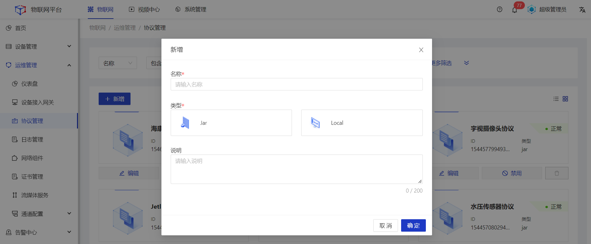

2.进入**网络组件**菜单，配置**MQTT服务**类型的网络协议。 
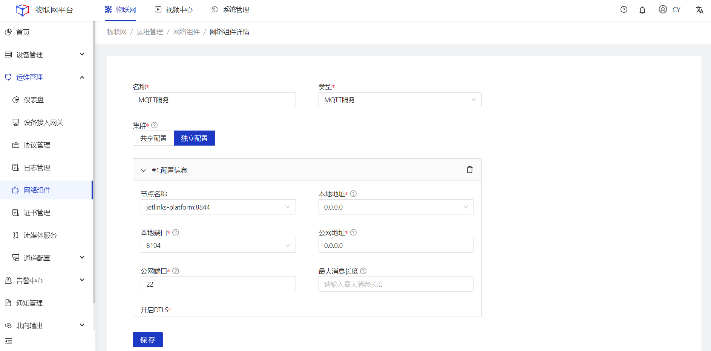

3.进入**设备接入网关**菜单，配置接入方式为**MQTT直连**的网关。 
&emsp;（1）选择MQTT服务类型的网络 
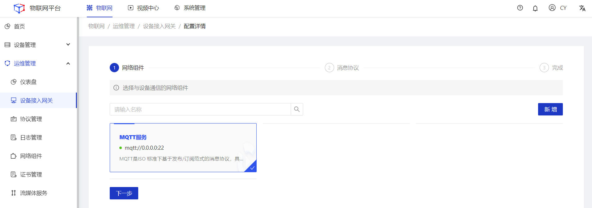
&emsp;（2）选择所需的协议包 
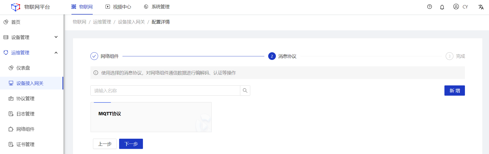
&emsp;（3）填写设备接入网关名称 
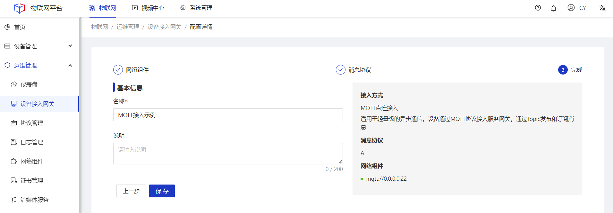

4.创建产品，并进入**设备接入**tab，选择所需的设备接入网关，然后**启用**产品。
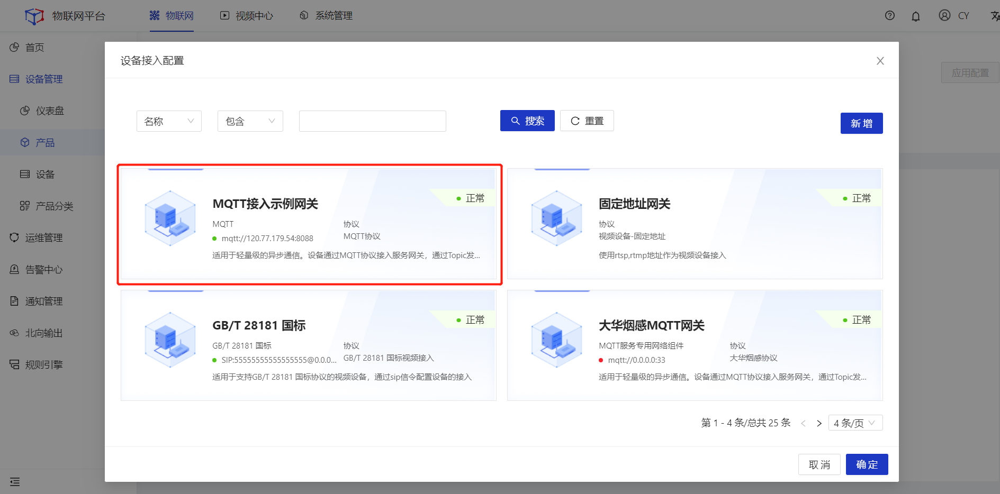

5.创建设备，选择对应的所属产品，然后**启用**设备。
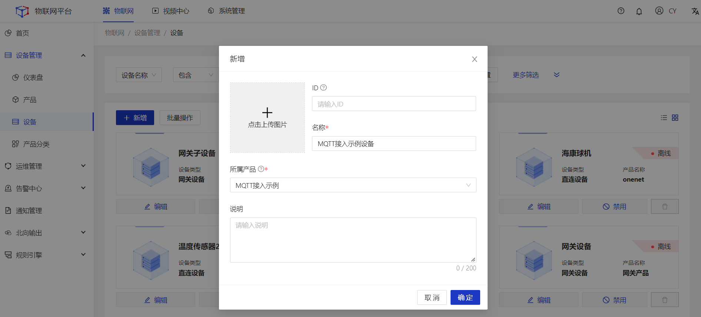

6.打开MQTTX软件，点击新建连接创建一个连接，设置**连接参数**。
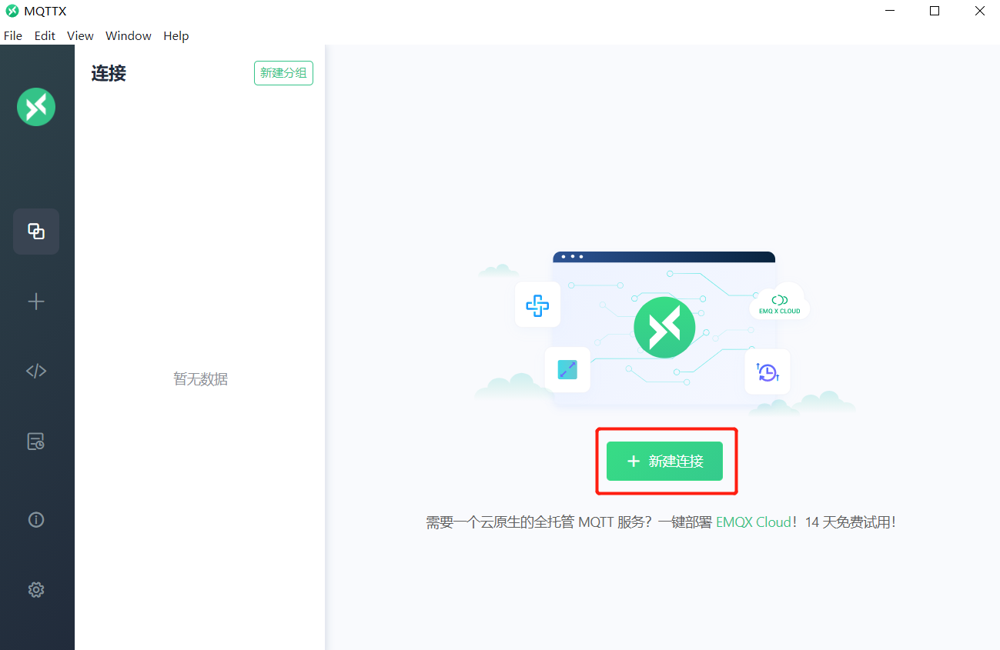
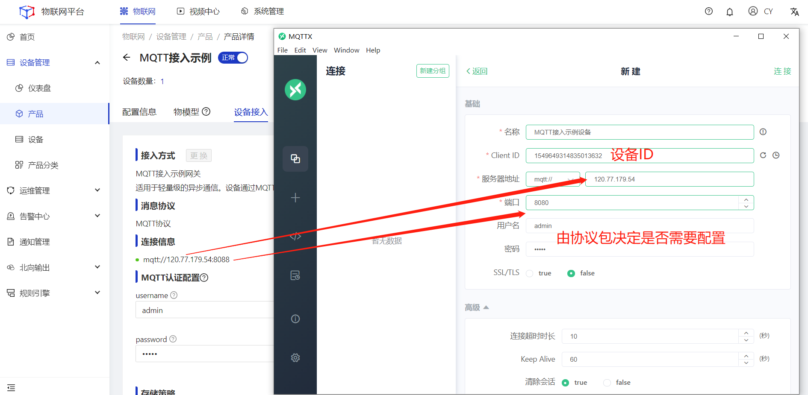

<table class='table'>
        <thead>
            <tr>
              <td>参数</td>
              <td>说明</td>
            </tr>
        </thead>
        <tbody>
          <tr>
            <td>名称</td>
            <td>输入您的自定义名称。</td>
          </tr>
          <tr>
            <td>Client ID</td>
            <td> 设备Id。必须与系统中设备的ID填写一致。</td>
          </tr>
          <tr>
            <td>服务器地址</td>
            <td>连接域名。本地连接可直接填写 `127.0.0.1`,如为远程连接，请填写产品-设备接入页面显示的连接地址。</td>
          </tr>
         <tr>
            <td>端口</td>
            <td>连接端口。本地连接直接填写1889，如为远程连接，请填写产品-设备接入页显示端口。</td>
          </tr>
          <tr>
            <td>用户名</td>
            <td>填写接入账号</td>
          </tr>
         <tr>
            <td>密码</td>
            <td>填写接入密码</td>
          </tr>
        </tbody>
      </table>

  

    
    说明
  

 username和password
  <a href="http://doc.jetlinks.cn/basics-guide/mqtt-auth-generator.html">自动生成器</a>

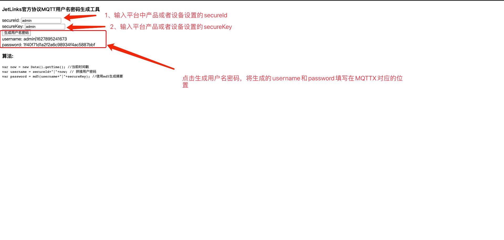

7.点击**连接**按钮，平台中设备状态变为**在线**。
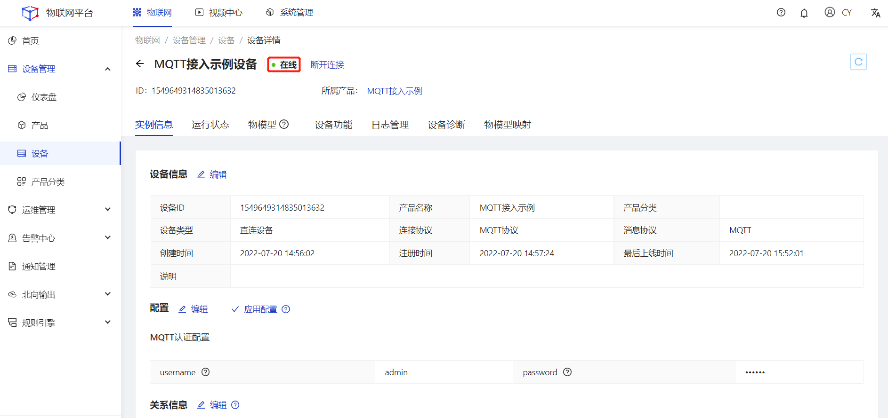

## HTTP接入

正在紧张编写中。