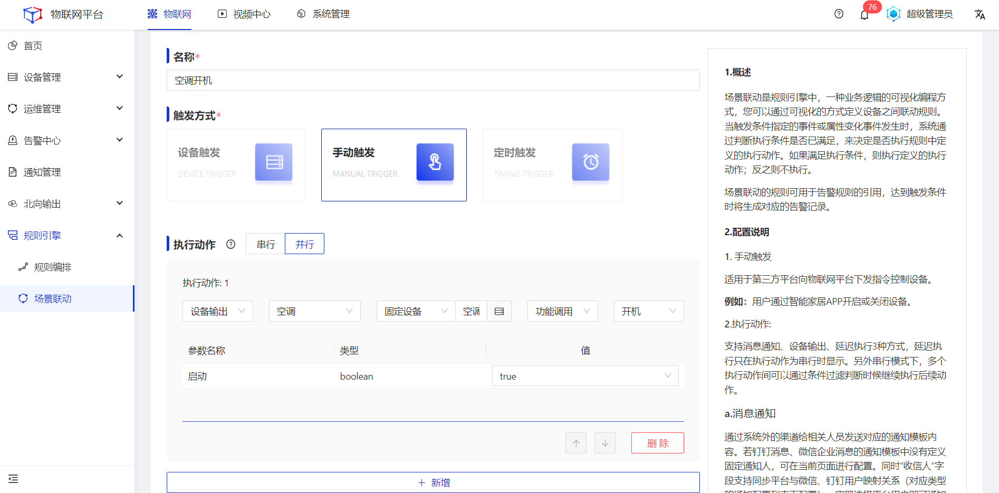
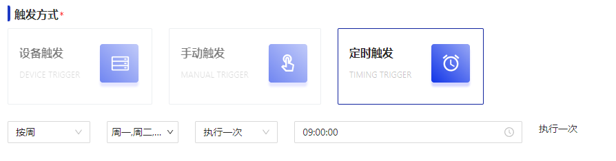
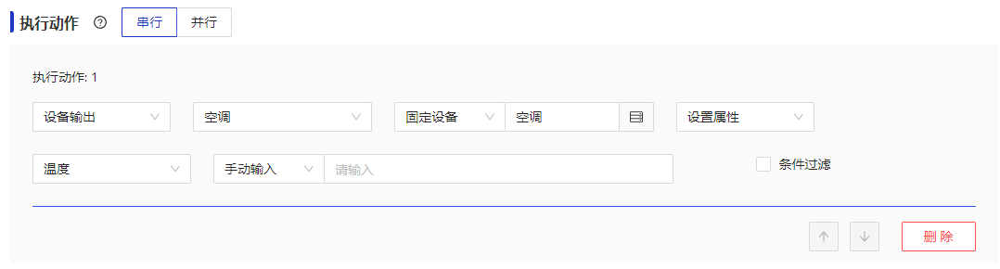

# 最佳实践

## 设备接入
### MQTT直连接入
本文档以MQTTX为例，介绍使用第三方软件以MQTT协议接入物联网平台。
#### 操作步骤
1.<a>登录</a>Jetlinks物联网平台，进入**协议管理**菜单，上传协议。 

2.进入**网络组件**菜单，配置**MQTT服务**类型的网络协议。 

3.进入**设备接入网关**菜单，配置接入方式为**MQTT直连**的网关。 
&emsp;（1）选择MQTT服务类型的网络 

&emsp;（2）选择所需的协议包 

&emsp;（3）填写设备接入网关名称 

4.创建产品，并进入**设备接入**tab，选择所需的设备接入网关，然后**启用**产品。

5.创建设备，选择对应的所属产品，然后**启用**设备。

6.打开MQTTX软件，点击New Connection创建一个连接，设置**连接参数**。

<table class='table'>
        <thead>
            <tr>
              <td>参数</td>
              <td>说明</td>
            </tr>
        </thead>
        <tbody>
          <tr>
            <td>名称</td>
            <td>输入您的自定义名称。</td>
          </tr>
          <tr>
            <td>Client ID</td>
            <td> 设备Id。必须与系统中设备的ID填写一致。</td>
          </tr>
          <tr>
            <td>服务器地址</td>
            <td>连接域名。本地连接可直接填写 `127.0.0.1`,如为远程连接，请填写产品-设备接入页面显示的连接地址。</td>
          </tr>
         <tr>
            <td>端口</td>
            <td>连接端口。本地连接直接填写1889，如为远程连接，请填写产品-设备接入页显示端口。</td>
          </tr>
          <tr>
            <td>用户名</td>
            <td>填写接入账号</td>
          </tr>
         <tr>
            <td>密码</td>
            <td>填写接入密码</td>
          </tr>
        </tbody>
      </table>

  
  说明
 username和password
  <a href="http://doc.jetlinks.cn/basics-guide/mqtt-auth-generator.html">自动生成器</a>

7.点击**连接**按钮，平台中设备状态变为**在线**。

## 场景联动
场景联动是规则引擎中，一种业务逻辑的可视化编程方式，您可以通过可视化的方式定义设备之间联动规则。当触发条件指定的事件或属性变化事件发生时，系统通过判断执行条件是否已满足，来决定是否执行规则中定义的执行动作。如果满足执行条件，则执行定义的执行动作；反之则不执行。 
### 手动触发
适用于第三方平台向物联网平台下发指令控制设备。 
**例如：**用户通过智能家居APP开启设备。

#### 前置条件
1.已经创建好空调产品。 
2.已经创建好空调设备以及对应的物模型，并已接入平台。 
3.已经通过第三方平台账号调用平台场景联动API服务。 

#### 操作步骤
1.<a>登录</a>Jetlinks物联网平台，进入**规则引擎>场景联动**菜单，点击**新增**，进入详情页。 
2.触发方式选择为**手动触发**，执行动作选择**设备输出**，产品选择**空调**，然后选择需要执行动作的**具体设备**，再选择**调用功能**，选择**开机**，设置具体参数值，最后点击**保存**。

### 定时触发
适用于第三方平台向物联网平台下发指令控制设备。支持按周、按月、按Corn表达式3种方式配置频率。 
**例如：**每天早上9点打开空调，并将空调开到26度。

#### 前置条件
1.已经创建好空调产品。 
2.已经创建好空调设备以及对应的物模型，并已接入平台。 

#### 操作步骤
1.<a>登录</a>Jetlinks物联网平台，进入**规则引擎>场景联动**菜单，点击**新增**，进入详情页。 
2.触发方式选择为**定时触发**，选择**按周**，周一、周二、周三、周四、周五**执行一次**，时间选择09:00:00。 

执行动作选择**设备输出**，产品选择**空调**，然后选择需要执行动作的**具体设备**，再选择**设置属性**功能，选择**温度**，**手动输入**属性值。

### 设备触发

## 规则引擎

## 视频设备

## 通知管理

## 国标级联