# 最佳实践

## 设备接入
### MQTT直连接入
本文档以MQTTX为例，介绍使用第三方软件以MQTT协议接入物联网平台。
#### 操作步骤
1.**登录**Jetlinks物联网平台，进入**协议管理**菜单，上传协议。 

2.进入**网络组件**菜单，配置**MQTT服务**类型的网络协议。 

3.进入**设备接入网关**菜单，配置接入方式为**MQTT直连**的网关。 
&emsp;（1）选择MQTT服务类型的网络 

&emsp;（2）选择所需的协议包 

&emsp;（3）填写设备接入网关名称 

4.创建产品，并进入**设备接入**tab，选择所需的设备接入网关，然后**启用**产品。

5.创建设备，选择对应的所属产品，然后**启用**设备。

6.打开MQTTX软件，点击New Connection创建一个连接，设置**连接参数**。

<table class='table'>
        <thead>
            <tr>
              <td>参数</td>
              <td>说明</td>
            </tr>
        </thead>
        <tbody>
          <tr>
            <td>名称</td>
            <td>输入您的自定义名称。</td>
          </tr>
          <tr>
            <td>Client ID</td>
            <td> 设备Id。必须与系统中设备的ID填写一致。</td>
          </tr>
          <tr>
            <td>服务器地址</td>
            <td>连接域名。本地连接可直接填写 `127.0.0.1`,如为远程连接，请填写产品-设备接入页面显示的连接地址。</td>
          </tr>
         <tr>
            <td>端口</td>
            <td>连接端口。本地连接直接填写1889，如为远程连接，请填写产品-设备接入页显示端口。</td>
          </tr>
          <tr>
            <td>用户名</td>
            <td>填写接入账号</td>
          </tr>
         <tr>
            <td>密码</td>
            <td>填写接入密码</td>
          </tr>
        </tbody>
      </table>

  
  说明
 username和password
  <a href="http://doc.jetlinks.cn/basics-guide/mqtt-auth-generator.html">自动生成器</a>

7.点击**连接**按钮，平台中设备状态变为**在线**。

## 场景联动
场景联动是规则引擎中，一种业务逻辑的可视化编程方式，您可以通过可视化的方式定义设备之间联动规则。当触发条件指定的事件或属性变化事件发生时，系统通过判断执行条件是否已满足，来决定是否执行规则中定义的执行动作。如果满足执行条件，则执行定义的执行动作；反之则不执行。 
### 手动触发
适用于第三方平台向物联网平台下发指令控制设备。 
**例如：**用户通过智能家居APP开启设备。

#### 前置条件
1.已经创建好空调产品。 
2.已经创建好空调设备以及对应的物模型，并已接入平台。 
3.已经通过第三方平台账号调用平台场景联动API服务。 

#### 操作步骤
1.**登录**Jetlinks物联网平台，进入**规则引擎>场景联动**菜单，点击**新增**，进入详情页。 
2.触发方式选择为**手动触发**，执行动作选择**设备输出**，产品选择**空调**，然后选择需要执行动作的**具体设备**，再选择**调用功能**，选择**开机**，设置具体参数值，最后点击**保存**。

### 定时触发
适用于第三方平台向物联网平台下发指令控制设备。支持按周、按月、按Corn表达式3种方式配置频率。 
**例如：**每天早上9点打开空调，并将空调开到26度。

#### 前置条件
1.已经创建好空调产品。 
2.已经创建好空调设备以及对应的物模型，并已接入平台。 

#### 操作步骤
1.**登录**Jetlinks物联网平台，进入**规则引擎>场景联动**菜单，点击**新增**，进入详情页。 
2.触发方式选择为**定时触发**，选择**按周**，周一、周二、周三、周四、周五**执行一次**，时间选择09:00:00。 

执行动作选择**设备输出**，产品选择**空调**，然后选择需要执行动作的**具体设备**，再选择**设置属性**功能，选择**温度**，**手动输入**属性值。

### 设备触发
适用于多个不同设备间执行动作的联动。 
**例如：**打开综合办部门房间门的时候，打开电空调，开启摄像头录像功能，5秒后关闭路线功能。

#### 前置条件
1.已经创建好智能门、摄像头产品。 
2.已经创建好智能门设备、摄像头设备以及对应的物模型，并已接入平台。 

#### 操作步骤
1.**登录**Jetlinks物联网平台，进入**规则引擎>场景联动**菜单，点击**新增**，进入详情页。 
2.触发方式选择为**设备触发**，产品选择**智能门**，设备**按部门**选择为**综合办**。 
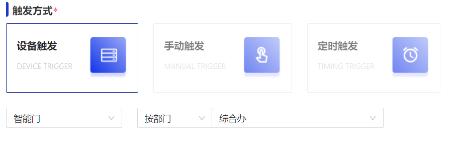
3.触发条件设置参数为**开门/当前值**，**等于**手动输入**是**。 
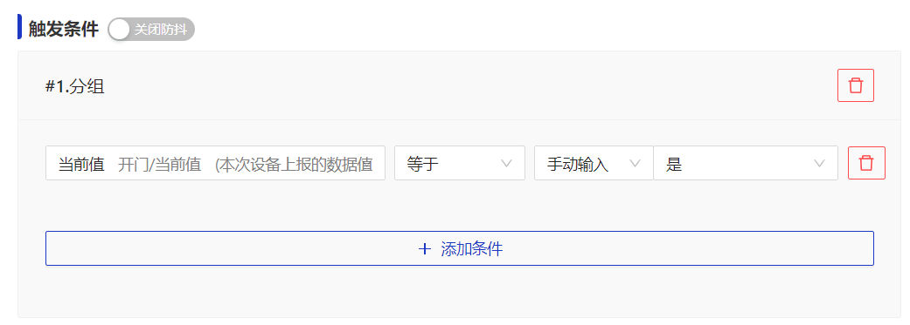
4.执行动作选择**串行**。 
&nbsp;(1)**执行动作1：**设置参数为**设备输出**，产品选择**空调**，设备选择**固定设备**并勾选具体空调设备，然后选择**功能调用**，选择**开机**，参数值选择**true**。
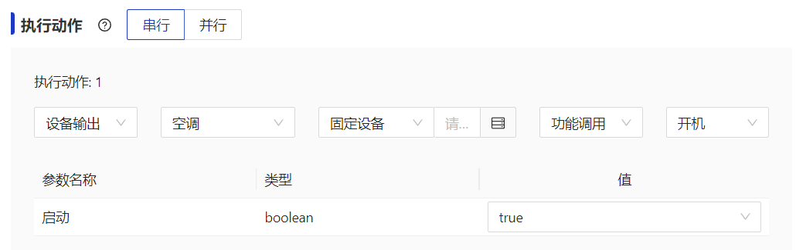

  
  说明
选择设备支持固定设备、按关系、按标签3种方式进行选择。 
例如：
<li>选择空调产品下，与触发设备为同一个"设备负责人"的空调设备</li>
<li>选择空调产品下，品牌标签为格力的设备</li>

&nbsp;(2)**执行动作2：**设置参数为**设备输出**，产品选择**摄像头**，设备选择**固定设备**并勾选具体摄像头设备，然后选择**功能调用**，选择**开启录像**，参数值选择**true**。
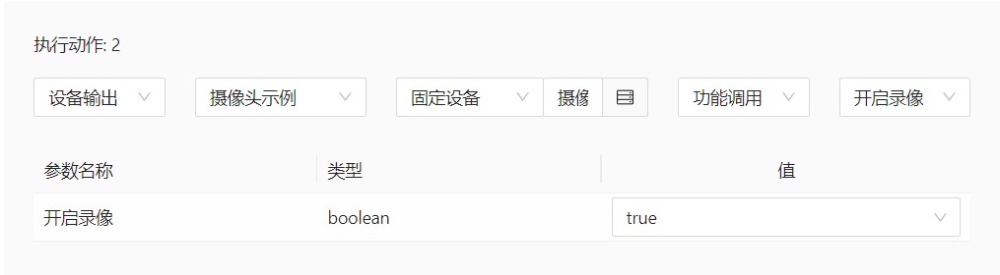

&nbsp;(3)**执行动作3：**设置参数为**延迟执行**，填写值为**5**秒。
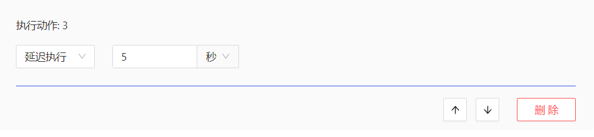

&nbsp;(4)**执行动作4：**设置参数为**设备输出**，产品选择**摄像头**，设备选择**固定设备**并勾选具体摄像头设备，然后选择**功能调用**，选择**关闭录像**，参数值选择**true**。
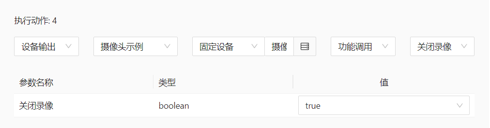

## 规则引擎

## 通知管理
### 钉钉消息通知

#### 前置条件
1.已经在钉钉开放平台创建了三方应用。

#### 操作步骤
1.**登录**Jetlinks物联网平台，点击**通知管理**菜单，进入卡片页，点击钉钉类型的**通知配置**按钮，进入列表页，再点击**新增**按钮，进入通知配置详情页。填写钉钉消息相关配置 
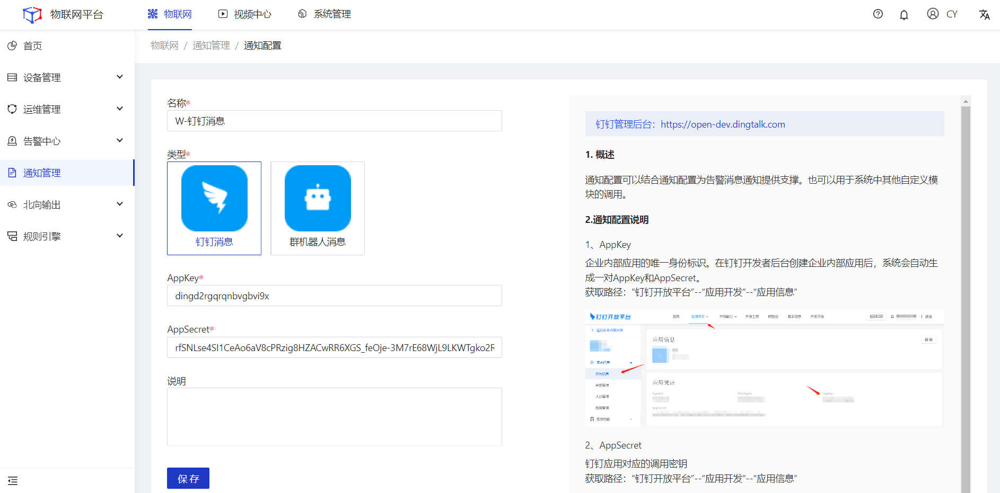

2.进入钉钉类型的**通知模板**列表页，点击**新增**按钮，进入通知模板详情页，填写**钉钉消息**模板内容。
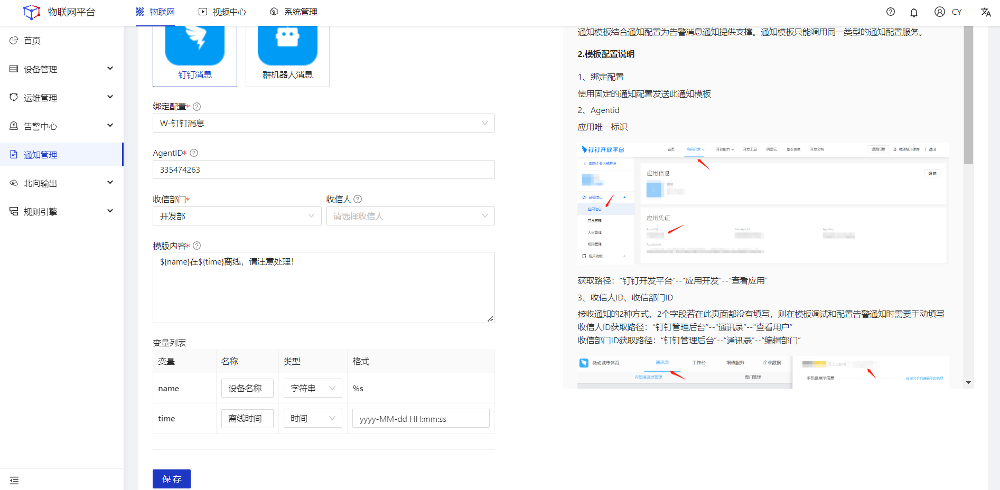

<table class='table'>
        <thead>
            <tr>
              <td>参数</td>
              <td>说明</td>
            </tr>
        </thead>
        <tbody>
          <tr>
            <td>名称</td>
            <td>通知模板命名，最多64个字符。</td>
          </tr>
          <tr>
            <td>绑定配置</td>
            <td>绑定通知配置。</td>
          </tr>
          <tr>
            <td>agentId</td>
            <td>每个应用都有唯一的agentId。 登录https://open-dev.dingtalk.com/fe/app-在管理后台->钉钉应用，点进某个应用，即可看到agentId。</td>
          </tr>
           <tr>
            <td>收信部门</td>
            <td>设置通知模板的收信部门，必填。</td>
          </tr>
           <tr>
            <td>收信人</td>
            <td>设置通知模板的收信人，非必填。如果不填写该字段，将在使用此模板发送通知时进行指定。</td>
          </tr>
           <tr>
            <td>模板内容</td>
            <td>模板的通知内容。支持输入变量，变量格式：${name}。</td>
          </tr>
          <tr>
            <td>变量列表</td>
            <td>变量列表名称、类型、格式配置。</td>
          </tr>
        </tbody>
      </table>

3.点击对应模板的**调试**按钮，在弹框页面填写相关参数，然后点击**确定**。
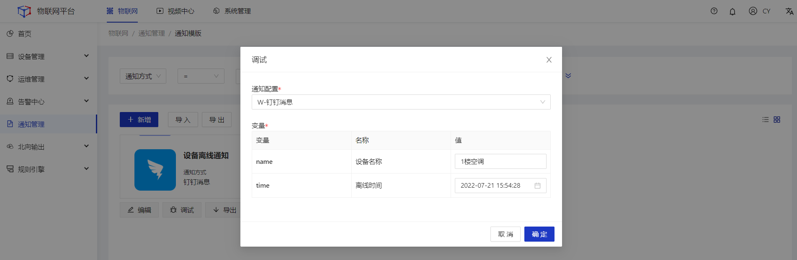

### 钉钉群机器人消息

#### 前置条件
1.已经在钉钉开放平台创建了机器人。

#### 操作步骤
1.**登录**Jetlinks物联网平台，点击**通知管理**菜单，进入卡片页，点击钉钉类型的**通知配置**按钮，进入列表页，再点击**新增**按钮，进入通知配置详情页。填写钉钉群机器人相关配置 
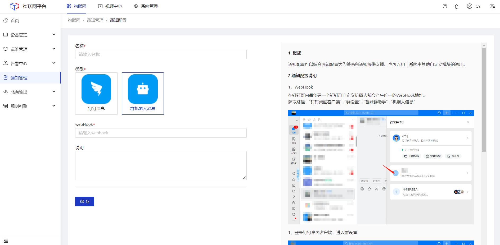
2.进入钉钉类型的**通知模板**列表页，点击**新增**按钮，进入通知模板详情页，填写**群机器人**模板内容。
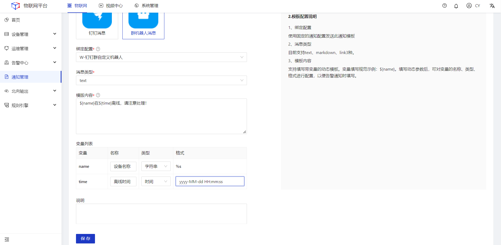

## 国标级联

