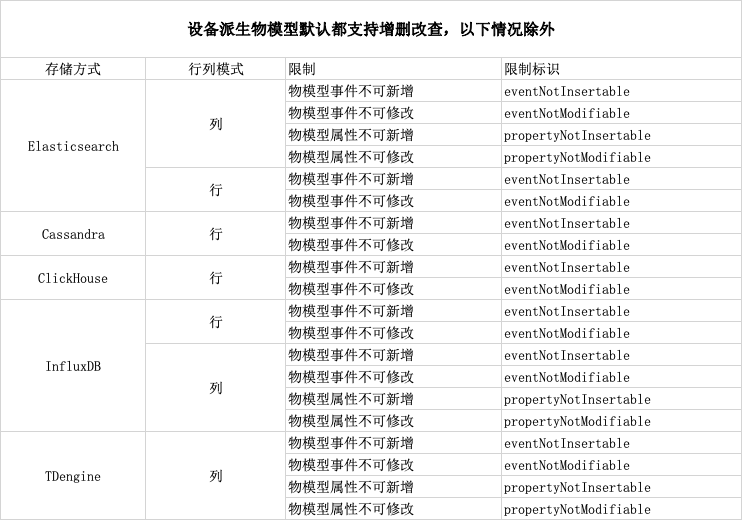

# 配置物模型

### 物模型概述

物模型是对设备在云端的功能描述，包括设备的**属性**、**功能**、**事件**和**标签**。物联网平台通过定义一种物的描述语言来描述物模型，称之为**TSL**（即 Thing Specification Language），采用**JSON**格式，您可以根据TSL组装上报设备的数据。 

### 功能说明
物模型是物理空间中的实体（如传感器设备、消防装置、园区、工厂等）在云端的数字化表示，从**属性**、**功能**、**事件**、**标签**四个维度，分别描述了该实体是什么、能做什么、可以对外提供哪些信息、可以自定义补充哪些信息。定义了物模型的这四个维度，即完成了产品功能的定义。

<table class='table'>
        <thead>
            <tr>
              <td>类型</td>
              <td>说明</td>
            </tr>
        </thead>
        <tbody>
          <tr>
            <td>属性</td>
            <td>用于描述设备运行时具体信息和状态。例如，环境监测设备所读取的当前环境温度、智能灯开关状态、电风扇风力等级等。属性可分为读、写和上报三种类型，即支持读取、设置属性、设备上报属性。 </td>
          </tr>
          <tr>
            <td>功能</td>
            <td>指设备可供外部调用的指令或方法。服务调用中可设置输入和输出参数。输入参数是服务执行时的参数，输出参数是服务执行后的结果。相比于属性，服务可通过一条指令实现更复杂的业务逻辑，例如执行某项特定的任务。服务分为异步和同步两种调用方式。</td>
          </tr>
          <tr>
            <td>事件</td>
            <td>设备运行时，主动上报给云端的信息，一般包含需要被外部感知和处理的信息、告警和故障。事件中可包含多个输出参数。例如，某项任务完成后的通知信息；设备发生故障时的温度、时间信息；设备告警时的运行状态等。事件可以被订阅和推送。</td>
          </tr>
          <tr>
            <td>标签</td>
            <td>设备基于业务需要，自定义补充的标签信息。</td>
          </tr>
          </tbody>
</table>

### 使用说明
1.Jetlinks物联网平台通过定义一种物的描述语言来描述物模型模块和功能，称为TSL（Thing Specification Language）。 
2.物模型TSL文件格式为JSON。您可以在**产品/设备**的**物模型**页面，单击**物模型TSL**,查看或导出JSON格式的TSL。 
3.物模型支持单个和批量的添加，设备会自动**继承**产品的物模型配置参数。 

  
  注意
  设备的物模型也支持单独配置，单独配置后，设备将脱离产品物模型，修改产品物模型不会再同步到设备。

### 限制说明
设备派生物模型（自动继承的产品物模型）默认都支持增删改查，以下情况除外：

### 物模型支持的数据类型
<table class='table'>
        <thead>
            <tr>
              <td>参数</td>
              <td>说明</td>
              <td>示例</td>
            </tr>
        </thead>
        <tbody>
          <tr>
            <td>int</td>
            <td>32位整形</td>
            <td>100</td>
          </tr>
          <tr>
            <td>float</td>
            <td>单精度浮点型</td>
            <td>10.4</td>
          </tr>
          <tr>
            <td>double</td>
            <td>双精度浮点型</td>
            <td>10.45</td>
          </tr>
          <tr>
            <td>text</td>
            <td>字符串，对应的数据长度不能超过10240字节。</td>
            <td>你好，Jetlinks物联网平台</td>
          </tr>
           <tr>
            <td>date</td>
            <td>时间戳。默认格式为String类型的UTC时间戳，单位：毫秒。</td>
            <td>1635839462000</td>
          </tr>
           <tr>
            <td>boolen</td>
            <td>布尔型。采用0（false）或1（true）来定义布尔值</td>
            <td>1表示是、0表示否</td>
          </tr>
            <tr>
            <td>enum</td>
            <td>枚举型。定义枚举项的参数值和参数描述。</td>
            <td>[{key:1,value:1}</td>
          </tr>
          <tr>
            <td>array</td>
            <td>数组。需声明数组内的元素类型、数组元素个数。需确保同一个数组元素类型相同。元素个数限制为1~512个。</td>
            <td>[1, 2, 3, 4, 5, 6]</td>
          </tr>
          <tr>
            <td>Object</td>
            <td>结构体数据，支持树形结构化数据。树形数据格式为JSON 。</td>
            <td>{ "name":"烟感设备", "address":1楼}</td>
          </tr>
          <tr>
            <td>file</td>
            <td>密码数据</td>
            <td>https://gimg2.baidu.com/image_search/src=http%3A%2…sec=1660189147&t=7e5068baf7bef3fb0664476ba4d94822</td>
          </tr>
          <tr>
            <td>password</td>
            <td>密码数据</td>
            <td>admin</td>
          </tr>
           <tr>
            <td>geoPoint</td>
            <td>地址位置数据，以经纬度显示</td>
            <td>106.551783,29.555705</td>
          </tr>
          </tbody>
</table>

