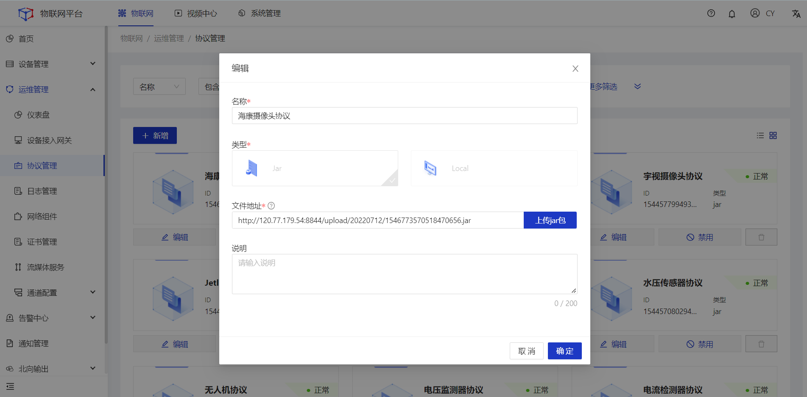

## 协议管理

协议是设备与平台通信的一种标准，某个设备想与平台进行通信就必须按照某种协议标准进行规定上报的数据格式。

#### 新增
##### 操作步骤
1.**登录**Jetlinks物联网平台。
2.在左侧导航栏，选择**运维管理>协议管理**，进入协议管理列表页。

3.点击新增按钮，在弹框页中填写配置信息，然后点击**确定**。

  
  说明
  <li>jar:上传协议jar包,文件格式支持.jar或.zip。</li>
  <li>local:填写本地协议编译目录绝对地址,如:d:/protocol/target/classes</li>

#### 编辑
##### 操作步骤
1.**登录**Jetlinks物联网平台。
2.在左侧导航栏，选择**运维管理>协议管理**，进入协议管理列表页。
3.点击具体协议的**编辑**按钮，在弹框页面中修改配置信息，然后点击**确定**。

  
  注意
  协议类型不可编辑。

#### 启用/禁用
##### 操作步骤
1.**登录**Jetlinks物联网平台。
2.在左侧导航栏，选择**运维管理>协议管理**，进入协议管理列表页。
3.点击具体协议的**启用/禁用**按钮，然后点击**确定**。

  
  注意
协议包被网关使用后，不支持禁用。

#### 删除
##### 操作步骤
1.**登录**Jetlinks物联网平台。
2.在左侧导航栏，选择**运维管理>协议管理**，进入协议管理列表页。
3.点击具体协议的**删除**按钮，然后点击**确定**。

  
  注意
 正常状态下的协议不支持删除。

