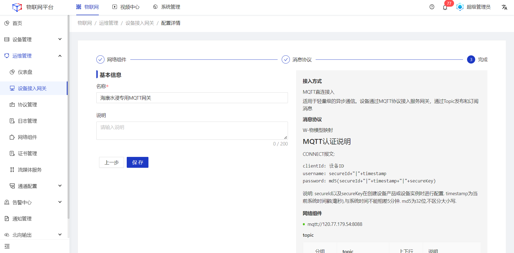
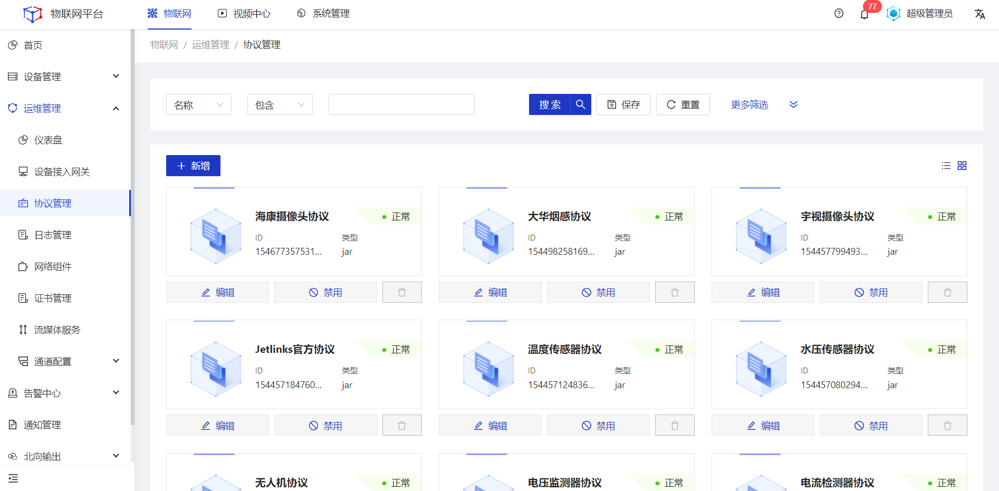
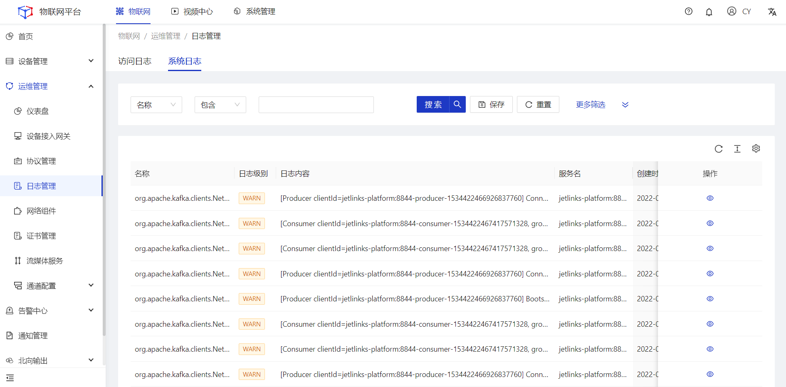
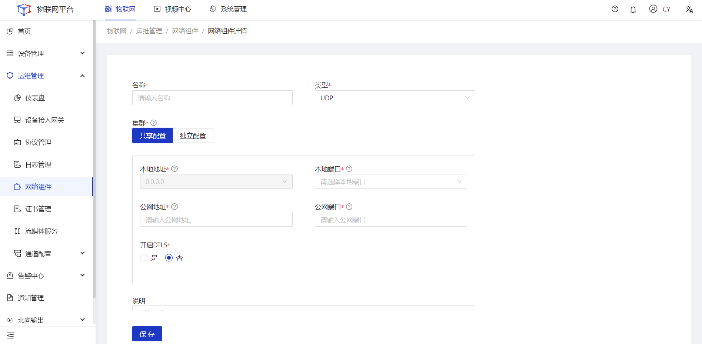
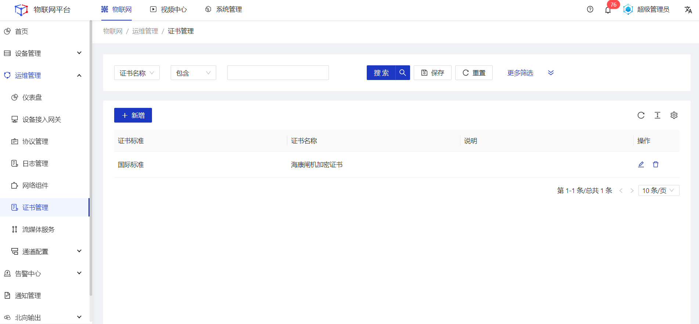
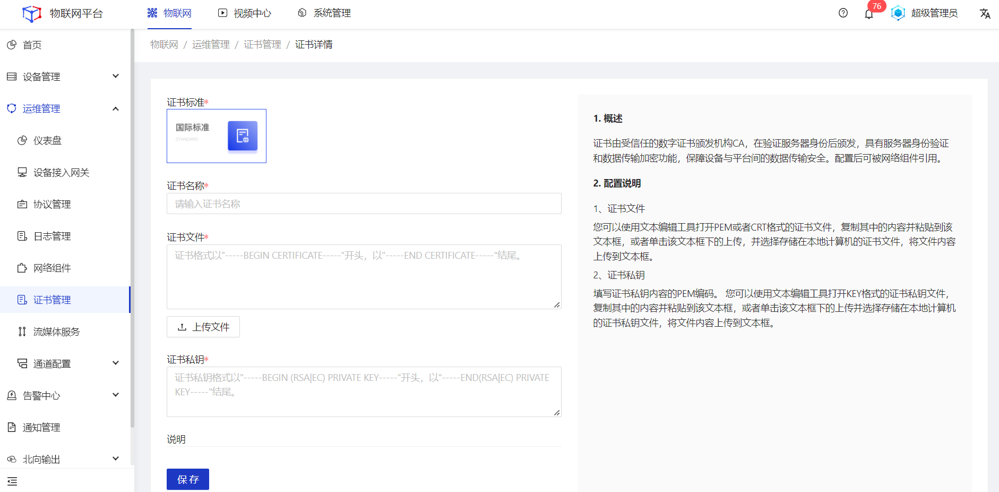
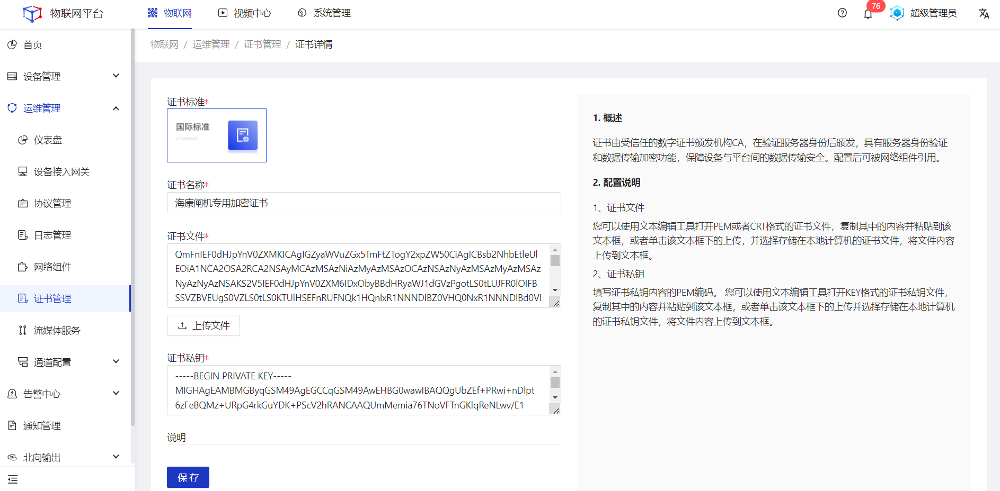
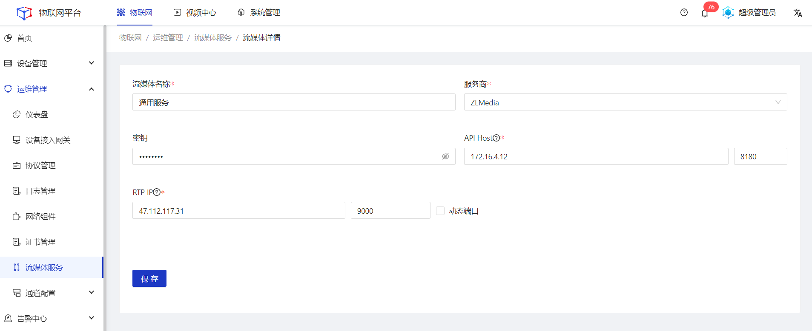

## 设备接入网关

#### 新增
##### 操作步骤
1.**登录**Jetlinks物联网平台。 
2.在左侧导航栏，选择**运维管理>设备接入网关**，进入设备接入网关列表页。 

3.点击**新增**按钮，进入网关类型选择页面，点击所需配置累的的卡片，进入详情页。 

网关类型包括**自定义设备接入**、**视频类设备接入**、**云平台接入**、**通道类设备接入**4大类。不同的类型，具体配置项不同。 
4.按步骤填写所需的网关参数，填写完成后，点击**保存**。 

#### 编辑
##### 操作步骤
1.**登录**Jetlinks物联网平台。 
2.在左侧导航栏，选择**运维管理>设备接入网关**，进入设备接入网关列表页。 
3.点击具体网关的**编辑**按钮，进入详情页步骤条第一步。 
4.编辑所需要修改的配置参数，然后点击**保存**。 

  
  说明
  已选定的网关类型不可编辑。

#### 启用/禁用
##### 操作步骤
1.**登录**Jetlinks物联网平台。 
2.在左侧导航栏，选择**运维管理>设备接入网关**，进入设备接入网关列表页。 
3.点击具体网关的**启用/禁用**按钮，然后点击**确定**。 

#### 删除
##### 操作步骤
1.**登录**Jetlinks物联网平台。 
2.在左侧导航栏，选择**运维管理>设备接入网关**，进入设备接入网关列表页。 
3.点击具体网关的**删除**按钮，然后点击**确定**。 

  
  说明
  <li>当产品的接入方式为自定义接入类型时才会出现物模型映射tab页。</li>
  <li> 设备-物模型映射进行修改后，将脱离产品物模型映射。</li>
  <li>系统会根据属性标识进行自动映射，若属性标识不一致，默认使用物模型属性。</li>

## 协议管理

协议是设备与平台通信的一种标准，某个设备想与平台进行通信就必须按照某种协议标准进行规定上报的数据格式。

#### 新增
##### 操作步骤
1.**登录**Jetlinks物联网平台。 
2.在左侧导航栏，选择**运维管理>协议管理**，进入协议管理列表页。 

3.点击新增按钮，在弹框页中填写配置信息，然后点击**确定**。 

  
  说明
  <li>jar:上传协议jar包,文件格式支持.jar或.zip。</li>
  <li>local:填写本地协议编译目录绝对地址,如:d:/protocol/target/classes</li>

#### 编辑
##### 操作步骤
1.**登录**Jetlinks物联网平台。 
2.在左侧导航栏，选择**运维管理>协议管理**，进入协议管理列表页。 
3.点击具体协议的**编辑**按钮，在弹框页面中修改配置信息，然后点击**确定**。

  
  说明
  协议类型不可编辑。

#### 启用/禁用
##### 操作步骤
1.**登录**Jetlinks物联网平台。 
2.在左侧导航栏，选择**运维管理>协议管理**，进入协议管理列表页。 
3.点击具体协议的**启用/禁用**按钮，然后点击**确定**。 

  
  说明
协议包被网关使用后，不支持禁用。

#### 删除
##### 操作步骤
1.**登录**Jetlinks物联网平台。 
2.在左侧导航栏，选择**运维管理>协议管理**，进入协议管理列表页。 
3.点击具体协议的**删除**按钮，然后点击**确定**。 

  
  说明
 正常状态下的协议不支持删除。

## 日志管理

#### 查看
##### 操作步骤
1.**登录**Jetlinks物联网平台。 
2.在左侧导航栏，选择**运维管理>日志管理**，进入列表页。 

3.点击具体日志的**查看**按钮，查看**日志详情**。 

4.（可选操作）点击页面顶部**系统日志tab**，查看系统日志信息。 

## 网络组件

#### 新增
##### 操作步骤
1.**登录**Jetlinks物联网平台。 
2.在左侧导航栏，选择**运维管理>网络组件**，进入列表页。 

3.点击页面左上角**新增**按钮，进入详情页。 

  
  说明
 <li>共享配置:集群下所有节点共用同一配置。 共享配置时本地地址默认为0.0.0.0</li>
 <li>独立配置:集群下不同节点使用不同配置。</li>

4.根据不同的网络组件类型配置对应的参数，然后点击**保存**。 

UDP参数说明
<table class='table'>
        <thead>
            <tr>
              <td>参数</td>
              <td>说明</td>
            </tr>
        </thead>
        <tbody>
          <tr>
            <td>名称</td>
            <td>为网络组件命名，最多可输入64个字符。</td>
          </tr>
          <tr>
            <td>类型</td>
            <td>单选下拉框，可根据业务需要进行选择。</td>
          </tr>
          <tr>
            <td>集群</td>
            <td>选择是否所有服务器共享一个网络配置或者每个服务器单独配置。</td>
          </tr>
          <tr>
            <td>本地地址</td>
            <td>绑定到服务器上的网卡地址,绑定到所有网卡:0.0.0.0</td>
          </tr>
           <tr>
            <td>本地端口</td>
            <td>监听指定端口的请求</td>
          </tr>
           <tr>
            <td>公网地址</td>
            <td>对外提供访问的地址,内网环境是填写服务器的内网IP地址。</td>
          </tr>
          <tr>
            <td>公网端口</td>
            <td>对外提供访问的端口。</td>
          </tr>
           <tr>
            <td>DTLS</td>
            <td>是否开启DTLS，用于数据加密配置。</td>
          </tr>
            <tr>
            <td>证书</td>
            <td>数据加密证书配置。</td>
          </tr>
           <tr>
            <td>私钥别名</td>
            <td>证书的私钥别名。</td>
          </tr>
        </tbody>
</table>

TCP服务参数说明
<table class='table'>
        <thead>
            <tr>
              <td>参数</td>
              <td>说明</td>
            </tr>
        </thead>
        <tbody>
          <tr>
            <td>名称</td>
            <td>为网络组件命名，最多可输入64个字符。</td>
          </tr>
          <tr>
            <td>类型</td>
            <td>单选下拉框，可根据业务需要进行选择。</td>
          </tr>
          <tr>
            <td>集群</td>
            <td>选择是否所有服务器共享一个网络配置或者每个服务器单独配置。</td>
          </tr>
          <tr>
            <td>本地地址</td>
            <td>绑定到服务器上的网卡地址,绑定到所有网卡:0.0.0.0</td>
          </tr>
           <tr>
            <td>本地端口</td>
            <td>监听指定端口的请求</td>
          </tr>
           <tr>
            <td>公网地址</td>
            <td>对外提供访问的地址,内网环境是填写服务器的内网IP地址。</td>
          </tr>
          <tr>
            <td>公网端口</td>
            <td>对外提供访问的端口。</td>
          </tr>
           <tr>
            <td>DTLS</td>
            <td>是否开启DTLS，用于数据加密配置。</td>
          </tr>
            <tr>
            <td>证书</td>
            <td>数据加密证书配置。</td>
          </tr>
           <tr>
            <td>私钥别名</td>
            <td>证书的私钥别名。</td>
          </tr>
            <tr>
            <td>粘拆包规则</td>
            <td>单选下拉框，用于配置粘拆包方式。</td>
          </tr>
        </tbody>
</table>

WebSocket/HTTP服务参数说明
<table class='table'>
        <thead>
            <tr>
              <td>参数</td>
              <td>说明</td>
            </tr>
        </thead>
        <tbody>
          <tr>
            <td>名称</td>
            <td>为网络组件命名，最多可输入64个字符。</td>
          </tr>
          <tr>
            <td>类型</td>
            <td>单选下拉框，可根据业务需要进行选择。</td>
          </tr>
          <tr>
            <td>集群</td>
            <td>选择是否所有服务器共享一个网络配置或者每个服务器单独配置。</td>
          </tr>
          <tr>
            <td>本地地址</td>
            <td>绑定到服务器上的网卡地址,绑定到所有网卡:0.0.0.0</td>
          </tr>
           <tr>
            <td>本地端口</td>
            <td>监听指定端口的请求</td>
          </tr>
           <tr>
            <td>公网地址</td>
            <td>对外提供访问的地址,内网环境是填写服务器的内网IP地址。</td>
          </tr>
          <tr>
            <td>公网端口</td>
            <td>对外提供访问的端口。</td>
          </tr>
           <tr>
            <td>TLS</td>
            <td>是否开启TLS，用于数据加密配置。</td>
          </tr>
            <tr>
            <td>证书</td>
            <td>数据加密证书配置。</td>
          </tr>
           <tr>
            <td>私钥别名</td>
            <td>证书的私钥别名。</td>
          </tr>
            <tr>
            <td>粘拆包规则</td>
            <td>单选下拉框，用于配置粘拆包方式。</td>
          </tr>
        </tbody>
</table>

MQTT客户端参数说明
<table class='table'>
        <thead>
            <tr>
              <td>参数</td>
              <td>说明</td>
            </tr>
        </thead>
        <tbody>
          <tr>
            <td>名称</td>
            <td>为网络组件命名，最多可输入64个字符。</td>
          </tr>
          <tr>
            <td>类型</td>
            <td>单选下拉框，可根据业务需要进行选择。</td>
          </tr>
          <tr>
            <td>集群</td>
            <td>选择是否所有服务器共享一个网络配置或者每个服务器单独配置。</td>
          </tr>
          <tr>
            <td>远程地址</td>
            <td>连接远程连接地址</td>
          </tr>
           <tr>
            <td>远程端口</td>
            <td>连接远程端口的请求</td>
          </tr>
           <tr>
            <td>clientId</td>
            <td>客户端唯一标识。</td>
          </tr>
          <tr>
            <td>用户名</td>
            <td>客户端用户名。</td>
          </tr>
           <tr>
            <td>密码</td>
            <td>客户端密码。</td>
          </tr>
            <tr>
            <td>最大消息长度</td>
            <td>单次收发消息的最大长度,单位:字节;设置过大可能会影响性能。</td>
          </tr>
           <tr>
            <td>订阅前缀</td>
            <td>当连接的服务为EMQ时,可能需要使用共享的订阅前缀,如:$queue或$share</td>
           <tr>
            <td>DTLS</td>
            <td>是否开启DTLS，用于数据加密配置。</td>
          </tr>
            <tr>
            <td>证书</td>
            <td>数据加密证书配置。</td>
          </tr>
           <tr>
            <td>私钥别名</td>
            <td>证书的私钥别名。</td>
          </tr>
          </tbody>
</table>

MQTT服务参数说明
<table class='table'>
        <thead>
            <tr>
              <td>参数</td>
              <td>说明</td>
            </tr>
        </thead>
        <tbody>
          <tr>
            <td>名称</td>
            <td>为网络组件命名，最多可输入64个字符。</td>
          </tr>
          <tr>
            <td>类型</td>
            <td>单选下拉框，可根据业务需要进行选择。</td>
          </tr>
          <tr>
            <td>集群</td>
            <td>选择是否所有服务器共享一个网络配置或者每个服务器单独配置。</td>
          </tr>
          <tr>
            <td>本地地址</td>
            <td>绑定到服务器上的网卡地址,绑定到所有网卡:0.0.0.0</td>
          </tr>
           <tr>
            <td>本地端口</td>
            <td>监听指定端口的请求</td>
          </tr>
           <tr>
            <td>公网地址</td>
            <td>对外提供访问的地址,内网环境是填写服务器的内网IP地址。</td>
          </tr>
          <tr>
            <td>公网端口</td>
            <td>对外提供访问的端口。</td>
          </tr>
           <tr>
            <td>DTLS</td>
            <td>是否开启DTLS，用于数据加密配置。</td>
          </tr>
            <tr>
            <td>证书</td>
            <td>数据加密证书配置。</td>
          </tr>
           <tr>
            <td>私钥别名</td>
            <td>证书的私钥别名。</td>
          </tr>
           <tr>
            <td>最大消息长度</td>
            <td>单次收发消息的最大长度,单位:字节;设置过大可能会影响性能。</td>
          </tr>
          </tbody>
</table>

CoAP服务参数说明
<table class='table'>
        <thead>
            <tr>
              <td>参数</td>
              <td>说明</td>
            </tr>
        </thead>
        <tbody>
          <tr>
            <td>名称</td>
            <td>为网络组件命名，最多可输入64个字符。</td>
          </tr>
          <tr>
            <td>类型</td>
            <td>单选下拉框，可根据业务需要进行选择。</td>
          </tr>
          <tr>
            <td>集群</td>
            <td>选择是否所有服务器共享一个网络配置或者每个服务器单独配置。</td>
          </tr>
          <tr>
            <td>本地地址</td>
            <td>绑定到服务器上的网卡地址,绑定到所有网卡:0.0.0.0</td>
          </tr>
           <tr>
            <td>本地端口</td>
            <td>监听指定端口的请求</td>
          </tr>
           <tr>
            <td>公网地址</td>
            <td>对外提供访问的地址,内网环境是填写服务器的内网IP地址。</td>
          </tr>
          <tr>
            <td>公网端口</td>
            <td>对外提供访问的端口。</td>
          </tr>
           <tr>
            <td>DTLS</td>
            <td>是否开启DTLS，用于数据加密配置。</td>
          </tr>
            <tr>
            <td>证书</td>
            <td>数据加密证书配置。</td>
          </tr>
           <tr>
            <td>私钥别名</td>
            <td>证书的私钥别名。</td>
          </tr>
          </tbody>
</table>

#### 编辑
##### 操作步骤
1.**登录**Jetlinks物联网平台。 
2.在左侧导航栏，选择**运维管理>网络组件**，进入列表页。 

3.点击具体网络组件的**编辑**按钮，进入详情页。 

4.编辑所需要修改的网络组件配置参数，然后点击**保存**。 

#### 启用/禁用
##### 操作步骤
1.**登录**Jetlinks物联网平台。 
2.在左侧导航栏，选择**运维管理>网络组件**，进入列表页。 
3.点击具体网络组件的**启用/禁用**按钮，然后点击**确定**。 

#### 删除
##### 操作步骤
1.**登录**Jetlinks物联网平台。 
2.在左侧导航栏，选择**运维管理>网络组件**，进入列表页。 
3.点击具体网络组件的**删除**按钮，然后点击**确定**。 

## 证书管理

#### 新增
##### 操作步骤
1.**登录**Jetlinks物联网平台。 
2.在左侧导航栏，选择**运维管理>证书管理**，进入列表页。 

3.点击新增按钮，进入证书详情页。填写完证书信息后，点击**保存**。 

#### 编辑
##### 操作步骤
1.**登录**Jetlinks物联网平台。 
2.在左侧导航栏，选择**运维管理>证书管理**，进入列表页。 
3.点击具体证书的**编辑**按钮，进入到证书详情页。 
4.编辑所需要修改的配置参数，然后点击**保存**。 

#### 删除
##### 操作步骤
1.**登录**Jetlinks物联网平台。 
2.在左侧导航栏，选择**运维管理>设备接入网关**，进入列表页。 
3.点击具体证书的**删除**按钮，然后点击**确定**。 

  
  说明
  证书被网络组件使用时，不支持删除。

## 流媒体服务

#### 新增
##### 操作步骤
1.**登录**Jetlinks物联网平台。 
2.在左侧导航栏，选择**运维管理>流媒体服务**，进入列表页。 

3.点击**新增**按钮，进入流媒体详情页。 

4.填写流媒体服务配置信息，然后点击**保存**。 

流媒体服务配置参数说明：
<table class='table'>
        <thead>
            <tr>
              <td>参数</td>
              <td>说明</td>
            </tr>
        </thead>
        <tbody>
          <tr>
            <td>流媒体名称</td>
            <td>为流媒体服务命名，最多可输入64个字符。</td>
          </tr>
          <tr>
            <td>服务商</td>
            <td>配置流媒体服务商。</td>
          </tr>
          <tr>
            <td>秘钥</td>
            <td>调用流媒体API服务的秘钥。</td>
          </tr>
          <tr>
            <td>API Host</td>
            <td>调用流媒体接口时请求的服务地址</td>
          </tr>
           <tr>
            <td>RTP IP</td>
            <td>视频设备将流推送到该IP地址下，部分设备仅支持IP地址，建议全是用IP地址</td>
          </tr>
          </tbody>
</table>

  
  说明
  若系统中存在多个流媒体服务，播放视频时会进行随机调用。

#### 编辑
##### 操作步骤
1.**登录**Jetlinks物联网平台。 
2.在左侧导航栏，选择**运维管理>流媒体服务**，进入列表页。 
3.点击具体流媒体服务的**编辑**按钮，进入流媒体详情页。 
4.编辑所需要修改的配置参数，然后点击**保存**。 

#### 删除
##### 操作步骤
1.**登录**Jetlinks物联网平台。 
2.在左侧导航栏，选择**运维管理>流媒体服务**，进入列表页。 
3.点击具体流媒体服务的**删除**按钮，然后点击**确定**。 

