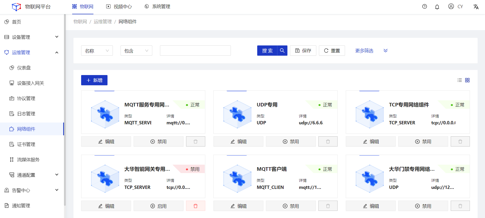
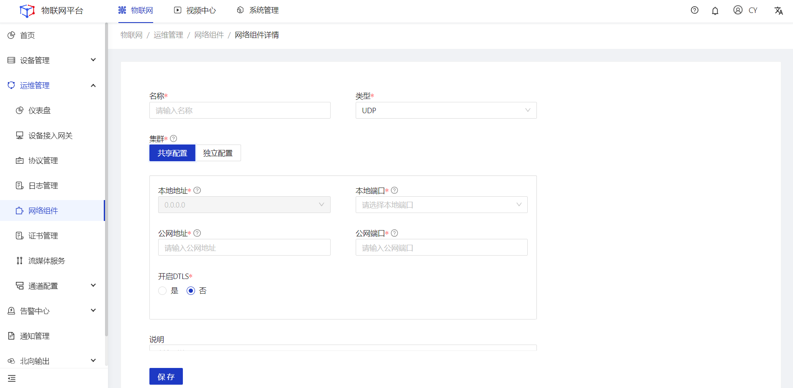
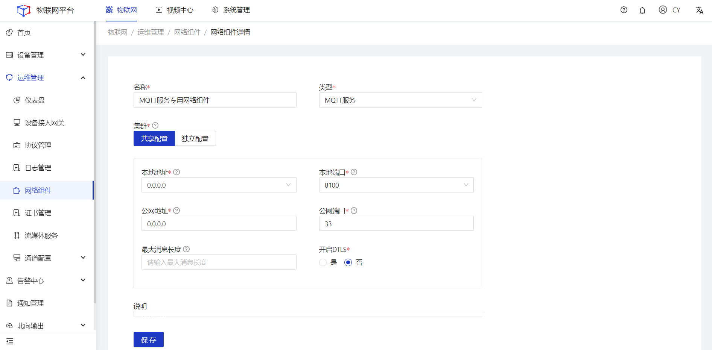
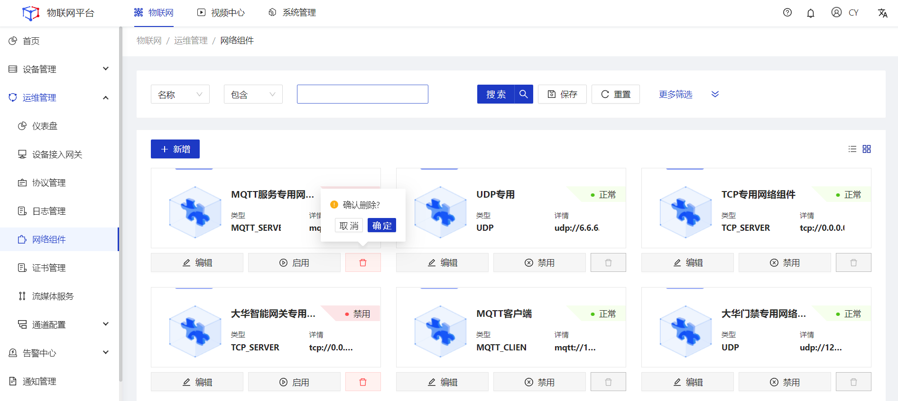

## 网络组件

#### 新增
##### 操作步骤
1.**登录**Jetlinks物联网平台。
2.在左侧导航栏，选择**运维管理>网络组件**，进入列表页。

3.点击页面左上角**新增**按钮，进入详情页。

  
  注意
 <li>共享配置:集群下所有节点共用同一配置。 共享配置时本地地址默认为0.0.0.0</li>
 <li>独立配置:集群下不同节点使用不同配置。</li>

4.根据不同的网络组件类型配置对应的参数，然后点击**保存**。

UDP参数说明
<table class='table'>
        <thead>
            <tr>
              <td>参数</td>
              <td>说明</td>
            </tr>
        </thead>
        <tbody>
          <tr>
            <td>名称</td>
            <td>为网络组件命名，最多可输入64个字符。</td>
          </tr>
          <tr>
            <td>类型</td>
            <td>单选下拉框，可根据业务需要进行选择。</td>
          </tr>
          <tr>
            <td>集群</td>
            <td>选择是否所有服务器共享一个网络配置或者每个服务器单独配置。</td>
          </tr>
          <tr>
            <td>本地地址</td>
            <td>绑定到服务器上的网卡地址,绑定到所有网卡:0.0.0.0</td>
          </tr>
           <tr>
            <td>本地端口</td>
            <td>监听指定端口的请求</td>
          </tr>
           <tr>
            <td>公网地址</td>
            <td>对外提供访问的地址,内网环境是填写服务器的内网IP地址。</td>
          </tr>
          <tr>
            <td>公网端口</td>
            <td>对外提供访问的端口。</td>
          </tr>
           <tr>
            <td>DTLS</td>
            <td>是否开启DTLS，用于数据加密配置。</td>
          </tr>
            <tr>
            <td>证书</td>
            <td>数据加密证书配置。</td>
          </tr>
           <tr>
            <td>私钥别名</td>
            <td>证书的私钥别名。</td>
          </tr>
        </tbody>
</table>

TCP服务参数说明
<table class='table'>
        <thead>
            <tr>
              <td>参数</td>
              <td>说明</td>
            </tr>
        </thead>
        <tbody>
          <tr>
            <td>名称</td>
            <td>为网络组件命名，最多可输入64个字符。</td>
          </tr>
          <tr>
            <td>类型</td>
            <td>单选下拉框，可根据业务需要进行选择。</td>
          </tr>
          <tr>
            <td>集群</td>
            <td>选择是否所有服务器共享一个网络配置或者每个服务器单独配置。</td>
          </tr>
          <tr>
            <td>本地地址</td>
            <td>绑定到服务器上的网卡地址,绑定到所有网卡:0.0.0.0</td>
          </tr>
           <tr>
            <td>本地端口</td>
            <td>监听指定端口的请求</td>
          </tr>
           <tr>
            <td>公网地址</td>
            <td>对外提供访问的地址,内网环境是填写服务器的内网IP地址。</td>
          </tr>
          <tr>
            <td>公网端口</td>
            <td>对外提供访问的端口。</td>
          </tr>
           <tr>
            <td>DTLS</td>
            <td>是否开启DTLS，用于数据加密配置。</td>
          </tr>
            <tr>
            <td>证书</td>
            <td>数据加密证书配置。</td>
          </tr>
           <tr>
            <td>私钥别名</td>
            <td>证书的私钥别名。</td>
          </tr>
            <tr>
            <td>粘拆包规则</td>
            <td>单选下拉框，用于配置粘拆包方式。</td>
          </tr>
        </tbody>
</table>

WebSocket/HTTP服务参数说明
<table class='table'>
        <thead>
            <tr>
              <td>参数</td>
              <td>说明</td>
            </tr>
        </thead>
        <tbody>
          <tr>
            <td>名称</td>
            <td>为网络组件命名，最多可输入64个字符。</td>
          </tr>
          <tr>
            <td>类型</td>
            <td>单选下拉框，可根据业务需要进行选择。</td>
          </tr>
          <tr>
            <td>集群</td>
            <td>选择是否所有服务器共享一个网络配置或者每个服务器单独配置。</td>
          </tr>
          <tr>
            <td>本地地址</td>
            <td>绑定到服务器上的网卡地址,绑定到所有网卡:0.0.0.0</td>
          </tr>
           <tr>
            <td>本地端口</td>
            <td>监听指定端口的请求</td>
          </tr>
           <tr>
            <td>公网地址</td>
            <td>对外提供访问的地址,内网环境是填写服务器的内网IP地址。</td>
          </tr>
          <tr>
            <td>公网端口</td>
            <td>对外提供访问的端口。</td>
          </tr>
           <tr>
            <td>TLS</td>
            <td>是否开启TLS，用于数据加密配置。</td>
          </tr>
            <tr>
            <td>证书</td>
            <td>数据加密证书配置。</td>
          </tr>
           <tr>
            <td>私钥别名</td>
            <td>证书的私钥别名。</td>
          </tr>
            <tr>
            <td>粘拆包规则</td>
            <td>单选下拉框，用于配置粘拆包方式。</td>
          </tr>
        </tbody>
</table>

MQTT客户端参数说明
<table class='table'>
        <thead>
            <tr>
              <td>参数</td>
              <td>说明</td>
            </tr>
        </thead>
        <tbody>
          <tr>
            <td>名称</td>
            <td>为网络组件命名，最多可输入64个字符。</td>
          </tr>
          <tr>
            <td>类型</td>
            <td>单选下拉框，可根据业务需要进行选择。</td>
          </tr>
          <tr>
            <td>集群</td>
            <td>选择是否所有服务器共享一个网络配置或者每个服务器单独配置。</td>
          </tr>
          <tr>
            <td>远程地址</td>
            <td>连接远程连接地址</td>
          </tr>
           <tr>
            <td>远程端口</td>
            <td>连接远程端口的请求</td>
          </tr>
           <tr>
            <td>clientId</td>
            <td>客户端唯一标识。</td>
          </tr>
          <tr>
            <td>用户名</td>
            <td>客户端用户名。</td>
          </tr>
           <tr>
            <td>密码</td>
            <td>客户端密码。</td>
          </tr>
            <tr>
            <td>最大消息长度</td>
            <td>单次收发消息的最大长度,单位:字节;设置过大可能会影响性能。</td>
          </tr>
           <tr>
            <td>订阅前缀</td>
            <td>当连接的服务为EMQ时,可能需要使用共享的订阅前缀,如:$queue或$share</td>
           <tr>
            <td>DTLS</td>
            <td>是否开启DTLS，用于数据加密配置。</td>
          </tr>
            <tr>
            <td>证书</td>
            <td>数据加密证书配置。</td>
          </tr>
           <tr>
            <td>私钥别名</td>
            <td>证书的私钥别名。</td>
          </tr>
          </tbody>
</table>

MQTT服务参数说明
<table class='table'>
        <thead>
            <tr>
              <td>参数</td>
              <td>说明</td>
            </tr>
        </thead>
        <tbody>
          <tr>
            <td>名称</td>
            <td>为网络组件命名，最多可输入64个字符。</td>
          </tr>
          <tr>
            <td>类型</td>
            <td>单选下拉框，可根据业务需要进行选择。</td>
          </tr>
          <tr>
            <td>集群</td>
            <td>选择是否所有服务器共享一个网络配置或者每个服务器单独配置。</td>
          </tr>
          <tr>
            <td>本地地址</td>
            <td>绑定到服务器上的网卡地址,绑定到所有网卡:0.0.0.0</td>
          </tr>
           <tr>
            <td>本地端口</td>
            <td>监听指定端口的请求</td>
          </tr>
           <tr>
            <td>公网地址</td>
            <td>对外提供访问的地址,内网环境是填写服务器的内网IP地址。</td>
          </tr>
          <tr>
            <td>公网端口</td>
            <td>对外提供访问的端口。</td>
          </tr>
           <tr>
            <td>DTLS</td>
            <td>是否开启DTLS，用于数据加密配置。</td>
          </tr>
            <tr>
            <td>证书</td>
            <td>数据加密证书配置。</td>
          </tr>
           <tr>
            <td>私钥别名</td>
            <td>证书的私钥别名。</td>
          </tr>
           <tr>
            <td>最大消息长度</td>
            <td>单次收发消息的最大长度,单位:字节;设置过大可能会影响性能。</td>
          </tr>
          </tbody>
</table>

CoAP服务参数说明
<table class='table'>
        <thead>
            <tr>
              <td>参数</td>
              <td>说明</td>
            </tr>
        </thead>
        <tbody>
          <tr>
            <td>名称</td>
            <td>为网络组件命名，最多可输入64个字符。</td>
          </tr>
          <tr>
            <td>类型</td>
            <td>单选下拉框，可根据业务需要进行选择。</td>
          </tr>
          <tr>
            <td>集群</td>
            <td>选择是否所有服务器共享一个网络配置或者每个服务器单独配置。</td>
          </tr>
          <tr>
            <td>本地地址</td>
            <td>绑定到服务器上的网卡地址,绑定到所有网卡:0.0.0.0</td>
          </tr>
           <tr>
            <td>本地端口</td>
            <td>监听指定端口的请求</td>
          </tr>
           <tr>
            <td>公网地址</td>
            <td>对外提供访问的地址,内网环境是填写服务器的内网IP地址。</td>
          </tr>
          <tr>
            <td>公网端口</td>
            <td>对外提供访问的端口。</td>
          </tr>
           <tr>
            <td>DTLS</td>
            <td>是否开启DTLS，用于数据加密配置。</td>
          </tr>
            <tr>
            <td>证书</td>
            <td>数据加密证书配置。</td>
          </tr>
           <tr>
            <td>私钥别名</td>
            <td>证书的私钥别名。</td>
          </tr>
          </tbody>
</table>

#### 编辑
##### 操作步骤
1.**登录**Jetlinks物联网平台。
2.在左侧导航栏，选择**运维管理>网络组件**，进入列表页。

3.点击具体网络组件的**编辑**按钮，进入详情页。

4.编辑所需要修改的网络组件配置参数，然后点击**保存**。

#### 启用/禁用
##### 操作步骤
1.**登录**Jetlinks物联网平台。
2.在左侧导航栏，选择**运维管理>网络组件**，进入列表页。
3.点击具体网络组件的**启用/禁用**按钮，然后点击**确定**。

#### 删除
##### 操作步骤
1.**登录**Jetlinks物联网平台。
2.在左侧导航栏，选择**运维管理>网络组件**，进入列表页。
3.点击具体网络组件的**删除**按钮，然后点击**确定**。

