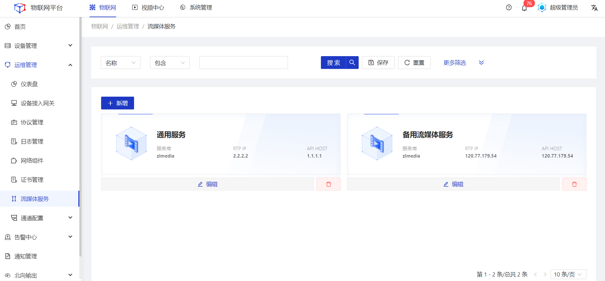
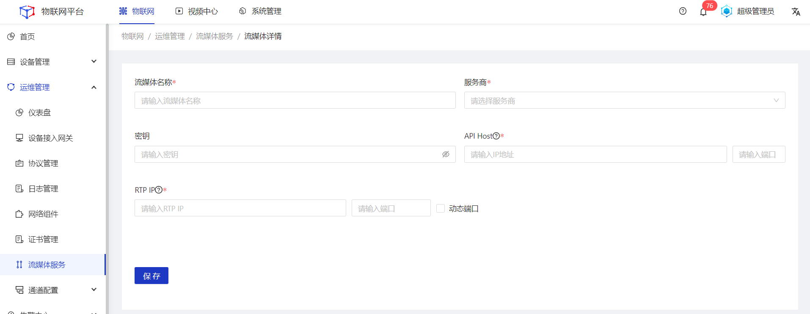
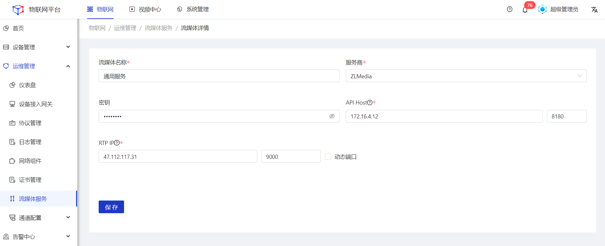
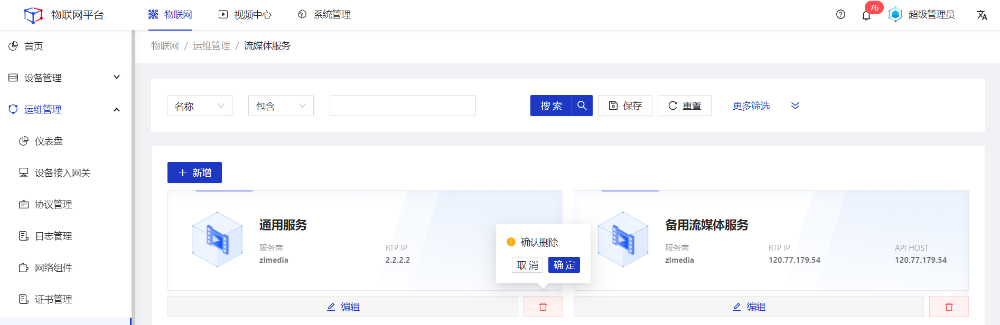

## 流媒体服务

#### 新增
##### 操作步骤
1.**登录**Jetlinks物联网平台。
2.在左侧导航栏，选择**运维管理>流媒体服务**，进入列表页。

3.点击**新增**按钮，进入流媒体详情页。

4.填写流媒体服务配置信息，然后点击**保存**。

流媒体服务配置参数说明：
<table class='table'>
        <thead>
            <tr>
              <td>参数</td>
              <td>说明</td>
            </tr>
        </thead>
        <tbody>
          <tr>
            <td>流媒体名称</td>
            <td>为流媒体服务命名，最多可输入64个字符。</td>
          </tr>
          <tr>
            <td>服务商</td>
            <td>配置流媒体服务商。</td>
          </tr>
          <tr>
            <td>秘钥</td>
            <td>调用流媒体API服务的秘钥。</td>
          </tr>
          <tr>
            <td>API Host</td>
            <td>调用流媒体接口时请求的服务地址</td>
          </tr>
           <tr>
            <td>RTP IP</td>
            <td>视频设备将流推送到该IP地址下，部分设备仅支持IP地址，建议全是用IP地址</td>
          </tr>
          </tbody>
</table>

  
  说明
  若系统中存在多个流媒体服务，播放视频时会进行随机调用。

#### 编辑
##### 操作步骤
1.**登录**Jetlinks物联网平台。
2.在左侧导航栏，选择**运维管理>流媒体服务**，进入列表页。
3.点击具体流媒体服务的**编辑**按钮，进入流媒体详情页。
4.编辑所需要修改的配置参数，然后点击**保存**。

#### 删除
##### 操作步骤
1.**登录**Jetlinks物联网平台。
2.在左侧导航栏，选择**运维管理>流媒体服务**，进入列表页。
3.点击具体流媒体服务的**删除**按钮，然后点击**确定**。

