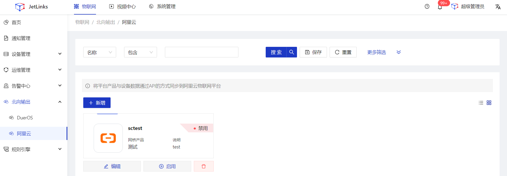
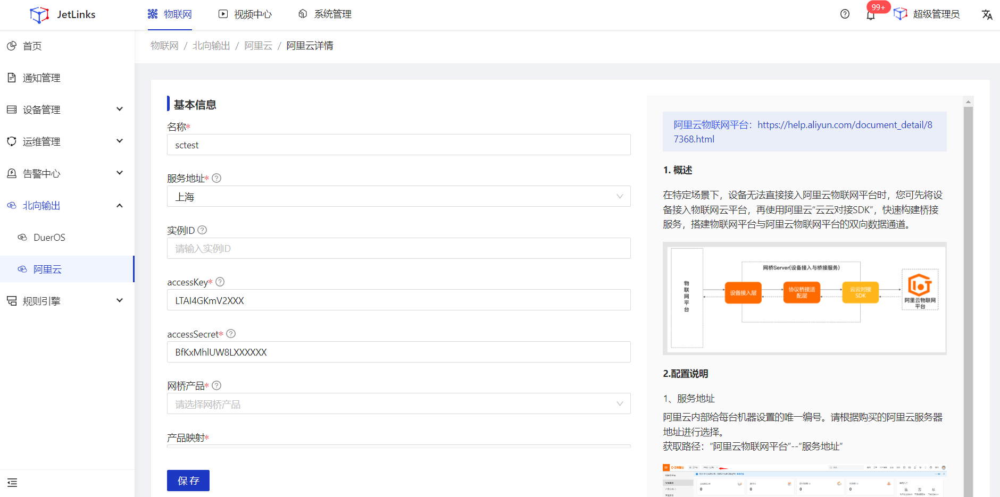

# 北向输出

北向输出功能用于将平台的**设备**以及**设备上报数据**，通过可视化配置的方式，**北向**输出给其他系统。 

## DuerOS
#### 新增
##### 操作步骤
1.**登录**Jetlinks物联网平台。 
2.在左侧导航栏，选择**北向输出>DuerOS**，进入列表页。 

3.点击**新增**按钮，进入详情页填写配置信息，然后点击**保存**按钮。 

#### 编辑
##### 操作步骤
1.**登录**Jetlinks物联网平台。 
2.在左侧导航栏，选择**北向输出>DuerOS**，进入列表页。 
3.选择具体配置的**编辑**按钮，进入详情页编辑配置信息，然后点击**保存**按钮。 

  
  说明
  产品不支持编辑，同一个产品只能配置一个映射规则。

#### 启用/禁用
##### 操作步骤
1.**登录**Jetlinks物联网平台。 
2.在左侧导航栏，选择**北向输出>DuerOS**，进入列表页。 
3.选择具体配置的**启用/禁用**按钮，然后点击**确定**。 

#### 删除
##### 操作步骤
1.**登录**Jetlinks物联网平台。 
2.在左侧导航栏，选择**北向输出>DuerOS**，进入列表页。 
3.选择具体配置的**删除**按钮，然后点击**确定**。 

## 阿里云
#### 新增
##### 操作步骤
1.**登录**Jetlinks物联网平台。 
2.在左侧导航栏，选择**北向输出>阿里云**，进入列表页。 

3.点击**新增**按钮，进入详情页填写配置信息，然后点击**保存**按钮。 

  
  说明
  Jetlinks物联网平台北向输出到阿里云物联网平台，是一个网关设备。

#### 编辑 
##### 操作步骤
1.**登录**Jetlinks物联网平台。 
2.在左侧导航栏，选择**北向输出>阿里云**，进入列表页。 
3.点击具体数据的**编辑**按钮，进入详情页编辑配置信息，然后点击**保存**按钮。 

#### 启用/禁用
##### 操作步骤
1.**登录**Jetlinks物联网平台。 
2.在左侧导航栏，选择**北向输出>阿里云**，进入列表页。 
3.点击具体数据的**启用/禁用**按钮，然后点击**确定**。 

#### 删除
##### 操作步骤
1.**登录**Jetlinks物联网平台。 
2.在左侧导航栏，选择**北向输出>阿里云**，进入列表页。 
3.点击具体数据的**删除**按钮，然后点击**确定**。 

