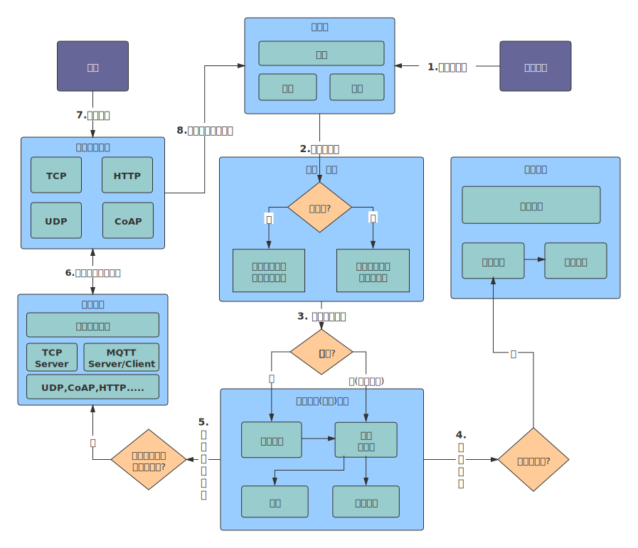

# 产品简介

### 什么是Jetlinks物联网平台
**Jetlinks物联网平台**是一个集成了设备接入、设备全生命周期管理、规则引擎、消息订阅等能力的一体化开源PAAS服务平台。向下支持连接海量设备，采集设备数据上云；向上提供北向输出功能和系统API，服务端可通过调用API将指令下发至设备端，实现远程控制。

### 产品架构图

### 设备接入流程

### 许可版本
JetLinks所有版本均开放源代码.

  
  注意
 JetLinks使用模块化(git submodule+maven)管理,部分核心模块是单独的仓库并定期发布到maven中央仓库。可在github (opens new window)中找到全部代码。

