# 规则引擎

规则引擎是**可视化**的系统数据逻辑处理工具，可自定义数据处理**规则编排**，以及可视化的**场景联动**规则配置。 

## 规则编排
#### 新增
##### 操作步骤
1.**登录**Jetlinks物联网平台。 
2.在左侧导航栏，选择**规则引擎>规则编排**，进入列表页。 
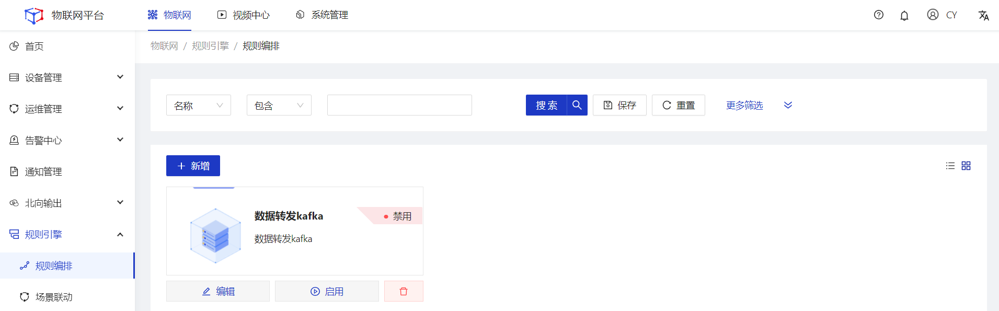
3.点击**新增**按钮，在弹框页填写名称，然后点击**确定**按钮。 
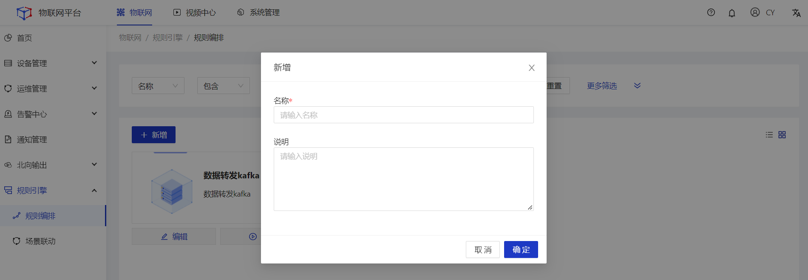
4.点击卡片，进入画布页，**拖拽**左侧组件到画布页，并**双击**组件，填写相关配置。 
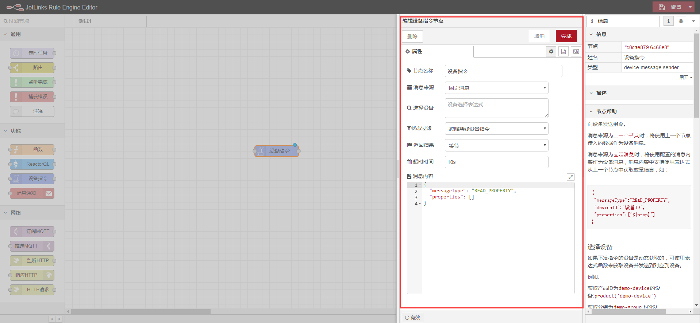
5.将多个组件之间，通过**连线**进行连接。 
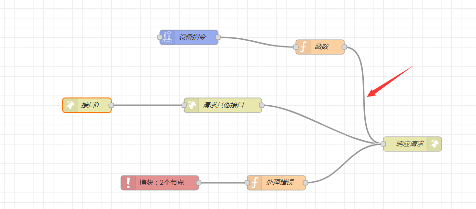
6.点击页面右上角**部署**。 

#### 编辑
##### 操作步骤
1.**登录**Jetlinks物联网平台。 
2.在左侧导航栏，选择**规则引擎>规则编排**，进入列表页。 
3.点击具体数据的**编辑**按钮，在弹框页编辑名称，然后点击**确定**按钮。 
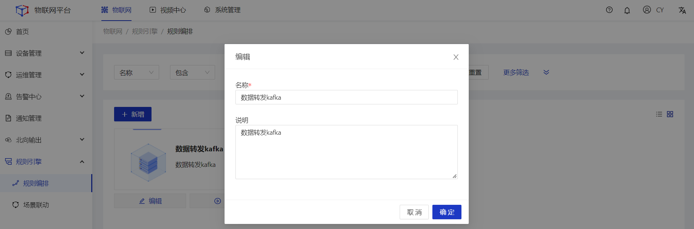

  
  注意
  产品不支持编辑，同一个产品只能配置一个映射规则。

#### 启用/禁用
##### 操作步骤
1.**登录**Jetlinks物联网平台。 
2.在左侧导航栏，选择**规则引擎>规则编排**，进入列表页。 
3.点击具体数据的**启用/禁用**按钮，然后点击**确定**。 
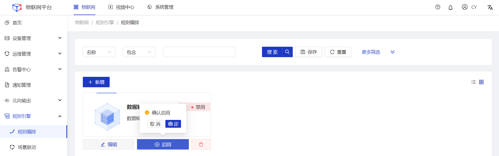

#### 删除
##### 操作步骤
1.**登录**Jetlinks物联网平台。 
2.在左侧导航栏，选择**规则引擎>规则编排**，进入列表页。 
3.选择具体数据的**删除**按钮，然后点击**确定**。 
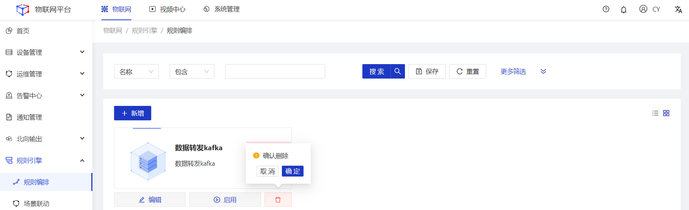

## 场景联动
#### 新增
##### 操作步骤
1.**登录**Jetlinks物联网平台。 
2.在左侧导航栏，选择**规则引擎>场景联动**，进入列表页。 

3.点击**新增**按钮，在详情页选择**触发方式**。 
4.根据触发方式填写**触发条件**（选择设备触发时有此配置项）、**执行动作**，然后点击**保存**。 
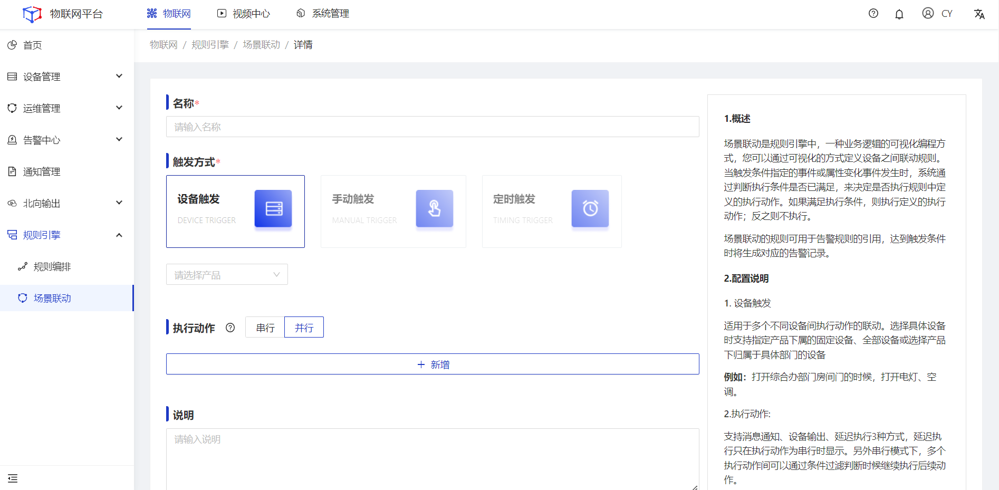

#### 编辑
##### 操作步骤
1.**登录**Jetlinks物联网平台。 
2.在左侧导航栏，选择**规则引擎>场景联动**，进入列表页。 
3.点击具体数据的**编辑**按钮，在详情页填写具体配置，然后点击**保存**。 
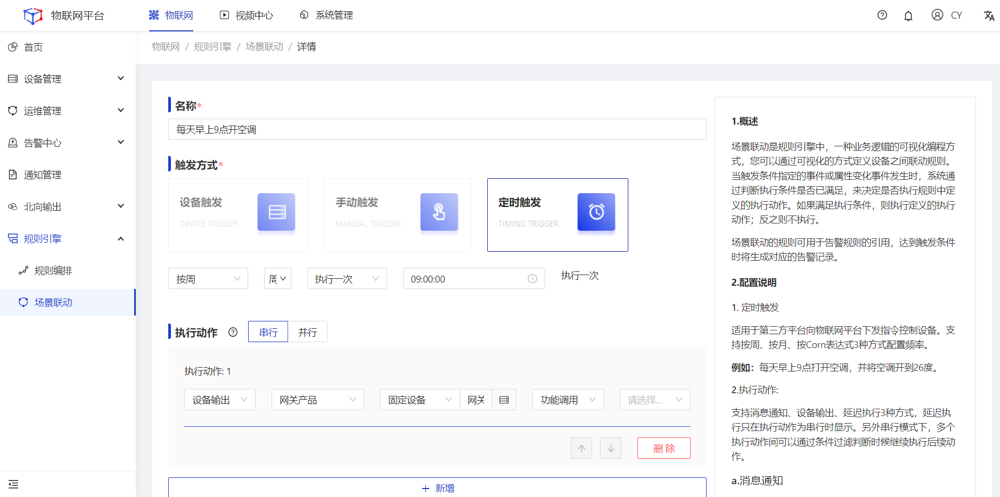

#### 启用/禁用
##### 操作步骤
1.**登录**Jetlinks物联网平台。 
2.在左侧导航栏，选择**规则引擎>场景联动**，进入列表页。 
3.点击具体数据的**启用/禁用**按钮，然后点击**确定**。 
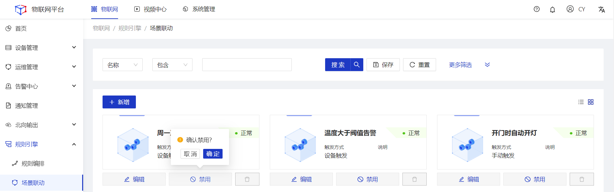

#### 删除
##### 操作步骤
1.**登录**Jetlinks物联网平台。 
2.在左侧导航栏，选择**规则引擎>规则编排**，进入列表页。 
3.选择具体数据的**删除**按钮，然后点击**确定**。 
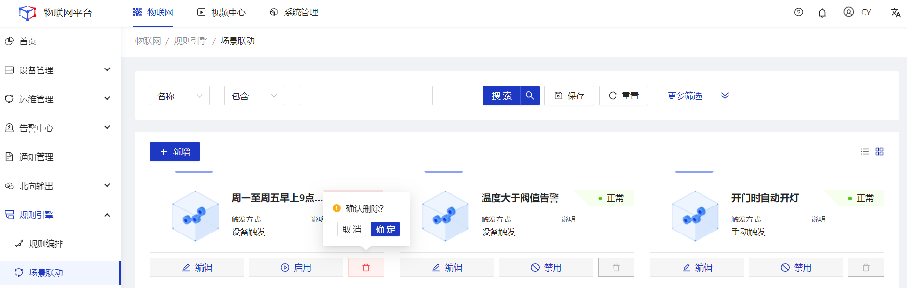

