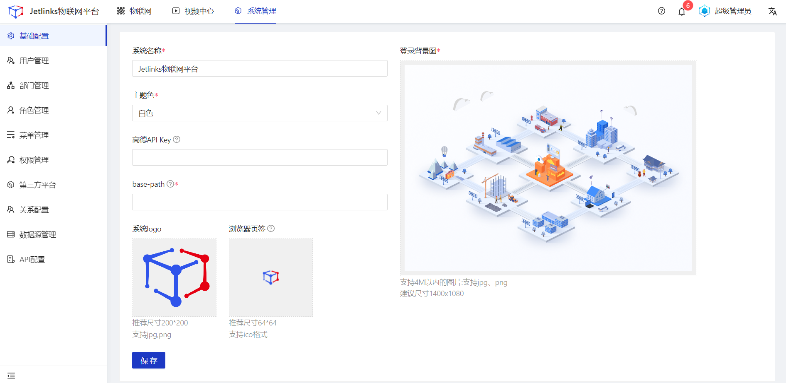

## 基础配置
对系统的名称、风格、登录页、LOGO等基础信息进行维护管理。 

#### 基础信息配置
##### 操作步骤
1.<a>登录</a>Jetlinks物联网平台。 
2.点击顶部**系统管理**，在左侧导航栏，选择**基础配置**，进入详情页。 
3.填写基础信息，然后点击**保存**。 

  
  说明
  不填写高德API Key，系统内基于地图展示的功能均不可使用。

## 用户管理
统一维护管理系统内的所有用户信息，用户的账号密码可用于登录本系统。 

#### 新增
##### 操作步骤
1.<a>登录</a>Jetlinks物联网平台。 
2.点击顶部**系统管理**，在左侧导航栏，选择**用户管理**，进入列表页。 

3.点击**新增**按钮，在弹框页中填写用户信息，然后点击**确定**。 

#### 编辑
##### 操作步骤
1.<a>登录</a>Jetlinks物联网平台。 
2.点击顶部**系统管理**，在左侧导航栏，选择**用户管理**，进入列表页。 
3.点击具体用户的**编辑**按钮，在弹框页中编辑用户信息，然后点击**确定**。 

#### 启用/禁用
##### 操作步骤
1.<a>登录</a>Jetlinks物联网平台。 
2.点击顶部**系统管理**，在左侧导航栏，选择**用户管理**，进入列表页。 
3.点击具体用户的**启用/禁用**按钮，然后点击**确定**。 

#### 重置密码
##### 操作步骤
1.<a>登录</a>Jetlinks物联网平台。 
2.点击顶部**系统管理**，在左侧导航栏，选择**用户管理**，进入列表页。 
3.点击具体用户的**重置密码**按钮，在弹框页重新设置用户登录密码，然后点击**确定**。 

#### 删除
##### 操作步骤
1.<a>登录</a>Jetlinks物联网平台。 
2.点击顶部**系统管理**，在左侧导航栏，选择**用户管理**，进入列表页。 
3.点击具体用户的**删除**按钮，然后点击**确定**。 

  
  警告
超级管理员被删除后，需手动修改数据库，请谨慎操作！

## 部门管理
统一维护管理系统内的组织架构信息，支持为每个部门分配产品、设备、用户。 

#### 新增
##### 操作步骤
1.<a>登录</a>Jetlinks物联网平台。 
2.点击顶部**系统管理**，在左侧导航栏，选择**部门管理**，进入列表页。 
3.点击左侧**新增**按钮，在弹框页填写部门信息，然后点击**确定**。 

#### 编辑
##### 操作步骤
1.<a>登录</a>Jetlinks物联网平台。 
2.点击顶部**系统管理**，在左侧导航栏，选择**部门管理**，进入列表页。 
3.鼠标移入左侧树中的具体数据，点击**编辑**按钮，在弹框页编辑部门信息，然后点击**确定**。 

#### 删除
##### 操作步骤
1.<a>登录</a>Jetlinks物联网平台。 
2.点击顶部**系统管理**，在左侧导航栏，选择**部门管理**，进入列表页。 
3.鼠标移入左侧树中的具体数据，点击**删除**按钮，然后点击**确定**。 

#### 分配资产
##### 操作步骤
1.<a>登录</a>Jetlinks物联网平台。 
2.点击顶部**系统管理**，在左侧导航栏，选择**部门管理**，进入列表页。 
3.鼠标点击左侧树中的具体节点，点击页面右侧tab，选择要分类的资产类型（产品、设备、用户），点击**资产分配**按钮，在弹框页勾选需要分配的资产，然后点击**确定**。 

##### 后续步骤
1.资产解绑 
勾选需要解绑的资产数据或点击具体资产的解绑按钮，可进行批量解绑或单个解绑。
2.编辑资产权限 
点击具体资产的**编辑**按钮，在弹框页面编辑资产数据权限。

  
  说明
<li>用户类型的资产不涉及此功能。</li>
<li>同一个设备可以被分配至多个部门。</li>

## 角色管理
统一维护管理系统内的角色，角色可与权限进行关联，以实现不同角色查看不同菜单，不同用户查看同一菜单下不同数据。

  
  说明
当前只有产品、设备、产品分类3个菜单支持数据权限。

