# 视频设备
## 视频设备

视频设备是对系统内所有视频类设备的统一接入与管理。支持GB/T28181和固定地址2种方式的接入。 

#### 新增
##### 操作步骤
1.**登录**Jetlinks物联网平台。 
2.点击顶部**视频中心**，在左侧导航栏，选择**视频设备**，进入列表页。 
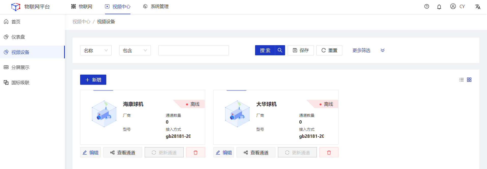
3.点击**新增**按钮，进入详情页，填写设备信息，然后点击**保存**。 
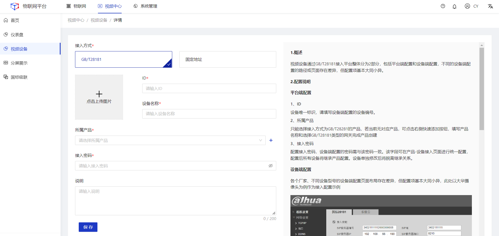

#### 编辑
##### 操作步骤
1.**登录**Jetlinks物联网平台。 
2.点击顶部**视频中心**，在左侧导航栏，选择**视频设备**，进入列表页。 
3.点击具体数据的**编辑**按钮，进入详情页，编修所需要修改的信息，然后点击**确定**按钮。 
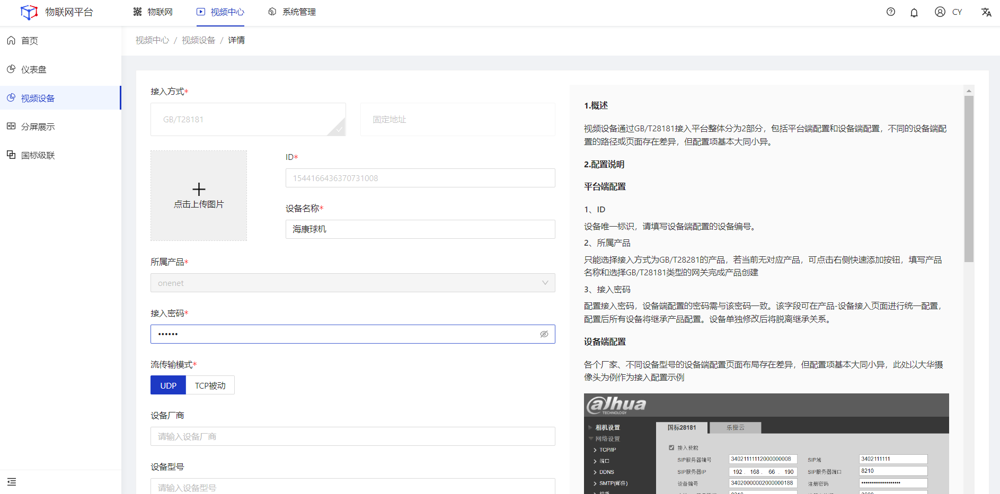

#### 删除
##### 操作步骤
1.**登录**Jetlinks物联网平台。 
2.点击顶部**视频中心**，在左侧导航栏，选择**视频设备**，进入列表页。 
3.点击具体数据的**删除**按钮，然后点击**确定**。 
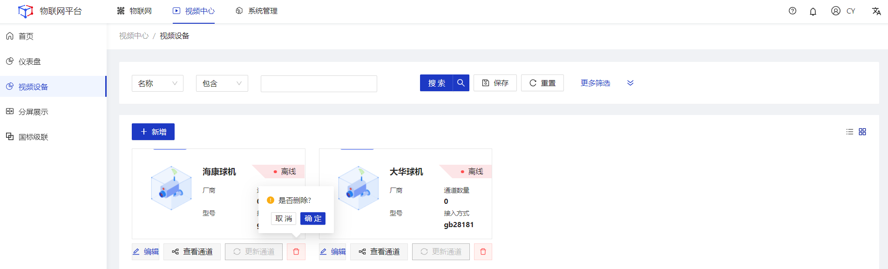

#### 查看通道
##### 操作步骤
1.**登录**Jetlinks物联网平台。 
2.点击顶部**视频中心**，在左侧导航栏，选择**视频设备**，进入列表页。 
3.点击具体数据的**查看通道**按钮，进入详情页。 
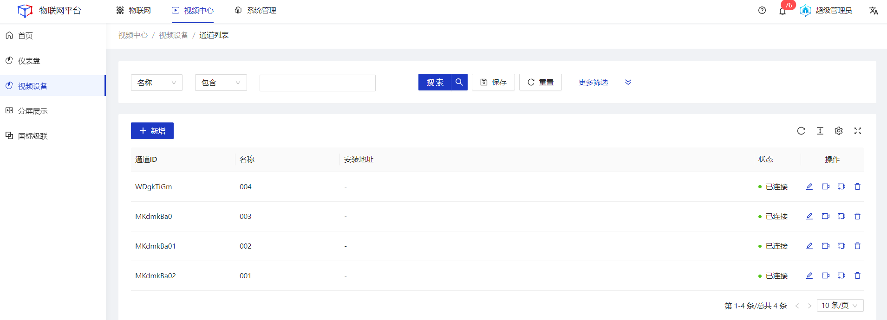

#### 后续步骤
1.新增通道 
点击页面左上角新增按钮，填写通道信息。
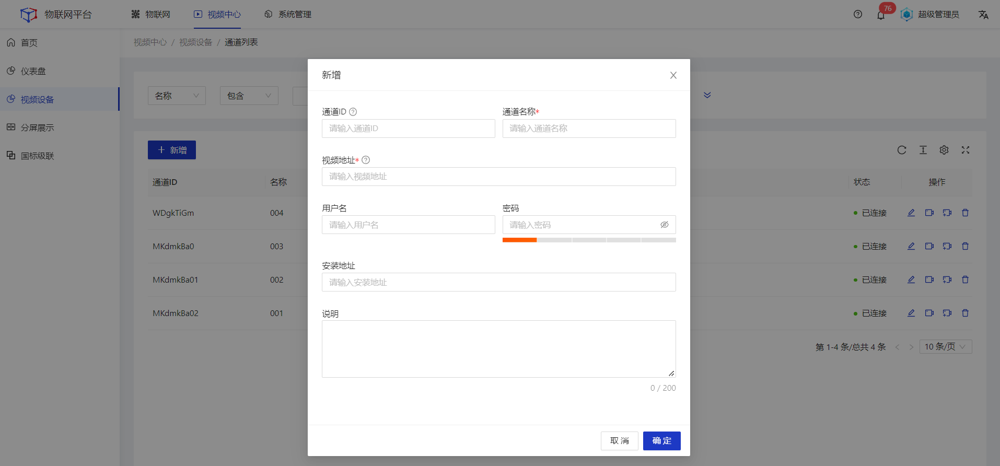

  
  说明
 只有固定地址接入类型的设备才可以新增通道。

2.播放通道实时视频流 
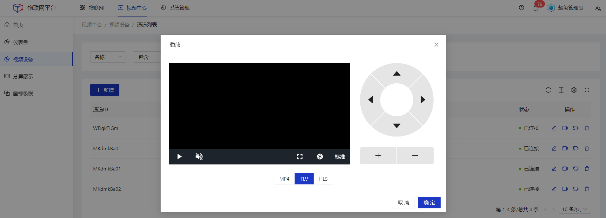

3.回放视频 
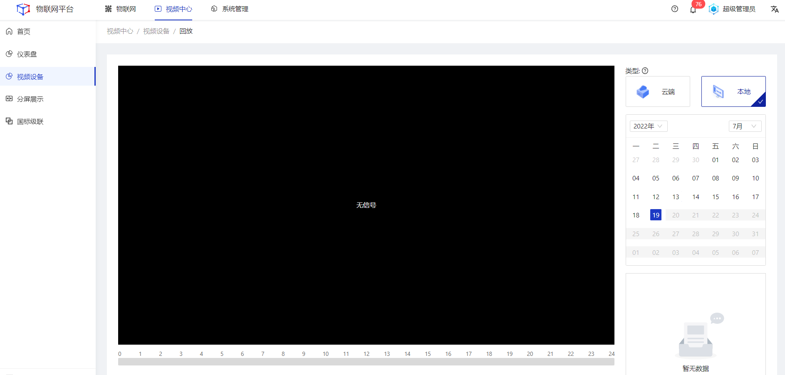

4.删除通道 
点击通道操作列的**删除**按钮，然后点击确定。

  
  说明
  只有固定地址接入类型的设备才可以删除通道。

## 分屏展示

分屏展示对摄像头监控画面进行播放，支持单屏，四分屏，九分屏，和全屏，对于可以旋转的摄像头也可以通过右边的操作按钮调整摄像头方向。 

#### 查看
##### 操作步骤
1.**登录**Jetlinks物联网平台。 
2.点击顶部**视频中心**，在左侧导航栏，选择**分屏展示**，进入详情页。 
3.点击左侧通道树，点击需要被查看的通道。 

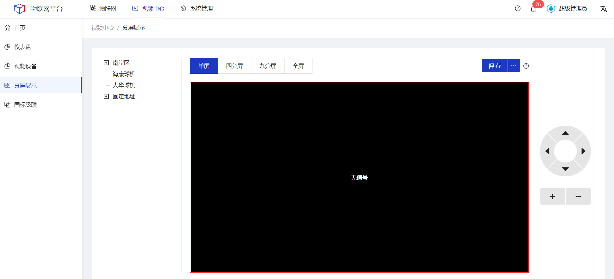

##### 后续步骤
1.保存分屏信息 
点击页面右上角**保存**按钮，可保存当前页面所选择的通道数据，后续进入该页面时，点击点击保存按钮右侧的折叠按钮，选择保存的分屏展示信息，进行快速回显。

## 国标级联

该功能通过GB/T28181的方式将本地平台的设备推送给上级平台。 

#### 新增
##### 操作步骤
1.**登录**Jetlinks物联网平台。 
2.点击顶部**视频中心**，在左侧导航栏，选择**国标级联**，进入列表页。 
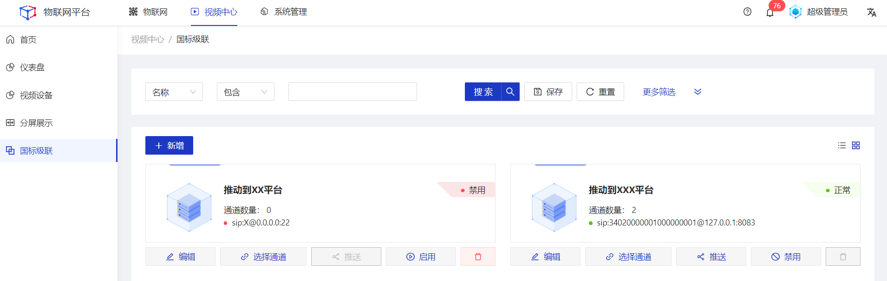
3.点击左上角**新增**按钮，进入详情页填写相关信息，然后点击**保存**。 
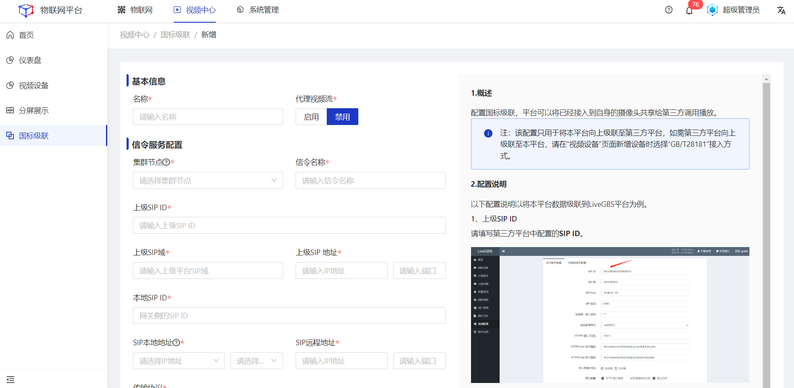

#### 编辑
##### 操作步骤
1.**登录**Jetlinks物联网平台。 
2.点击顶部**视频中心**，在左侧导航栏，选择**国标级联**，进入列表页。 
3.点击具体数据的**编辑**按钮，编辑相关配置信息，然后点击**保存**。 
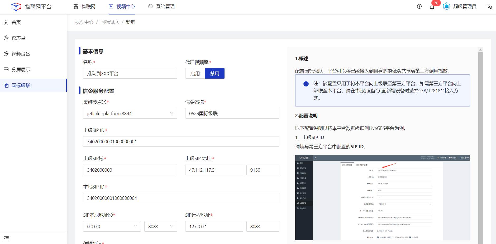

#### 选择通道
##### 操作步骤
1.**登录**Jetlinks物联网平台。 
2.点击顶部**视频中心**，在左侧导航栏，选择**国标级联**，进入列表页。 
3.点击具体数据的**选择通道**按钮，进入详情页。 
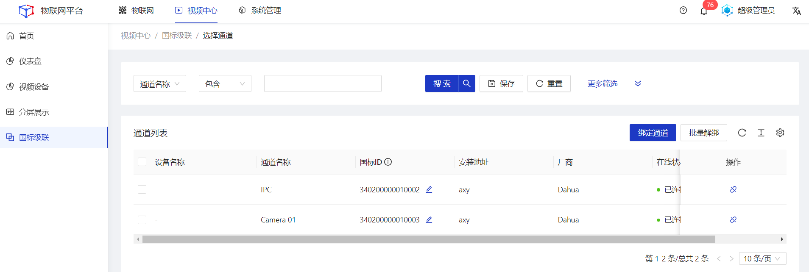
4.点击绑定通道按钮，在弹框页面中勾选需要被推送的通道，然后点击**保存**。 
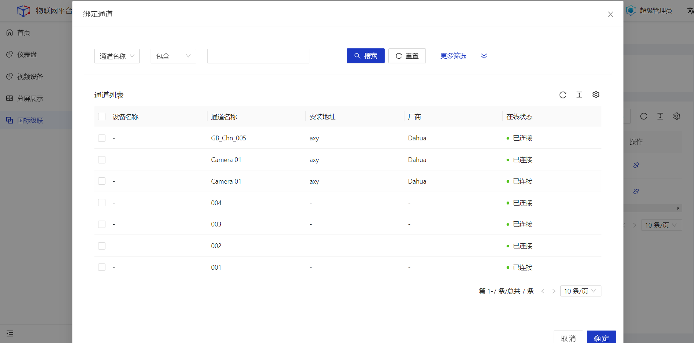

##### 后续步骤
1.编辑国标ID 
点击国标ID字段后方的**编辑**ICON，重新填写**18位**或**20位**的ID。
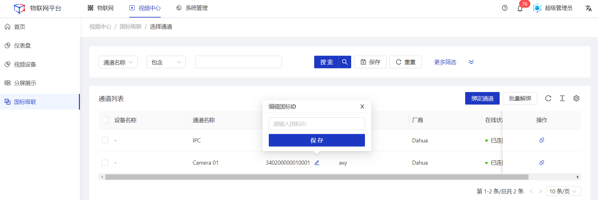

  
  注意
  国标ID必须符合GB/T28181协议规范，否则将导致级联推送失败。

2.解绑 
勾选通道列表数据，点击页面右上角**批量解绑**按钮，或直接点击通道列表操作列的**解绑**按钮，可将对应通道与该级联配置解绑。
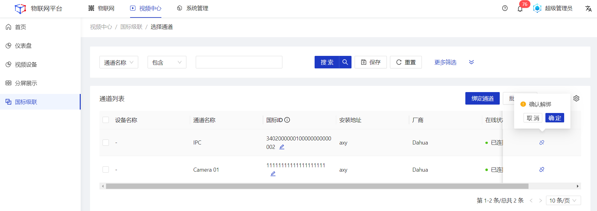

#### 启用/禁用
##### 操作步骤
1.**登录**Jetlinks物联网平台。 
2.点击顶部**视频中心**，在左侧导航栏，选择**国标级联**，进入列表页。 
3.点击具体数据的**启用/禁用**按钮，然后点击**确定**。 
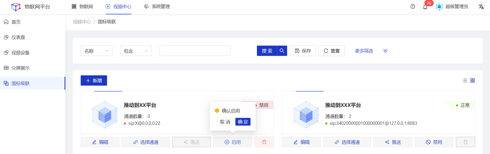

#### 删除
##### 操作步骤
1.**登录**Jetlinks物联网平台。 
2.点击顶部**视频中心**，在左侧导航栏，选择**国标级联**，进入列表页。 
3.点击具体数据的**删除**按钮，然后点击**确定**。 
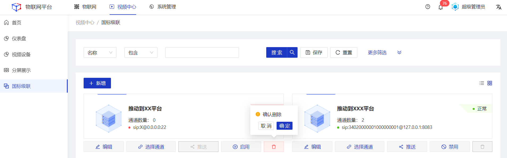
