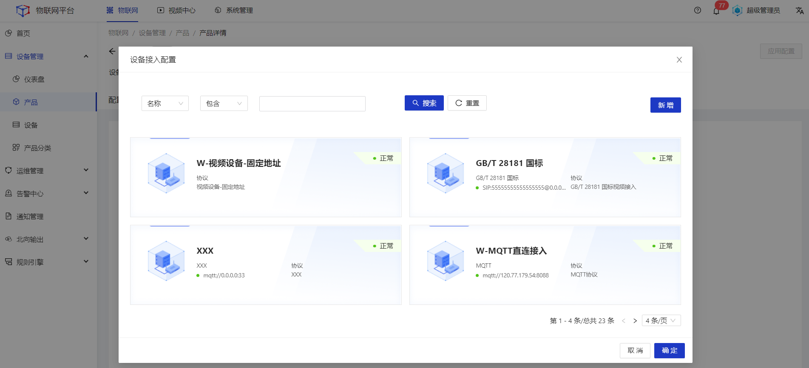
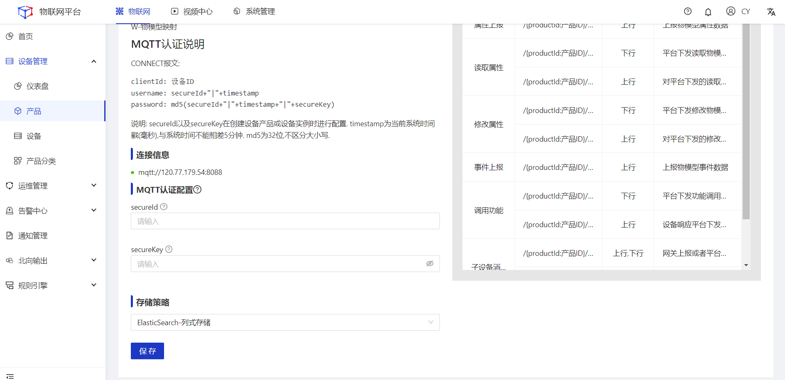
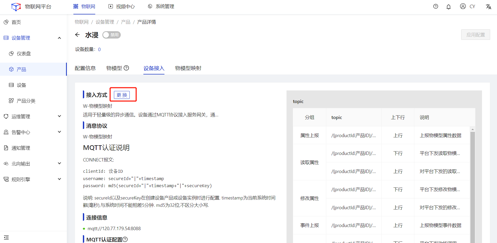

## 设备接入

#### 新增
##### 操作步骤
1.**登录**Jetlinks物联网平台。
2.在左侧导航栏，选择**设备管理>产品**，点击**查看**，切换至设备接入tab页。
3.在设备接入tab页中选择设备接入方式，然后单击**确定**。

##### 后续步骤
1.填写产品接入相关参数，然后点击**保存**。

  
  注意
  接入配置中的参数根据所选择的接入方式以及协议包内容动态显示。

#### 更换接入方式
##### 操作步骤
1.**登录**Jetlinks物联网平台。
2.在左侧导航栏，选择**设备管理>产品**，点击**查看**，切换至设备接入tab页。
3.在设备接入tab页中点击**更换**，重新选择接入方式后，单击**确定**。

  
  注意
  当前产品下若已接入设备，不支持更换接入方式。

