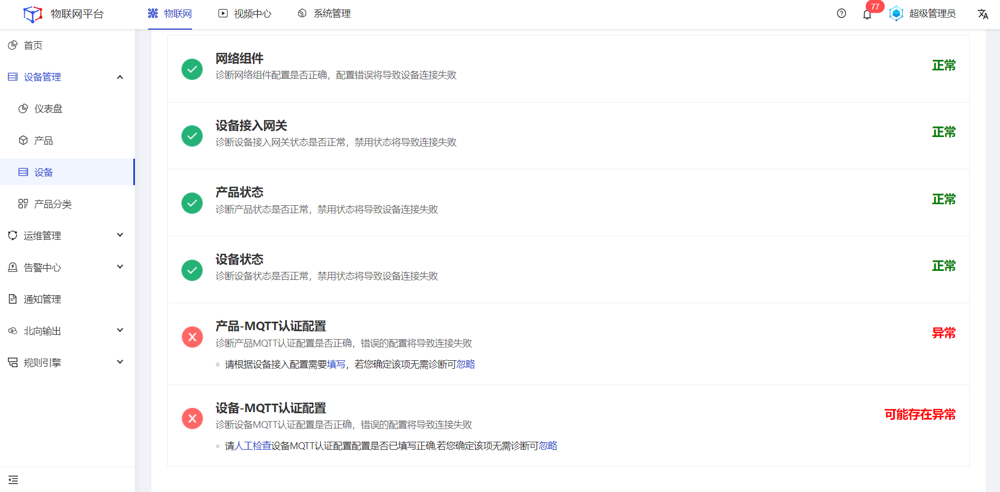
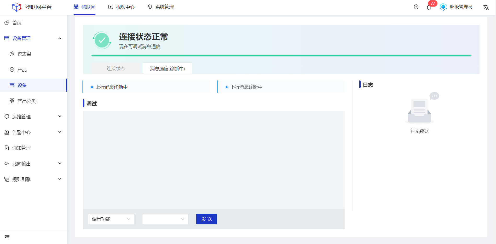

### 设备诊断

#### 连接状态诊断
##### 操作步骤
1.<a>登录</a>Jetlinks物联网平台。
2.在左侧导航栏，选择**设备管理>设备**，点击**查看**，切换至设备诊断tab页。
3.根据系统自动诊断结果，对**异常**或**可能存在异常**的检查项进行处理。

 

  
  说明
 <li>人工检查：人工核查一遍对应诊断项的配置参数是否填写正确。</li>
 <li>忽略：人工判断该检查项不影响设备接入平台时，可直接点击忽略。

4.连接成功后，点击**消息通信**按钮，切换至消息通信tab，选择**调用功能**或**操作属性**。
5.配置完成后，点击**发送**按钮，在对话框中查看具体的上下行消息，同时可查看页面右侧详细日志数据。

