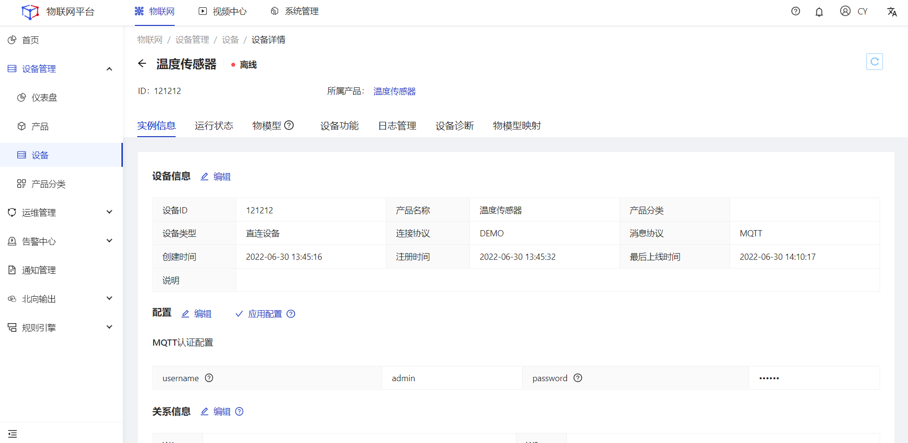

### 实例信息

#### 实例信息管理
##### 操作步骤
1.**登录**Jetlinks物联网平台。
2.在左侧导航栏，选择**设备管理>设备**，列表页中点击**查看**按钮，进入实例信息页面。

实例信息是对设备实例信息的统一管理，该页面包括设备信息、设备所属产品自定义的标签信息、接入配置信息、关系信息。除设备信息外，其他信息根据产品接入配置、系统配置**动态显示**。

### 后续步骤
1.点击基本信息卡片中的**编辑**按钮，可以修改基本信息。
2.点击配置信息卡片中的**编辑**按钮，可修改配置信息。
3.点击关系信息卡片中的**编辑**按钮，可绑定设备与用户之间的关系，例如`设备负责人`。

