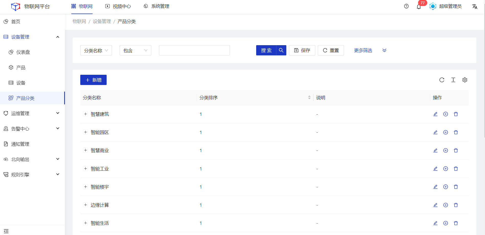
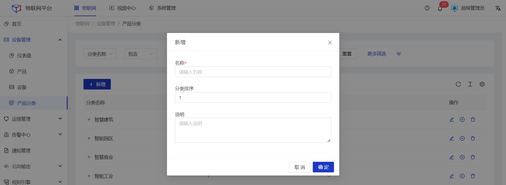
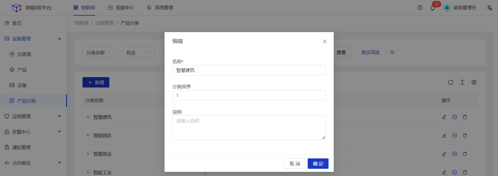
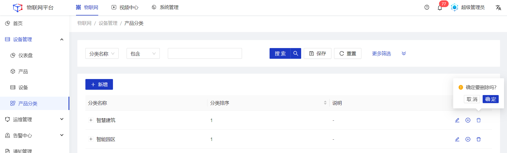

## 产品分类

#### 新增
##### 操作步骤
1.<a>登录</a>Jetlinks物联网平台。
2.在左侧导航栏，选择**设备管理>产品分类**，进入列表页。

3.点击**新增**按钮，在新增弹框中填写配置信息，然后点击**确定**。

#### 编辑
##### 操作步骤
1.<a>登录</a>Jetlinks物联网平台。
2.在左侧导航栏，选择**设备管理>产品分类**，进入列表页。
3.点击具体分类的**编辑**按钮，在编辑弹框中修改配置信息，然后点击**确定**。

#### 添加子分类
##### 操作步骤
1.<a>登录</a>Jetlinks物联网平台。
2.在左侧导航栏，选择**设备管理>产品分类**，进入列表页。
3.点击具体分类的**添加子分类**按钮，在编辑弹框中修改配置信息，然后点击**确定**。

#### 删除
##### 操作步骤
1.<a>登录</a>Jetlinks物联网平台。
2.在左侧导航栏，选择**设备管理>产品分类**，进入列表页。
3.点击具体分类的**删除**按钮，然后点击**确定**。

  
  注意
 <li>已经被产品绑定的分类，不可删除。</li>
 <li>删除父节点时，子节点也会被一起删除。</li>

