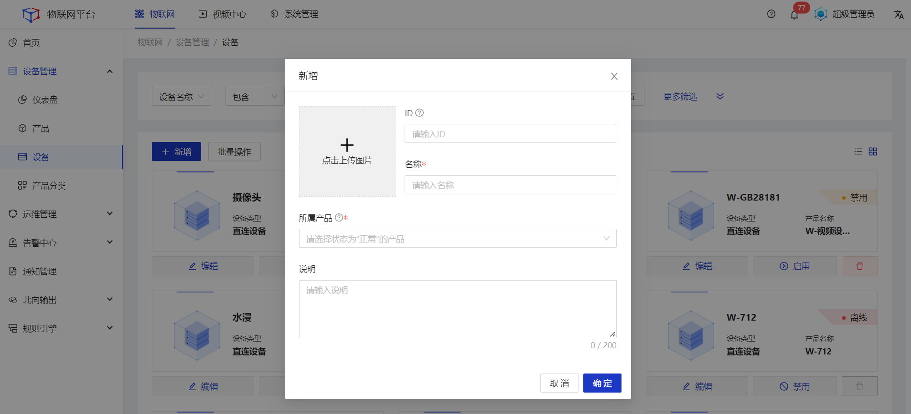
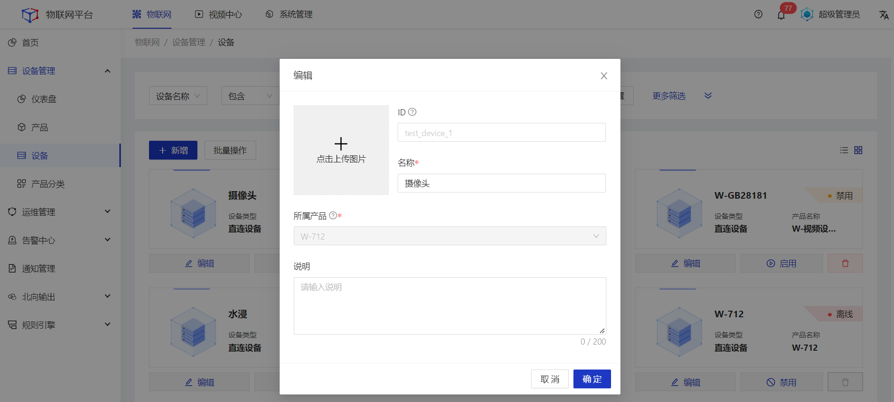
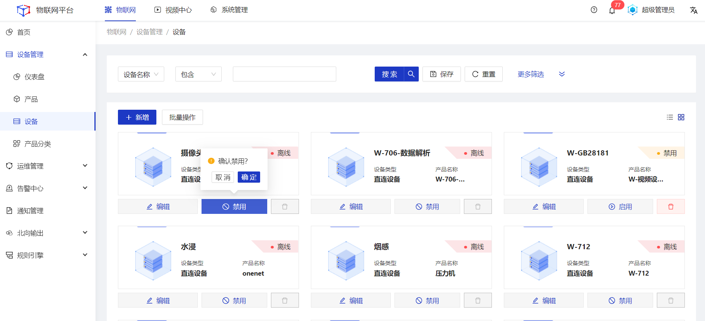
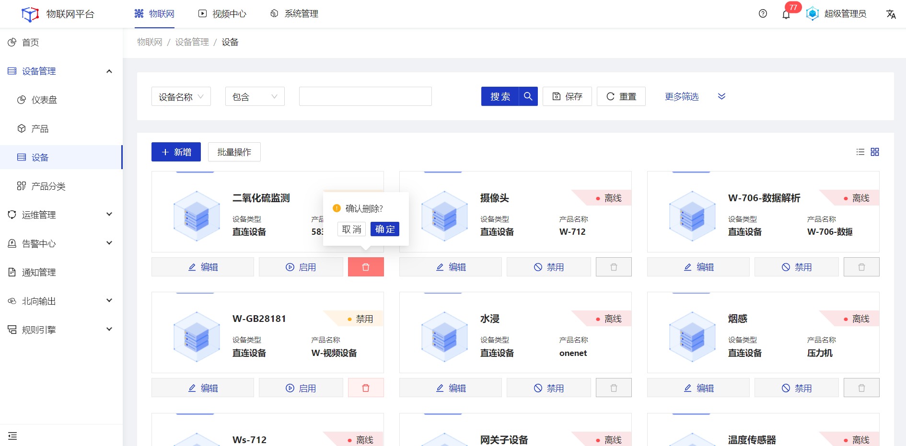

## 列表功能

#### 新增
##### 操作步骤
1.<a>登录</a>Jetlinks物联网平台。
2.在左侧导航栏，选择**设备管理>设备**，点击**新增**。
3.在**新建**弹框中，根据设备实际情况，按照页面提示填写信息，然后单击**确定**。

<!-- <table class='table'>
        <thead>
            <tr>
              <td>参数</td>
              <td>说明</td>
            </tr>
        </thead>
        <tbody>
          <tr>
            <td>ID</td>
            <td>设备唯一标识，在系统内具有全局唯一性。 </td>
          </tr>
          <tr>
            <td>名称</td>
            <td>为设备命名，最多可输入64个字符。</td>
          </tr>
          <tr>
            <td>所属产品</td>
            <td>单选下拉框，只能选择正常状态下的产品。</td>
          </tr>
          <tr>
            <td>标签</td>
            <td>设备基于业务需要，自定义补充的标签信息。</td>
          </tr>
         </tbody>
</table> -->

#### 编辑 
##### 操作步骤
1.<a>登录</a>Jetlinks物联网平台。
2.在左侧导航栏，选择**设备管理>设备**，选择具体设备。点击**编辑**。
3.在**编辑**弹框中，编辑相关配置，然后单击**确定**。

  
  说明
   ID和所属产品不支持编辑。

#### 启用/禁用
##### 操作步骤
1.<a>登录</a>Jetlinks物联网平台。
2.在左侧导航栏，选择**设备管理>设备**，选择具体设备。点击**启用/禁用**。

  
  说明
 设备在离线/在线状态时，按钮显示为禁用；设备在禁用状态时，按钮显示为启用。

#### 删除
##### 操作步骤
1.<a>登录</a>Jetlinks物联网平台。
2.在左侧导航栏，选择**设备管理>设备**，选择具体设备。点击**删除**。

  
  说明
 设备在离线/在线状态时，不可删除。

#### 批量操作
##### 操作步骤
1.<a>登录</a>Jetlinks物联网平台。
2.在左侧导航栏，选择**设备管理>设备**，点击**批量操作**。
   + 点击导入，可在对应产品下批量导入设备基础数据。
   + 点击导出，不选择产品时导出所有设备基础数据，选择产品时导出对应产品下的设备数据。
   + 点击激活全部设备，向所有设备发送激活指令。
   + 点击同步设备状态，平台读取一遍所有设备的最新状态数据。

