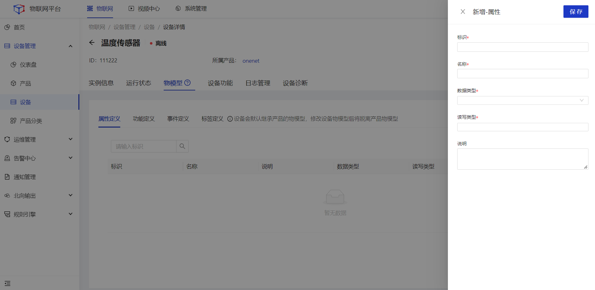

### 物模型

#### 新增
##### 操作步骤
1.**登录**Jetlinks物联网平台。
2.在左侧导航栏，选择**设备管理>设备**，点击**查看**，切换至物模型tab页，并点击**新增**按钮。
3.在**新建**抽屉中，根据设备实际情况，按照页面提示填写信息，然后单击**确定**。

###### 属性参数说明
<table class='table'>
        <thead>
            <tr>
              <td>标识</td>
              <td>同一个产品内属性标识具有唯一性，不支持编辑</td>
            </tr>
        </thead>
        <tbody>
          <tr>
            <td>名称</td>
            <td>为设备命名，最多可输入64个字符。</td>
          </tr>
          <tr>
            <td>数据类型</td>
            <td>1. int32：32位整型。需定义取值范围、步长和单位符号。 2. float：单精度浮点型。需定义取值范围、步长和单位符号。 3. double：双精度浮点型。需定义取值范围、步长和单位符号。 4. enum：枚举型。定义枚举项的参数值和参数描述，例如1-加热模式、2-制冷模式等。 5. bool：布尔型。采用0或1来定义布尔值，例如0-关；1-开。 6. text：字符串。需定义字符串的数据长度，最长支持2048字节。 7. date：时间戳。默认格式为String类型的UTC时间戳，单位：毫秒。 8. object：JSON对象。定义一个JSON结构体，新增JSON参数项，例如定义灯的颜色是由Red、Green、Blue三个参数组成的结构体。 miniui版本不支持结构体嵌套。 9. array：数组。需声明数组内元素的数据类型，可选择int32、float、double、text或object。需确保同一个数组元素类型相同。数组内可包含1-128个元素。 10. file：文件。需声明文件元素类型，可选择URL、base64、binary(二进制)。 11. password：密码。上报时如果属性为密码，将进行加密或者是隐秘的方式进行显现或者处理。 
</td>
         </td>
          </tr>
          <tr>
            <td>单位</td>
            <td>单选下拉框，可选择为无或根据实际情况选择。</td>
          </tr>
         <tr>
            <td>精度</td>
            <td>控制所需的小数位数。</td>
          </tr>
         <tr>
            <td>最大长度</td>
            <td>单位为字节。</td>
          </tr>
         <tr>
            <td>来源</td>
            <td>单选下拉框，支持设备、手动、规则。</td>
          </tr>
          <tr>
            <td>读写类型</td>
            <td>单选下拉框，支持读、写、上报</td>
          </tr>
          </tbody>
</table>

###### 功能参数说明
<table class='table'>
        <thead>
            <tr>
              <td>标识</td>
              <td>同一个产品内功能标识具有唯一性，不支持编辑</td>
            </tr>
        </thead>
        <tbody>
          <tr>
            <td>名称</td>
            <td>为功能命名，最多可输入64个字符。</td>
          </tr>
         <tr>
            <td>是否异步</td>
            <td>异步：服务为异步调用时，云端执行调用后直接返回结果，不会等待设备的回复消息。 同步：服务为同步调用时，云端会等待设备回复；若设备没有回复，则调用超时。</td>
          </tr>
          <tr>
            <td>输入参数</td>
            <td>定义功能的输入参数标识、名称、数据类型。
            </td>
          </tr>
          <tr>
            <td>输出参数</td>
            <td>1. int32：32位整型。需定义取值范围、步长和单位符号。 2. float：单精度浮点型。需定义取值范围、步长和单位符号。 3. double：双精度浮点型。需定义取值范围、步长和单位符号。 4. enum：枚举型。定义枚举项的参数值和参数描述，例如1-加热模式、2-制冷模式等。 5. bool：布尔型。采用0或1来定义布尔值，例如0-关；1-开。 6. text：字符串。需定义字符串的数据长度，最长支持2048字节。 7. date：时间戳。默认格式为String类型的UTC时间戳，单位：毫秒。 8. object：JSON对象。定义一个JSON结构体，新增JSON参数项，例如定义灯的颜色是由Red、Green、Blue三个参数组成的结构体。 miniui版本不支持结构体嵌套。 9. array：数组。需声明数组内元素的数据类型，可选择int32、float、double、text或object。需确保同一个数组元素类型相同。数组内可包含1-128个元素。 10. password：密码。上报时如果属性为密码，将进行加密或者是隐秘的方式进行显现或者处理。 
          </td>
      </tr>
</tbody>
</table>

###### 事件参数说明
<table class='table'>
        <thead>
            <tr>
              <td>标识</td>
              <td>同一个产品内事件标识具有唯一性，不支持编辑</td>
            </tr>
        </thead>
        <tbody>
          <tr>
            <td>名称</td>
            <td>为功能命名，最多可输入64个字符。</td>
          </tr>
         <tr>
            <td>级别</td>
            <td>单选下拉框，点击展开：普通、告警、紧急</td>
          </tr>
          <tr>
            <td>输出参数</td>
            <td> object：JSON对象。定义一个JSON结构体，新增JSON参数项，例如定义灯的颜色是由Red、Green、Blue三个参数组成的结构体。 miniui版本不支持结构体嵌套。 
            

              
              说明
            配置的事件的触发记录，将在设备“运行状态”左侧菜单中进行显示。
            

            </td>
          </tr>
           <tr>
            <td>JSON对象</td>
            <td>定义结构体的标识、名称、数据类型。</td>
          </tr>
</tbody>
</table>

###### 标签参数说明
<table class='table'>
        <thead>
            <tr>
              <td>标识</td>
              <td>同一个产品内标签标识具有唯一性，不支持编辑</td>
            </tr>
        </thead>
        <tbody>
          <tr>
            <td>名称</td>
            <td>为标签命名，最多可输入64个字符。</td>
          </tr>
          <tr>
            <td>输出参数</td>
            <td>1. int32：32位整型。需定义取值范围、步长和单位符号。 2. float：单精度浮点型。需定义取值范围、步长和单位符号。 3. double：双精度浮点型。需定义取值范围、步长和单位符号。 4. enum：枚举型。定义枚举项的参数值和参数描述，例如1-加热模式、2-制冷模式等。 5. bool：布尔型。采用0或1来定义布尔值，例如0-关；1-开。 6. text：字符串。需定义字符串的数据长度，最长支持2048字节。 7. date：时间戳。默认格式为String类型的UTC时间戳，单位：毫秒。 8. object：JSON对象。定义一个JSON结构体，新增JSON参数项，例如定义灯的颜色是由Red、Green、Blue三个参数组成的结构体。 miniui版本不支持结构体嵌套。 9. array：数组。需声明数组内元素的数据类型，可选择int32、float、double、text或object。需确保同一个数组元素类型相同。数组内可包含1-128个元素。 10. file：文件。需声明文件元素类型，可选择URL、base64、binary(二进制)。 11. password：密码。上报时如果属性为密码，将进行加密或者是隐秘的方式进行显现或者处理。 
            </td>
           </tr>
           <tr>
            <td>标签类型</td>
            <td>单选下拉框，支持读、写、上报</td>
          </tr>
</tbody>
</table>

#### 编辑
##### 操作步骤
1.**登录**Jetlinks物联网平台。
2.在左侧导航栏，选择**设备管理>设备**，点击**查看**，切换至物模型tab页，并点击**编辑**按钮。
3.在**编辑**抽屉中，编辑相关参数，然后单击**确定**。

  
  注意
  标识不支持编辑。

#### 快速导入
##### 操作步骤
1.**登录**Jetlinks物联网平台。
2.在左侧导航栏，选择**设备管理>设备**，点击**查看**，切换至物模型tab页，并点击**快速导入**按钮。
3.在**导入物模型**弹框中，选择导入方式，并根据导入方式，选择需要导入的物模型，然后单击**确定**。

  
  注意
  导入的物模型会覆盖原来的属性、功能、事件、标签，请谨慎操作。

