## 产品
### 功能列表

#### 新增
##### 操作步骤
1.**登录**Jetlinks物联网平台。 
2.在左侧导航栏，选择**设备管理>产品**，点击**新增**。 
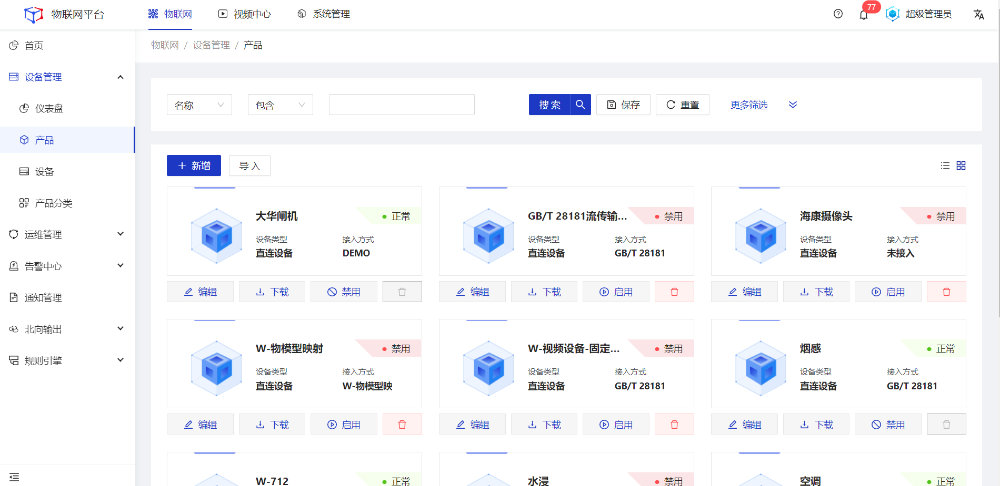
3.在**新建**弹框中，根据设备实际情况，按照页面提示填写信息，然后单击**确定**。 
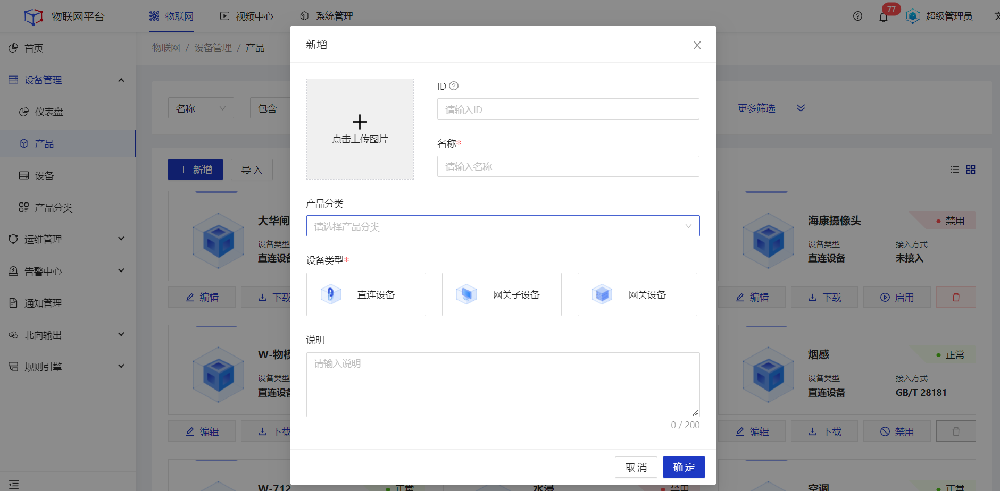

<table class='table'>
        <thead>
            <tr>
              <td>参数</td>
              <td>说明</td>
            </tr>
        </thead>
        <tbody>
          <tr>
            <td>ID</td>
            <td>设备唯一标识，在系统内具有全局唯一性。</td>
          </tr>
          <tr>
            <td>名称</td>
            <td>为设备命名，最多可输入64个字符。</td>
          </tr>
          <tr>
            <td>所属产品</td>
            <td>单选下拉框，非必填。可根据业务实际情况选择产品分类。</td>
          </tr>
          <tr>
            <td>说明</td>
            <td>备注说明信息，最多可输入200个字符</td>
          </tr>
        </tbody>
</table>

#### 编辑
##### 操作步骤
1.**登录**Jetlinks物联网平台。 
2.在左侧导航栏，选择**设备管理>产品**，选择具体产品。点击**编辑**。 
3.在**编辑**弹框中，编辑相关配置，然后单击**确定**。 
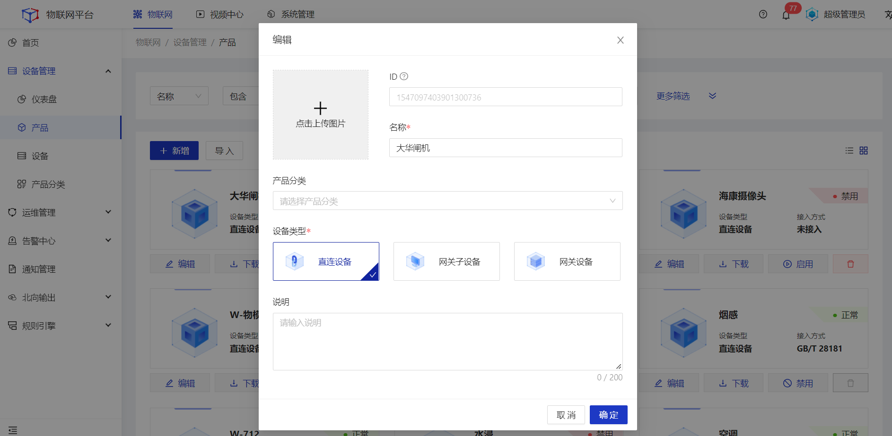

  

    
    说明
  

 ID不可编辑。

#### 启用/禁用
##### 操作步骤
1.**登录**Jetlinks物联网平台。 
2.在左侧导航栏，选择**设备管理>产品**，选择具体产品。点击**启用/禁用**。 
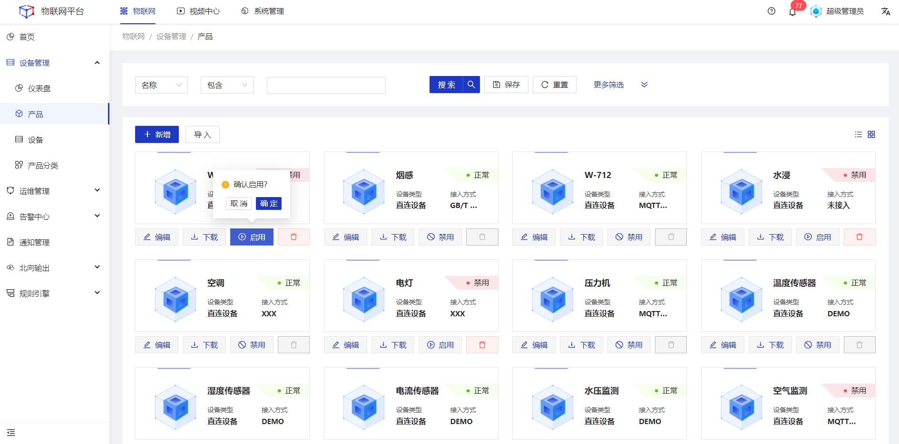

  

    
    说明
  

  <li>产品在正常状态时，按钮显示为禁用；产品在启用状态时，按钮显示为启用。</li>
  <li>产品禁用后，设备无法再接入。但不影响已经接入的设备。</li>

#### 删除
##### 操作步骤
1.**登录**Jetlinks物联网平台。 
2.在左侧导航栏，选择**设备管理>产品**，选择具体产品。点击**删除**。 
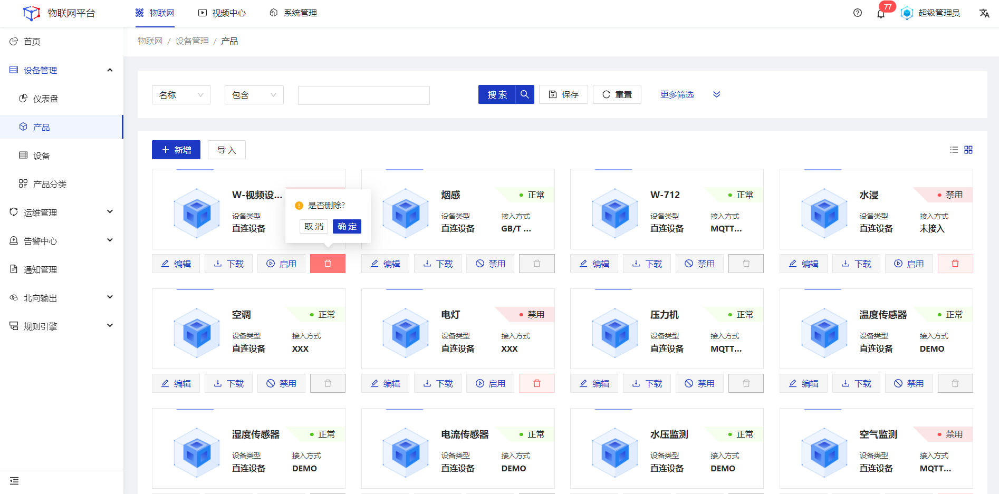

  

    
    说明
  

  产品在正常状态时，不可删除。

#### 导入
##### 操作步骤
1.**登录**Jetlinks物联网平台。 
2.在左侧导航栏，选择**设备管理>产品**，点击**导入**。 
3.选择需要导入的**JSON**文件，并上传。 

  

    
    说明
  

  导入数据根据ID进行匹配，系统中不存在对应ID时，将自动创建新产品，默认产品为禁用状态;系统中已存在对应ID时，将自动覆盖原产品数据。

#### 下载
##### 操作步骤
1.登录Jetlinks物联网平台。 
2.在左侧导航栏，选择**设备管理>产品**，选择具体产品，点击**下载**。 
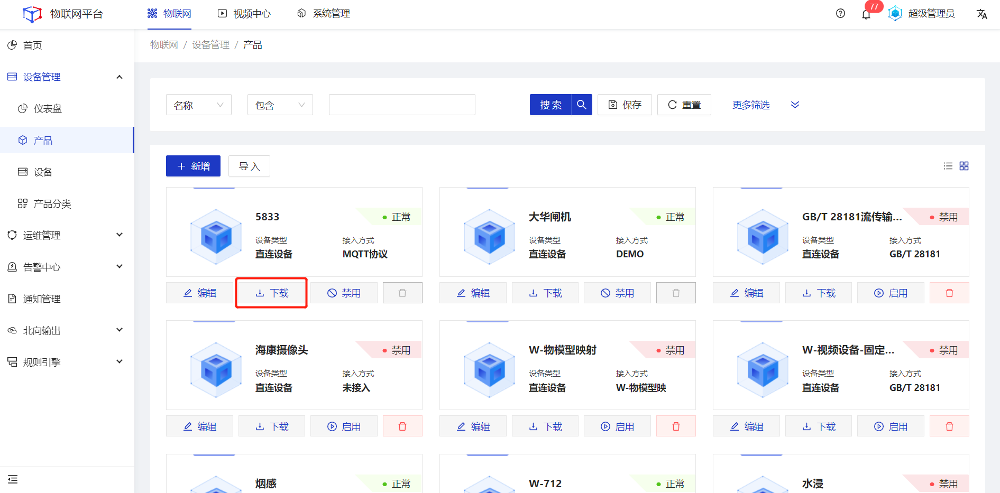

### 物模型

#### 新增
##### 操作步骤
1.**登录**Jetlinks物联网平台。 
2.在左侧导航栏，选择**设备管理>产品**，点击**查看**，切换至物模型tab页，并点击**新增**按钮。 
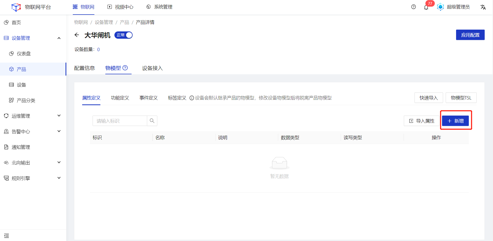
3.在**新建**抽屉中，根据设备实际情况，按照页面提示填写信息，然后单击右上角**保存**。 
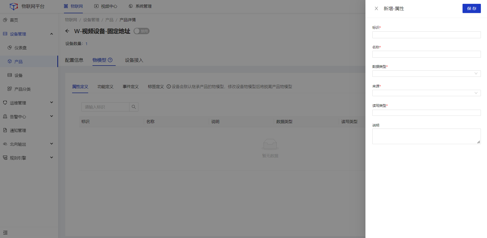

##### 属性参数说明

<table class='table'>
        <thead>
            <tr>
              <td>标识</td>
              <td>同一个产品内属性标识具有唯一性，不支持编辑</td>
            </tr>
        </thead>
        <tbody>
          <tr>
            <td>名称</td>
            <td>为设备命名，最多可输入64个字符。</td>
          </tr>
          <tr>
            <td>数据类型</td>
            <td>1. int32：32位整型。需定义单位。 2. float：单精度浮点型。需定义单位和精度。 3. double：双精度浮点型。需定义单位和精度。 4. enum：枚举型。定义枚举项的参数值和参数描述，例如1-加热模式、2-制冷模式等。 5. bool：布尔型。采用0或1来定义布尔值，例如0-关；1-开。 6. text：字符串。需定义字符串的数据长度，最长支持2048字节。 7. date：时间戳。默认格式为String类型的UTC时间戳，单位：毫秒。 8. object：JSON对象。定义一个JSON结构体，新增JSON参数项，例如定义灯的颜色是由Red、Green、Blue三个参数组成的结构体。 miniui版本不支持结构体嵌套。 9. array：数组。需声明数组内元素的数据类型，可选择int32、float、double、text或object。需确保同一个数组元素类型相同。数组内可包含1-128个元素。 10. file：文件。需声明文件元素类型，可选择URL、base64、binary(二进制)。 11. password：密码。上报时如果属性为密码，将进行加密或者是隐秘的方式进行显现或者处理。 </td>
          </tr>
          <tr>
            <td>单位</td>
            <td>单选下拉框，可选择为无或根据实际情况选择。</td>
          </tr>
         <tr>
            <td>精度</td>
            <td>控制所需的小数位数。</td>
          </tr>
         <tr>
            <td>最大长度</td>
            <td>单位为字节。</td>
          </tr>
           <tr>
            <td>读写类型</td>
            <td>多选下拉框，支持读、写、上报。</td>
          </tr>
          <tr>
            <td>存储配置</td>
            <td>单选下拉框，支持存储、不存储。
            </td>
          </tr>
         <tr>
            <td>来源</td>
            <td>单选下拉框，支持设备、手动、规则。</td>
          </tr>
          <tr>
            <td>读写类型</td>
            <td>多选下拉框，支持读、写、上报。</td>
          </tr>
           <tr>
            <td>说明</td>
            <td>备注说明，最多可输入200个字符。</td>
          </tr>
          </tbody>
</table>

##### 功能参数说明

<table class='table'>
        <thead>
            <tr>
              <td>标识</td>
              <td>同一个产品内功能标识具有唯一性，不支持编辑</td>
            </tr>
        </thead>
        <tbody>
          <tr>
            <td>名称</td>
            <td>为功能命名，最多可输入64个字符。</td>
          </tr>
         <tr>
            <td>是否异步</td>
            <td>异步：服务为异步调用时，云端执行调用后直接返回结果，不会等待设备的回复消息。 同步：服务为同步调用时，云端会等待设备回复；若设备没有回复，则调用超时。</td>
          </tr>
          <tr>
            <td>输入参数</td>
            <td>定义功能的输入参数标识、名称、数据类型。</td>
          </tr>
          <tr>
            <td>输出参数</td>
            <td>1. int32：32位整型。需定义单位。 2. float：单精度浮点型。需定义单位和精度。 3. double：双精度浮点型。需定义单位和精度。 4. enum：枚举型。定义枚举项的参数值和参数描述，例如1-加热模式、2-制冷模式等。 5. bool：布尔型。采用0或1来定义布尔值，例如0-关；1-开。 6. text：字符串。需定义字符串的数据长度，最长支持2048字节。 7. date：时间戳。默认格式为String类型的UTC时间戳，单位：毫秒。 8. object：JSON对象。定义一个JSON结构体，新增JSON参数项，例如定义灯的颜色是由Red、Green、Blue三个参数组成的结构体。 miniui版本不支持结构体嵌套。 9. array：数组。需声明数组内元素的数据类型，可选择int32、float、double、text或object。需确保同一个数组元素类型相同。数组内可包含1-128个元素。 10. password：密码。上报时如果属性为密码，将进行加密或者是隐秘的方式进行显现或者处理。 
            </td>
            </tr>
           <tr>
            <td>说明</td>
            <td>备注说明，最多可输入200个字符。</td>
          </tr>
</tbody>
</table>

##### 事件参数说明
<table class='table'>
        <thead>
            <tr>
              <td>标识</td>
              <td>同一个产品内事件标识具有唯一性，不支持编辑</td>
            </tr>
        </thead>
        <tbody>
          <tr>
            <td>名称</td>
            <td>为事件命名，最多可输入64个字符。</td>
          </tr>
         <tr>
            <td>级别</td>
            <td>单选下拉框，点击展开：普通、告警、紧急</td>
          </tr>
          <tr>
            <td>输出参数</td>
            <td> object：JSON对象。定义一个JSON结构体，新增JSON参数项，例如定义灯的颜色是由Red、Green、Blue三个参数组成的结构体。 miniui版本不支持结构体嵌套。 

    说明
    <ul>
事件的触发记录，将在设备“运行状态”左侧菜单中进行显示。
    </ul>
  

              </td>
           <tr>
            <td>JSON对象</td>
            <td>定义结构体的标识、名称、数据类型。</td>
          </tr>
          <tr>
            <td>说明</td>
            <td>备注说明，最多可输入200个字符。</td>
          </tr>
</tbody>
</table>

##### 标签参数说明
<table class='table'>
        <thead>
            <tr>
              <td>标识</td>
              <td>同一个产品内标签标识具有唯一性，不支持编辑</td>
            </tr>
        </thead>
        <tbody>
          <tr>
            <td>名称</td>
            <td>为标签命名，最多可输入64个字符。</td>
          </tr>
          <tr>
            <td>输出参数</td>
            <td>1. int32：32位整型。需定义单位。 2. float：单精度浮点型。需定义单位和精度。 3. double：双精度浮点型。需定义单位和精度。 4. enum：枚举型。定义枚举项的参数值和参数描述，例如1-加热模式、2-制冷模式等。 5. bool：布尔型。采用0或1来定义布尔值，例如0-关；1-开。 6. text：字符串。需定义字符串的数据长度，最长支持2048字节。 7. date：时间戳。默认格式为String类型的UTC时间戳，单位：毫秒。 8. object：JSON对象。定义一个JSON结构体，新增JSON参数项，例如定义灯的颜色是由Red、Green、Blue三个参数组成的结构体。 miniui版本不支持结构体嵌套。 9. array：数组。需声明数组内元素的数据类型，可选择int32、float、double、text或object。需确保同一个数组元素类型相同。数组内可包含1-128个元素。 10. file：文件。需声明文件元素类型，可选择URL、base64、binary(二进制)。 11. password：密码。上报时如果属性为密码，将进行加密或者是隐秘的方式进行显现或者处理。 
            </td>
           </tr>
           <tr>
            <td>标签类型</td>
            <td>多选下拉框，支持读、写、上报</td>
          </tr>
          <tr>
            <td>说明</td>
            <td>备注说明，最多可输入200个字符。</td>
          </tr>
</tbody>
</table>

#### 编辑
##### 操作步骤
1.**登录**Jetlinks物联网平台。 
2.在左侧导航栏，选择**设备管理>产品**，点击**查看**，切换至物模型tab页，选择具体属性，点击**编辑**按钮。 
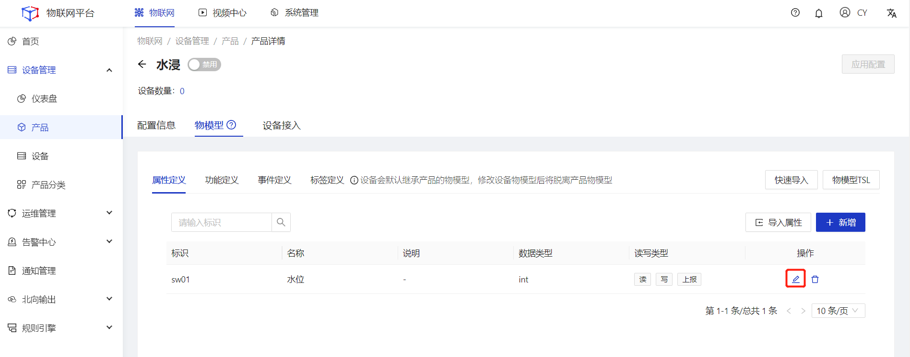
3.在**编辑**抽屉中，编辑相关参数，然后点击**保存**。 

  

    
    说明
  

 标识和来源均不可编辑。

#### 删除
##### 操作步骤
1.**登录**Jetlinks物联网平台。 
2.在左侧导航栏，选择**设备管理>产品**，点击**查看**，切换至物模型tab页，选择具体属性，点击**删除**按钮。 
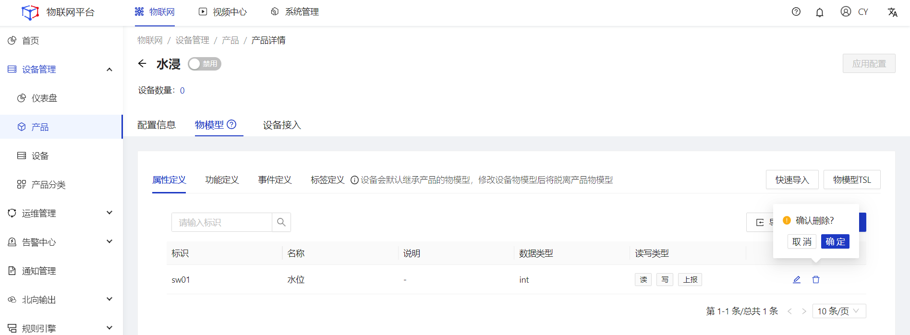

#### 快速导入
##### 操作步骤
1.**登录**Jetlinks物联网平台。 
2.在左侧导航栏，选择**设备管理>产品**，选择具体产品，点击**查看**，切换至物模型tab页，点击页面右上角**快速导入**按钮。 
3.在**导入物模型**弹框中，选择导入方式，并根据导入方式，选择需要导入的物模型，然后点击**确定**。 
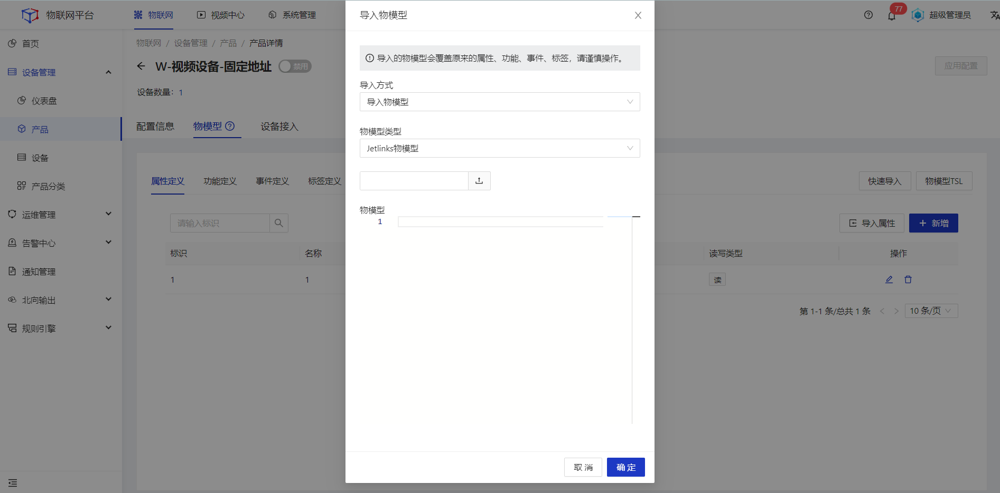

### 设备接入

#### 新增
##### 操作步骤
1.**登录**Jetlinks物联网平台。 
2.在左侧导航栏，选择**设备管理>产品**，点击**查看**，切换至设备接入tab页。 
3.在设备接入tab页中选择设备接入方式，然后单击**确定**。 
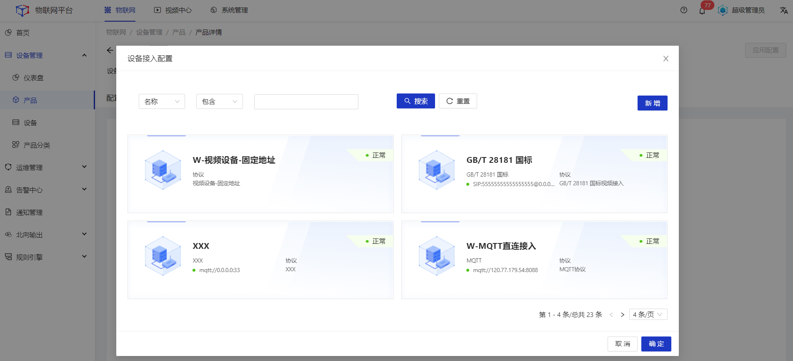

##### 后续步骤
1.填写产品接入相关参数，然后点击**保存**。

  

    
    说明
  

  接入配置中的参数根据所选择的接入方式以及协议包内容动态显示。

2.填写产品存储策略，然后点击**保存**。

  

    
    注意
  

      <li>    在确定好存储方案后,尽量不要跨类型进行修改,如将: 行式存储修改为列式存储,可能会导致数据结构错乱 </li>
      <li>     在创建物模型时,请根据存储策略判断好是否支持此类型      </li>

#### 更换接入方式
##### 操作步骤
1.**登录**Jetlinks物联网平台。 
2.在左侧导航栏，选择**设备管理>产品**，点击**查看**，切换至设备接入tab页。 
3.在设备接入tab页中点击**更换**，重新选择接入方式后，单击**确定**。 

  

    
    说明
  

    当前产品下若已接入设备，不支持更换接入方式。

### 物模型映射

#### 属性映射
##### 操作步骤
1.**登录**Jetlinks物联网平台。 
2.在左侧导航栏，选择**设备管理>产品**，点击**查看**，切换至物模型映射tab页。 
3.在物模型映射页面，通过下拉框建立**物模型属性**与**设备上报属性**的映射关系。 

  

    
    说明
  

  <li>当产品的接入方式为自定义接入类型时才会出现物模型映射tab页。</li>
  <li> 设备-物模型映射默认会继承产品物模型映射规则。</li>
  <li>系统会根据属性标识进行自动映射，若属性标识不一致，默认使用物模型属性。</li>

### 数据解析

#### 配置解析规则
##### 操作步骤
1.**登录**Jetlinks物联网平台。 
2.在左侧导航栏，选择**设备管理>产品**，点击**查看**，切换至数据解析tab页。 
3.在数据解析页面，自定义编写**数据解析脚本**。 
4.输入**Topic**或**URL**进行调试。

  

    
    说明
  

     显示Topic配置/URL配置由协议包拟定。

5.调试通过后，点击**保存**。

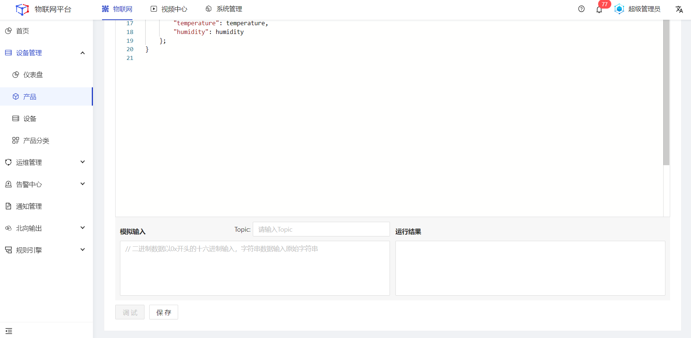

  

    
    说明
  

  <li>该tab页的展示与否由协议包拟定。</li>
  <li>设备-数据解析将自动继承产品的数据解析规则。</li>

## 设备
### 列表功能

#### 新增
##### 操作步骤
1.**登录**Jetlinks物联网平台。 
2.在左侧导航栏，选择**设备管理>设备**，点击**新增**。 
3.在**新建**弹框中，根据设备实际情况，按照页面提示填写信息，然后单击**确定**。 

<table class='table'>
        <thead>
            <tr>
              <td>参数</td>
              <td>说明</td>
            </tr>
        </thead>
        <tbody>
          <tr>
            <td>ID</td>
            <td>设备唯一标识，在系统内具有全局唯一性。 </td>
          </tr>
          <tr>
            <td>名称</td>
            <td>为设备命名，最多可输入64个字符。</td>
          </tr>
          <tr>
            <td>所属产品</td>
            <td>单选下拉框，只能选择正常状态下的产品。</td>
          </tr>
          <tr>
            <td>标签</td>
            <td>设备基于业务需要，自定义补充的标签信息。</td>
          </tr>
         </tbody>
</table>

#### 编辑 
##### 操作步骤
1.**登录**Jetlinks物联网平台。 
2.在左侧导航栏，选择**设备管理>设备**，选择具体设备。点击**编辑**。 
3.在**编辑**弹框中，编辑相关配置，然后单击**确定**。 
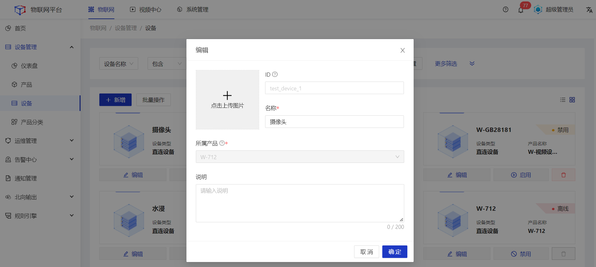

  

    
    说明
  

   ID和所属产品不支持编辑。

#### 启用/禁用
##### 操作步骤
1.**登录**Jetlinks物联网平台。 
2.在左侧导航栏，选择**设备管理>设备**，选择具体设备。点击**启用/禁用**。 
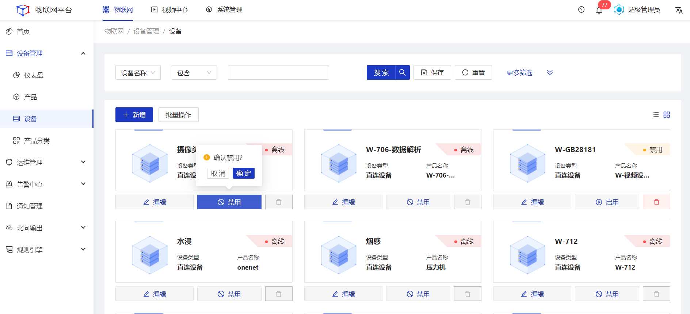

  

    
    说明
  

 设备在离线/在线状态时，按钮显示为禁用；设备在禁用状态时，按钮显示为启用。

#### 删除
##### 操作步骤
1.**登录**Jetlinks物联网平台。 
2.在左侧导航栏，选择**设备管理>设备**，选择具体设备。点击**删除**。 

  

    
    说明
  

 设备在离线/在线状态时，不可删除。

#### 批量操作
##### 操作步骤
1.**登录**Jetlinks物联网平台。 
2.在左侧导航栏，选择**设备管理>设备**，点击**批量操作**。
   + 点击导入，可在对应产品下批量导入设备基础数据。
   + 点击导出，不选择产品时导出所有设备基础数据，选择产品时导出对应产品下的设备数据。
   + 点击激活全部设备，向所有设备发送激活指令。
   + 点击同步设备状态，平台读取一遍所有设备的最新状态数据。

### 实例信息

#### 实例信息管理
##### 操作步骤
1.**登录**Jetlinks物联网平台。 
2.在左侧导航栏，选择**设备管理>设备**，列表页中点击**查看**按钮，进入实例信息页面。 
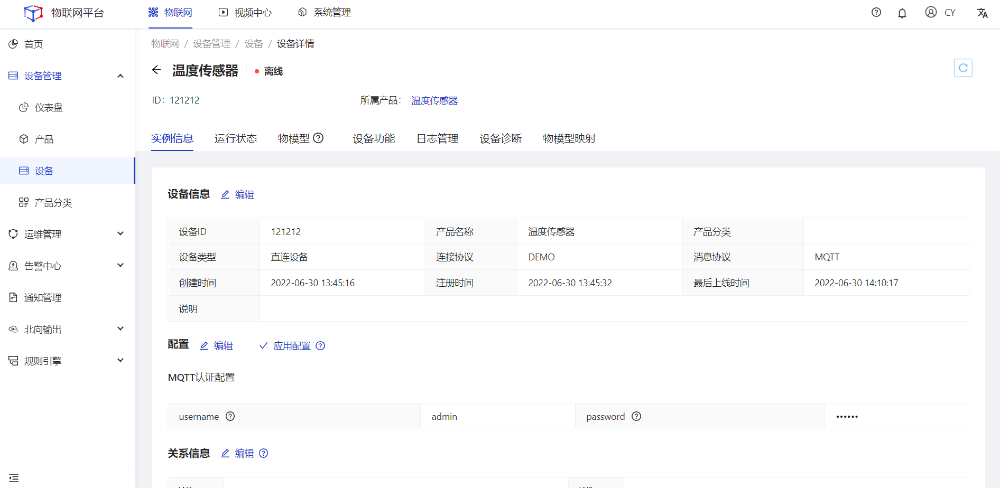
实例信息是对设备实例信息的统一管理，该页面包括设备信息、设备所属产品自定义的标签信息、接入配置信息、关系信息。除设备信息外，其他信息根据产品接入配置、系统配置**动态显示**。 
+ `配置`由**产品接入方式**动态决定，当接入方式为**云平台接入**或产品使用的**协议包中拟定有额外配置配置项**时将出现此部分配置内容
+ `关系信息`由**系统管理-关系配置**中的配置进行动态显示

#### 后续步骤
1.点击基本信息卡片中的**编辑**按钮，可以修改基本信息。 
2.点击配置信息卡片中的**编辑**按钮，可修改配置信息。 
3.点击关系信息卡片中的**编辑**按钮，可绑定设备与用户之间的关系，例如`设备负责人`。 

### 运行状态

#### 查看
##### 操作步骤
1.**登录**Jetlinks物联网平台。 
2.在左侧导航栏，选择**设备管理>设备**，列表页中点击**查看**按钮。 
3.进入详情页后，切换至**运行状态**tab页。 

#### 后续步骤
1.击左侧tab菜单可切换至查看事件详情。 
2.点击属性卡片右上角的操作按钮，可手动编辑属性值、查看属性历史数据、更新属性数据。 

### 物模型

#### 新增
##### 操作步骤
1.**登录**Jetlinks物联网平台。 
2.在左侧导航栏，选择**设备管理>设备**，点击**查看**，切换至物模型tab页，并点击**新增**按钮。 
3.在**新建**抽屉中，根据设备实际情况，按照页面提示填写信息，然后单击**确定**。 

##### 属性参数说明
<table class='table'>
        <thead>
            <tr>
              <td>标识</td>
              <td>同一个产品内属性标识具有唯一性，不支持编辑</td>
            </tr>
        </thead>
        <tbody>
          <tr>
            <td>名称</td>
            <td>为设备命名，最多可输入64个字符。</td>
          </tr>
          <tr>
            <td>数据类型</td>
            <td>1. int32：32位整型。需定义单位。 2. float：单精度浮点型。需定义单位和精度。 3. double：双精度浮点型。需定义单位和精度。 4. enum：枚举型。定义枚举项的参数值和参数描述，例如1-加热模式、2-制冷模式等。 5. bool：布尔型。采用0或1来定义布尔值，例如0-关；1-开。 6. text：字符串。需定义字符串的数据长度，最长支持2048字节。 7. date：时间戳。默认格式为String类型的UTC时间戳，单位：毫秒。 8. object：JSON对象。定义一个JSON结构体，新增JSON参数项，例如定义灯的颜色是由Red、Green、Blue三个参数组成的结构体。 miniui版本不支持结构体嵌套。 9. array：数组。需声明数组内元素的数据类型，可选择int32、float、double、text或object。需确保同一个数组元素类型相同。数组内可包含1-128个元素。 10. file：文件。需声明文件元素类型，可选择URL、base64、binary(二进制)。 11. password：密码。上报时如果属性为密码，将进行加密或者是隐秘的方式进行显现或者处理。 
</td>
         </td>
          </tr>
          <tr>
            <td>单位</td>
            <td>单选下拉框，可选择为无或根据实际情况选择。</td>
          </tr>
         <tr>
            <td>精度</td>
            <td>控制所需的小数位数。</td>
          </tr>
         <tr>
            <td>最大长度</td>
            <td>单位为字节。</td>
          </tr>
         <tr>
            <td>来源</td>
            <td>单选下拉框，支持设备、手动、规则。</td>
          </tr>
          <tr>
            <td>读写类型</td>
            <td>多选下拉框，支持读、写、上报</td>
          </tr>
          <tr>
            <td>说明</td>
            <td>备注说明，最多可输入200个字符。</td>
          </tr>
          </tbody>
</table>

##### 功能参数说明
<table class='table'>
        <thead>
            <tr>
              <td>标识</td>
              <td>同一个产品内功能标识具有唯一性，不支持编辑</td>
            </tr>
        </thead>
        <tbody>
          <tr>
            <td>名称</td>
            <td>为功能命名，最多可输入64个字符。</td>
          </tr>
         <tr>
            <td>是否异步</td>
            <td>异步：服务为异步调用时，云端执行调用后直接返回结果，不会等待设备的回复消息。 同步：服务为同步调用时，云端会等待设备回复；若设备没有回复，则调用超时。</td>
          </tr>
          <tr>
            <td>输入参数</td>
            <td>定义功能的输入参数标识、名称、数据类型。
            </td>
          </tr>
          <tr>
            <td>输出参数</td>
            <td>1. int32：32位整型。需定义单位。 2. float：单精度浮点型。需定义单位和精度。 3. double：双精度浮点型。需定义单位和精度。 4. enum：枚举型。定义枚举项的参数值和参数描述，例如1-加热模式、2-制冷模式等。 5. bool：布尔型。采用0或1来定义布尔值，例如0-关；1-开。 6. text：字符串。需定义字符串的数据长度，最长支持2048字节。 7. date：时间戳。默认格式为String类型的UTC时间戳，单位：毫秒。 8. object：JSON对象。定义一个JSON结构体，新增JSON参数项，例如定义灯的颜色是由Red、Green、Blue三个参数组成的结构体。 miniui版本不支持结构体嵌套。 9. array：数组。需声明数组内元素的数据类型，可选择int32、float、double、text或object。需确保同一个数组元素类型相同。数组内可包含1-128个元素。 10. password：密码。上报时如果属性为密码，将进行加密或者是隐秘的方式进行显现或者处理。 
          </td>
      </tr>
          <tr>
            <td>说明</td>
            <td>备注说明，最多可输入200个字符。</td>
          </tr>
</tbody>
</table>

##### 事件参数说明
<table class='table'>
        <thead>
            <tr>
              <td>标识</td>
              <td>同一个产品内事件标识具有唯一性，不支持编辑</td>
            </tr>
        </thead>
        <tbody>
          <tr>
            <td>名称</td>
            <td>为功能命名，最多可输入64个字符。</td>
          </tr>
         <tr>
            <td>级别</td>
            <td>单选下拉框，点击展开：普通、告警、紧急</td>
          </tr>
          <tr>
            <td>输出参数</td>
            <td> object：JSON对象。定义一个JSON结构体，新增JSON参数项，例如定义灯的颜色是由Red、Green、Blue三个参数组成的结构体。 miniui版本不支持结构体嵌套。 

    说明
    <ul>
 配置的事件的触发记录，将在设备“运行状态”左侧菜单中进行显示。
    </ul>
  

            </td>
          </tr>
           <tr>
            <td>JSON对象</td>
            <td>定义结构体的标识、名称、数据类型。</td>
          </tr>
           <tr>
            <td>说明</td>
            <td>备注说明，最多可输入200个字符。</td>
          </tr>
</tbody>
</table>

##### 标签参数说明
<table class='table'>
        <thead>
            <tr>
              <td>标识</td>
              <td>同一个产品内标签标识具有唯一性，不支持编辑</td>
            </tr>
        </thead>
        <tbody>
          <tr>
            <td>名称</td>
            <td>为标签命名，最多可输入64个字符。</td>
          </tr>
          <tr>
            <td>输出参数</td>
            <td>1. int32：32位整型。需定义单位。 2. float：单精度浮点型。需定义单位和精度。 3. double：双精度浮点型。需定义单位和精度。 4. enum：枚举型。定义枚举项的参数值和参数描述，例如1-加热模式、2-制冷模式等。 5. bool：布尔型。采用0或1来定义布尔值，例如0-关；1-开。 6. text：字符串。需定义字符串的数据长度，最长支持2048字节。 7. date：时间戳。默认格式为String类型的UTC时间戳，单位：毫秒。 8. object：JSON对象。定义一个JSON结构体，新增JSON参数项，例如定义灯的颜色是由Red、Green、Blue三个参数组成的结构体。 miniui版本不支持结构体嵌套。 9. array：数组。需声明数组内元素的数据类型，可选择int32、float、double、text或object。需确保同一个数组元素类型相同。数组内可包含1-128个元素。 10. file：文件。需声明文件元素类型，可选择URL、base64、binary(二进制)。 11. password：密码。上报时如果属性为密码，将进行加密或者是隐秘的方式进行显现或者处理。 
            </td>
           </tr>
           <tr>
            <td>标签类型</td>
            <td>多选下拉框，支持读、写、上报</td>
          </tr>
          <tr>
            <td>说明</td>
            <td>备注说明，最多可输入200个字符。</td>
          </tr>
</tbody>
</table>

#### 编辑
##### 操作步骤
1.**登录**Jetlinks物联网平台。 
2.在左侧导航栏，选择**设备管理>设备**，点击**查看**，切换至物模型tab页，并点击**编辑**按钮。 
3.在**编辑**抽屉中，编辑相关参数，然后单击**确定**。 

  

    
    说明
  

  标识不支持编辑。

#### 快速导入
##### 操作步骤
1.**登录**Jetlinks物联网平台。 
2.在左侧导航栏，选择**设备管理>设备**，点击**查看**，切换至物模型tab页，并点击**快速导入**按钮。 
3.在**导入物模型**弹框中，选择导入方式，并根据导入方式，选择需要导入的物模型，然后单击**确定**。 

  

    
    说明
  

  导入的物模型会覆盖原来的属性、功能、事件、标签，请谨慎操作。

### 设备功能

#### 调用设备功能
##### 操作步骤
1.**登录**Jetlinks物联网平台。 
2.在左侧导航栏，选择**设备管理>设备**，点击**查看**，切换至设备功能tab页，点击左侧需要调用的功能，设置功能参数值。 

3.点击**执行**按钮，查看右侧**执行结果**。 
4.（可选操作）点击**高级模式**，切换至高级模式tab页，输入**脚本**后，点击执行，查看右侧**执行结果** 
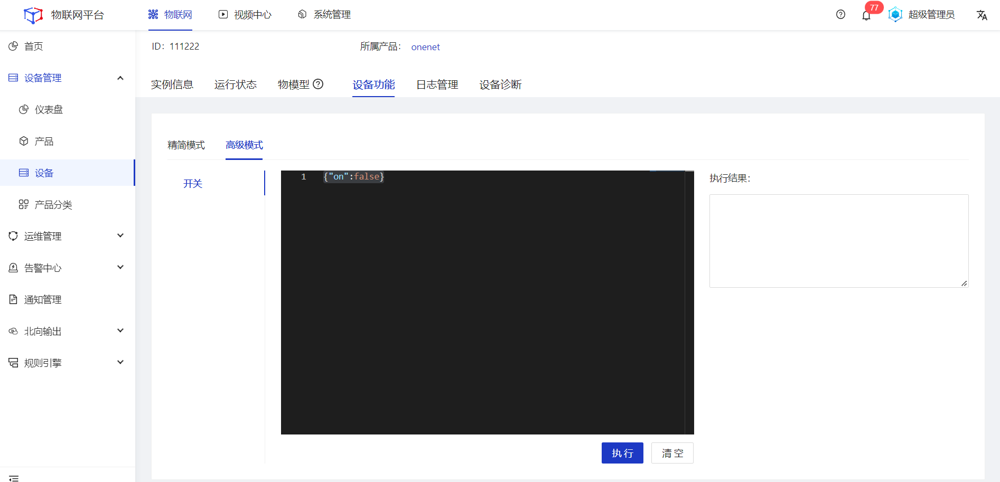

### 日志管理

#### 查看
##### 操作步骤
1.**登录**Jetlinks物联网平台。 
2.在左侧导航栏，选择**设备管理>设备**，点击**查看**，切换至日志管理tab页。 

3.点击具体日志的**查看**按钮，查看日志详情。 
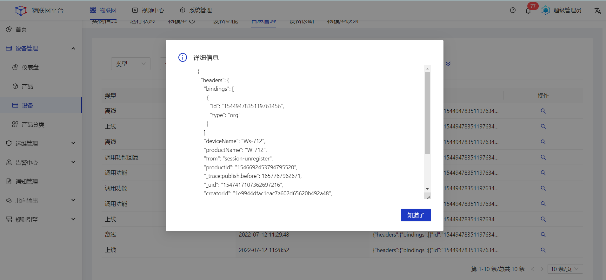

### 设备诊断

#### 连接状态诊断
##### 操作步骤
1.**登录**Jetlinks物联网平台。 
2.在左侧导航栏，选择**设备管理>设备**，点击**查看**，切换至设备诊断tab页。 
3.根据系统自动诊断结果，对**异常**或**可能存在异常**的检查项进行处理。 
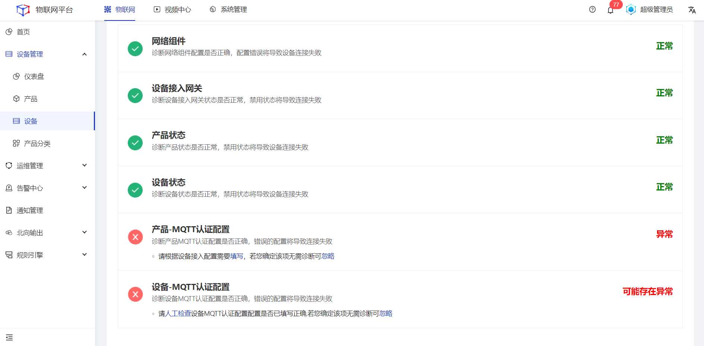

  

    
    说明
  

 <li>人工检查：人工核查一遍对应诊断项的配置参数是否填写正确。</li>
 <li>忽略：人工判断该检查项不影响设备接入平台时，可直接点击忽略。</li>

4.连接成功后，点击**消息通信**按钮，切换至消息通信tab，选择**调用功能**或**操作属性**。 
5.配置完成后，点击**发送**按钮，在对话框中查看具体的上下行消息，同时可查看页面右侧详细日志数据。 

### 物模型映射

#### 属性映射
##### 操作步骤
1.**登录**Jetlinks物联网平台。 
2.在左侧导航栏，选择**设备管理>设备**，点击**查看**，切换至物模型映射tab页。 
3.在物模型映射页面，通过下拉框建立**物模型属性**与**设备上报属性**的映射关系。 
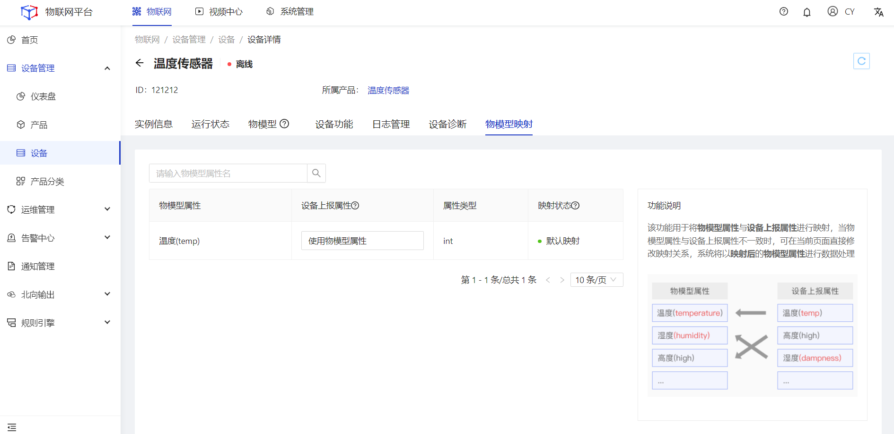

  

    
    说明
  

  <li>当产品的接入方式为自定义接入类型时才会出现物模型映射tab页。</li>
  <li> 设备-物模型映射进行修改后，将脱离产品物模型映射。</li>
  <li>系统会根据属性标识进行自动映射，若属性标识不一致，默认使用物模型属性。</li>

### modbus点位绑定
##### 操作步骤
1.**登录**Jetlinks物联网平台。 
2.在左侧导航栏，选择**设备管理>设备**，点击**查看**，切换至modbus tab页。 
3.在modbus页面，建立**物模型属性**与**modbus点位**的关联关系。 
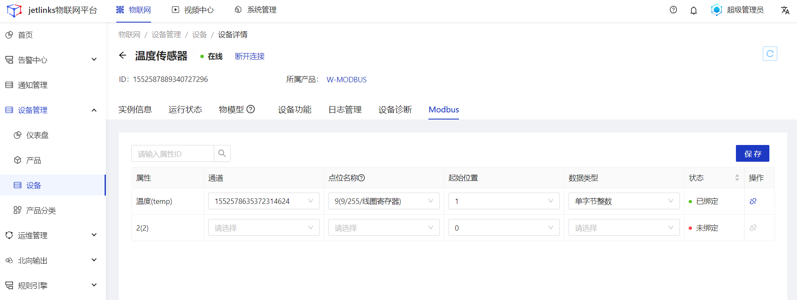

##### 后续步骤
1.点击属性操作列的**解绑**按钮，然后点击**确定**，解除属性与modbus点位的绑定关系。

## 产品分类

#### 新增
##### 操作步骤
1.**登录**Jetlinks物联网平台。 
2.在左侧导航栏，选择**设备管理>产品分类**，进入列表页。 

3.点击**新增**按钮，在新增弹框中填写配置信息，然后点击**确定**。 

#### 编辑
##### 操作步骤
1.**登录**Jetlinks物联网平台。 
2.在左侧导航栏，选择**设备管理>产品分类**，进入列表页。 
3.点击具体分类的**编辑**按钮，在编辑弹框中修改配置信息，然后点击**确定**。 

#### 添加子分类
##### 操作步骤
1.**登录**Jetlinks物联网平台。 
2.在左侧导航栏，选择**设备管理>产品分类**，进入列表页。 
3.点击具体分类的**添加子分类**按钮，在编辑弹框中修改配置信息，然后点击**确定**。 

#### 删除
##### 操作步骤
1.**登录**Jetlinks物联网平台。 
2.在左侧导航栏，选择**设备管理>产品分类**，进入列表页。 
3.点击具体分类的**删除**按钮，然后点击**确定**。 

  

    
    说明
  

 <li>已经被产品绑定的分类，不可删除。</li>
 <li>删除父节点时，子节点也会被一起删除。</li>

