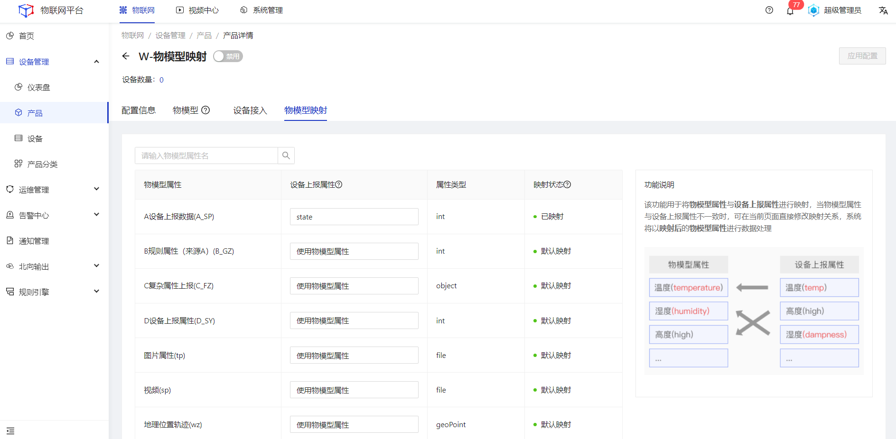

## 物模型映射

#### 属性映射
##### 操作步骤
1.**登录**Jetlinks物联网平台。
2.在左侧导航栏，选择**设备管理>产品**，点击**查看**，切换至物模型映射tab页。
3.在物模型映射页面，通过下拉框建立**物模型属性**与**设备上报属性**的映射关系。

  
  注意
  <li>当产品的接入方式为自定义接入类型时才会出现物模型映射tab页。</li>
  <li> 设备-物模型映射默认会继承产品物模型映射规则。</li>
  <li>系统会根据属性标识进行自动映射，若属性标识不一致，默认使用物模型属性。</li>

