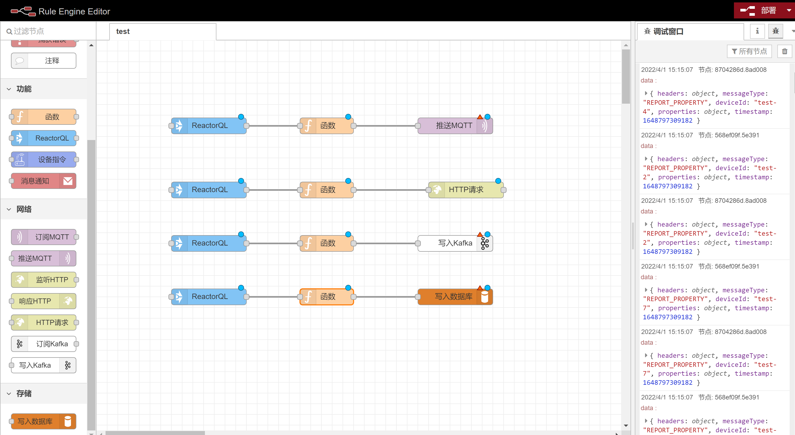
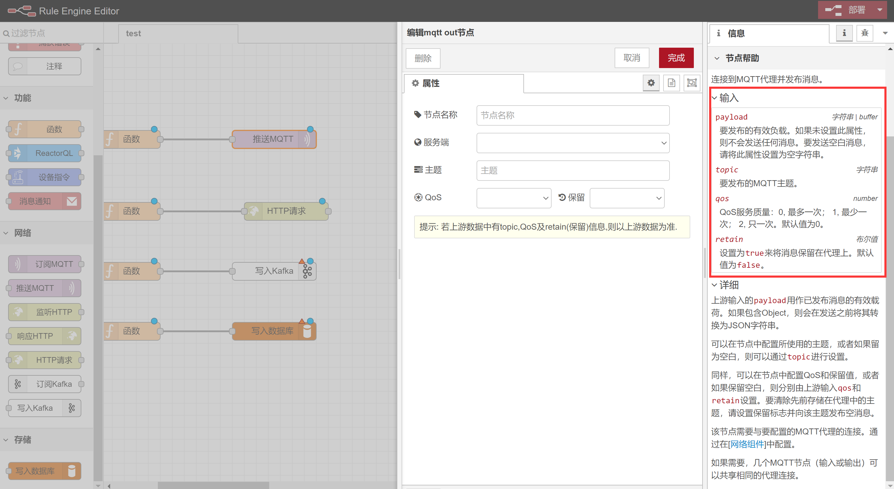
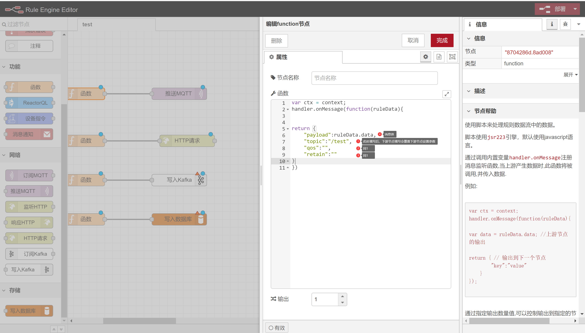
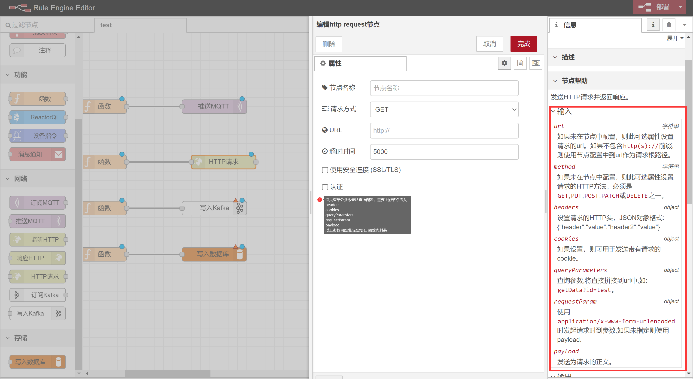
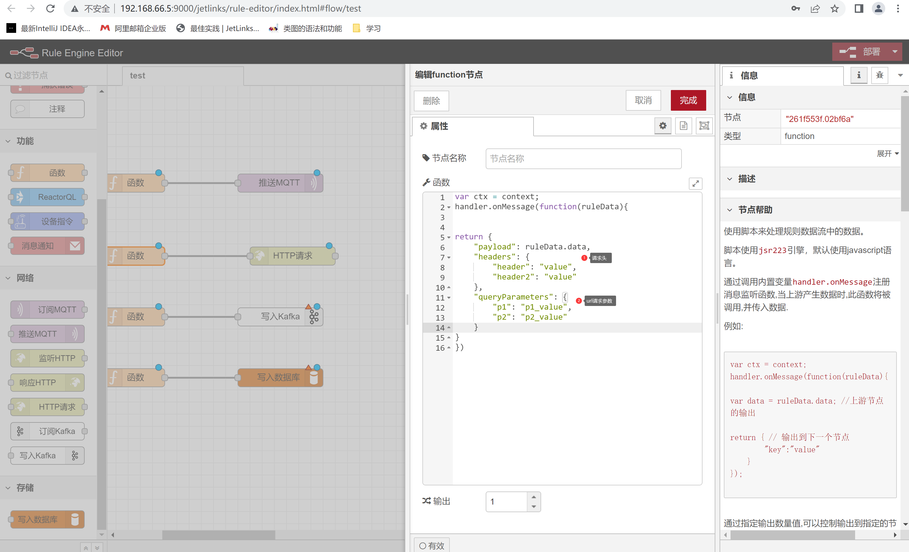
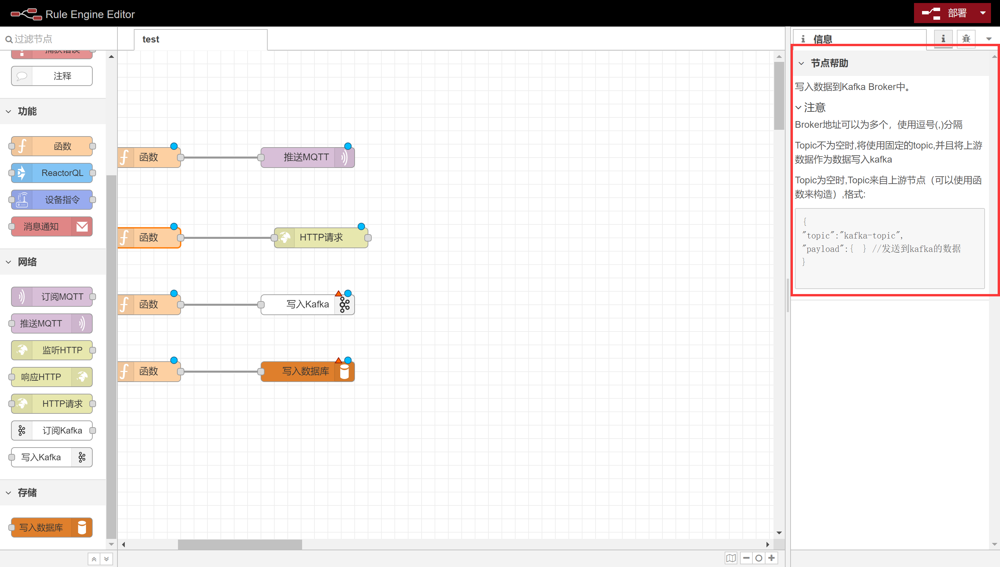
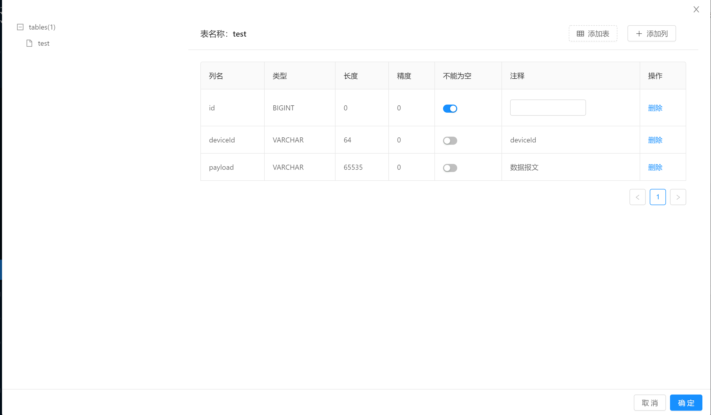
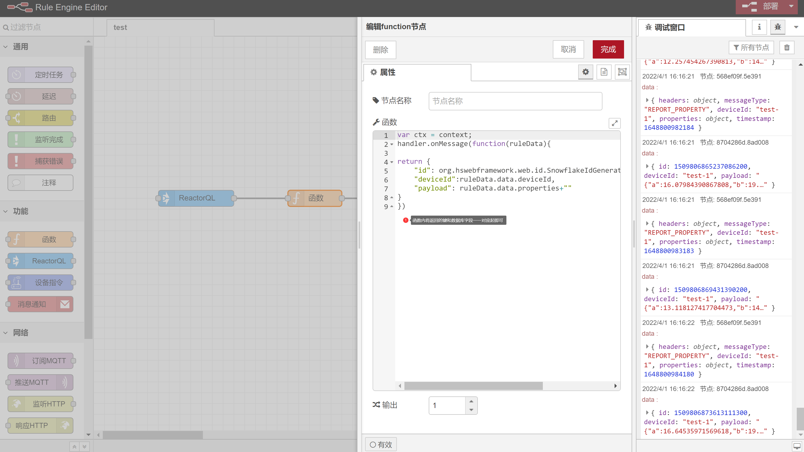
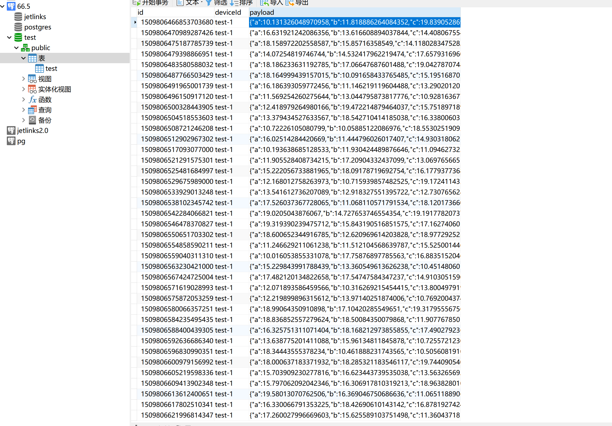

# 数据转发第三方平台

> 平台提供了四种数据转发的方式，`开放OpenApi`、`在线订阅websocket数据`、`规则引擎转发`及`MQTT订阅`


## 使用第三方平台调用OpenApi

> 基于数据签名的第三方平台模块，用于提供对外开放接口的认证方式。

<div class='explanation primary'>
  <p class='explanation-title-warp'>
    <span class='iconfont icon-bangzhu explanation-icon'></span>
    <span class='explanation-title font-weight'>说明</span>
  </p>

本功能仅在企业版中提供。

</div>

### 创建应用

进入平台：[系统设置]-[应用管理]


填写对应的内容保存。

<div class='explanation primary'>
  <p class='explanation-title-warp'>
    <span class='iconfont icon-bangzhu explanation-icon'></span>
    <span class='explanation-title font-weight'>说明</span>
  </p>

`clientId`和`secureKey`需要提供给客户端开发者。
用户名和密码是系统统一的用户主体，会自动创建到用户管理中。使用此用户名密码也能登录到系统中。
与其他用户相同，可以将用户绑定到机构实现数据权限控制。应用对应用户可以配置角色实现操作权限控制。

</div>

### 赋权

点击操作列中的赋权按钮对应用进行赋权。勾选应用可访问的api。

如果操作栏`赋权`里
没有任何权限选项，先去`API配置`配置系统支持API赋权的API。

### 使用签名的方式
#### 验证流程


<div class='explanation primary'>
  <p class='explanation-title-warp'>
    <span class='iconfont icon-bangzhu explanation-icon'></span>
    <span class='explanation-title font-weight'>说明</span>
  </p>

1. 图中`Signature`函数为客户端设置的签名方式,支持`MD5`和`Sha256`。
2. 发起请求的签名信息都需要放到请求头中,而不是请求体。
3. OpenApi对开发是透明的，开发只需要关心权限控制即可。

</div>

#### 签名

平台使用签名来校验客户端请求的完整性以及合法性。

例：

ClientId为`testId`，
SecureKey为:`testSecure`。
客户端请求接口: `/device-instance/dev0001/log/_query`，参数为`pageSize=20&pageIndex=0`，签名方式为`md5`。

1. 将参数key按ascii排序得到：pageIndex=0&pageSize=20
2. 使用拼接时间戳以及密钥得到：pageIndex=0&pageSize=201574993804802testSecure
3. 使用`md5("pageIndex=0&pageSize=201574993804802testSecure")`得到`837fe7fa29e7a5e4852d447578269523`

示例：

```text
GET /device-instance/dev0001/log/_query?pageIndex=0&pageSize=20
X-Client-Id: testId
X-Timestamp: 1574993804802
X-Sign: 837fe7fa29e7a5e4852d447578269523
```

响应结果:

```text
HTTP/1.1 200 OK
X-Timestamp: 1574994269075
X-Sign: c23faa3c46784ada64423a8bba433f25

{"status":200,result:[]}

```

#### 验签

使用和签名相同的算法(不需要对响应结果排序):

```java

String secureKey = ...; //密钥
String responseBody = ...;//服务端响应结果
String timestampHeader = ...;//响应头: X-Timestamp
String signHeader = ...; //响应头: X-Sign

String sign = DigestUtils.md5Hex(responseBody+timestampHeader+secureKey);
if(sign.equalsIgnoreCase(signHeader)){
    //验签通过

}

```

### 使用token的方式

通过请求接口`/token`来获取`X-Access-Token`，之后可以使用此token来发起api请求。

### 申请token
客户端请求接口`/token`  
    请求方式： POST  

```text

POST /token
X-Sign: 932bbe8a39ae03f568f73a507d87afac
X-Timestamp: 1587719082698 
X-Client-Id: kF**********HRZ  
Content-Type: application/json 

{  
    "expires": 7200 // 过期时间,单位秒.
}

//返回

{
    "status":200,
    "result":"3bcddb719b01da679b88d07acde2516" //token信息
}

```

### 使用token发起请求 
此处以获取设备test001详情为例。  
```text
GET /device-instance/test001/_detail  
X-Access-Token: 3bcddb719b01da679b88d07acde2516  
```
响应结果：
```json
{
    "result": {
        "id": "test001",
        "name": "温控设备0309",
        "protocol": "demo-v1",
        "transport": "MQTT",
        "orgId": "test",
        "productId": "1236859833832701952",
        "productName": "智能温控",
        "deviceType": {
            "text": "网关设备",
            "value": "gateway"
        },
        "state": {
            "text": "离线",
            "value": "offline"
        },
        "address": "/127.0.0.1:36982",
        "onlineTime": 1586705515429,
        "offlineTime": 1586705507734,
        "createTime": 1585809343175,
        "registerTime": 1583805253659,
        "metadata": "{\"events\":[{\"id\":\"fire_alarm\",\"name\":\"火警报警\",\"expands\":{\"eventType\":\"reportData\",\"level\":\"urgent\"},\"valueType\":{\"type\":\"object\",\"properties\":[{\"id\":\"a_name\",\"name\":\"区域名称\",\"valueType\":{\"type\":\"string\"}},{\"id\":\"b_name\",\"name\":\"建筑名称\",\"valueType\":{\"type\":\"string\"}},{\"id\":\"l_name\",\"name\":\"位置名称\",\"valueType\":{\"type\":\"string\"}}]}}],\"properties\":[{\"id\":\"temperature\",\"name\":\"温度\",\"valueType\":{\"type\":\"float\",\"min\":\"0\",\"max\":\"100\",\"step\":\"0.1\",\"unit\":\"celsiusDegrees\"},\"expands\":{\"readOnly\":\"true\"}}],\"functions\":[{\"id\":\"get-log\",\"name\":\"获取日志\",\"isAsync\":true,\"output\":{\"type\":\"string\",\"expands\":{\"maxLength\":\"2048\"}},\"inputs\":[{\"id\":\"start_date\",\"name\":\"开始日期\",\"valueType\":{\"type\":\"date\",\"dateFormat\":\"yyyy-MM-dd HH:mm:ss\"}},{\"id\":\"end_data\",\"name\":\"结束日期\",\"valueType\":{\"type\":\"date\",\"dateFormat\":\"yyyy-MM-dd HH:mm:ss\"}},{\"id\":\"time\",\"name\":\"分组\",\"valueType\":{\"type\":\"string\"}}]}]}",
        "configuration": {
            "username": "test",
            "password": "test"
        },
        "tags": []
    },
    "status": 200,
    "code": "success"
}
```
    
### Demo 

Demo中测试包org.jetlinks.demo.openapi下的测试类已测试通过平台已有的openApi接口。  
Demo中使用签名的方式接入。  

**<a target='_blank' href='https://github.com/jetlinks/jetlinks-openapi-demo'>前往下载Demo</a>**。

### OAuth2.0

平台也支持通过OAuth2.0进行认证，支持：`authorization_code`和`client_credentials`以及`refresh_token`。

+ 授权地址: http://{domain}/#/application/oauth2/login.html
+ client_id: 应用中配置的clientId
+ ClientSecret: 应用中配置的secureKey
+ Token地址: http://{domain}/api/token

例如:
```js
POST /api/oauth2/token
Content-Type: application/json

{
    "grant_type": "client_credentials", //固定client_credentials
    "client_id":"client_id",            
    "client_secret":"client_secret",
}

响应:

{
    "access_token":"access_token",
    "refresh_token":"refresh_token",
    "expires_in":7200 //有效期,单位秒
}
```

使用token请求接口:

```js
POST /device-instance/_query
Authorization: bearer access_token

{}
```

或者
```js
POST /device-instance/_query?access_token=access_token
 
{}
```

## 使用Websocket订阅实时设备消息

> 在`1.1`版本后提供websocket方式订阅平台消息的功能。
可以通过websocket来订阅设备、规则引擎、设备告警等相关消息。

### 接口

<div class='explanation primary'>
  <p class='explanation-title-warp'>
    <span class='iconfont icon-bangzhu explanation-icon'></span>
    <span class='explanation-title font-weight'>说明</span>
  </p>

websocket统一接口为：`/messaging/{token}`，
`{token}`可通过登录系统或者使用OpenAPI获取。

</div>

以前端js为例:
```js
var ws = new WebSocket("ws://localhost:8848/messaging/a872d8e6cf6ccd38deb0c8772f6040e3");
ws.onclose=function(e){console.log(e)};
ws.onmessage=function(e){console.log(e.data)}

// 如果认证失败,会立即返回消息: {"message":"认证失败","type":"authError"},并断开连接.
```

### 订阅消息

向websocket发送消息,格式为:

```js
{
    "type": "sub", //固定为sub
    "topic": "/device/*/*/**", // topic,见topic列表.
    "parameter": {       //参数,不同的订阅请求,支持的参数不同
        
    },
    "id": "request-id" //请求ID, 请求的标识,服务端在推送消息时,会将此标识一并返回.
}
```

<div class='explanation warning'>
  <p class='explanation-title-warp'>
    <span class='iconfont icon-jinggao explanation-icon'></span>
    <span class='explanation-title font-weight'>警告</span>
  </p>

在取消订阅之前，多次传入相同的id是无效的，不会重复订阅。

</div>

平台推送消息:

```js
{
	"payload": //消息内容, topic不同,内容不同,
	"requestId": "request-id", //与订阅请求的id一致
	"topic": "/device/demo-device/test0/offline", //topic,实际产生数据的topic
	"type": "result" //类型 result:订阅结果 complete:结束订阅 error:发生错误 
}
```

<div class='explanation primary'>
  <p class='explanation-title-warp'>
    <span class='iconfont icon-bangzhu explanation-icon'></span>
    <span class='explanation-title font-weight'>说明</span>
  </p>

type为complete时标识本此订阅已结束，通常是订阅有限数据流时（比如发送设备指令），或者取消订阅时会返回此消息。

</div>

### 取消订阅

向websocket发送消息,格式为:

```js
{
    "type":"unsub",//固定为unsub
     "id": "request-id" //与订阅请求ID一致
}
```

### 订阅设备消息

与消息网关中的设备topic一致，<a href='../device_message_description.md#设备消息对应事件总线topic'>查看topic列表</a>。
消息负载(`payload`)将与<a href='../device_message_description.md#平台统一设备消息定义'>设备消息类型</a>一致。

### 发送设备指令

发送消息到websocket

```js
{
    "type": "sub", //固定为sub
    "topic": "/device-message-sender/demo-device/test0,test1", // 发送消息给demo-device型号下的test0和test1设备
    "parameter": {
        // 消息类型,支持: READ_PROPERTY (读取属性),WRITE_PROPERTY (修改属性),INVOKE_FUNCTION (调用功能)
        "messageType":"READ_PROPERTY" 
        //根据不同的消息,参数也不同. 具体见: 平台统一消息定义
        "properties":["temperature"],
        //头信息
        "headers":{
            "async":false // 是否异步,异步时,平台不等待设备返回指令结果.
        }
    },
    "id": "request-id" //请求ID, 请求的标识,服务端在推送消息时,会将此标识一并返回.
}
```

平台将推送设备返的结果:

```js
{
	"payload": {   //请求消息类型不同,结果不同
		"deviceId": "test0",
        "messageType": "READ_PROPERTY_REPLY",
        "success":true, //指令是否成功
		"properties": {
			"temperature": 28.21
		},
		"timestamp": 1588148129787
	},
	"requestId": "request-id", //订阅请求的ID
	"topic": "/device/demo-device/test7/offline",
	"type": "result"
}
```

<div class='explanation primary'>
  <p class='explanation-title-warp'>
    <span class='iconfont icon-bangzhu explanation-icon'></span>
    <span class='explanation-title font-weight'>说明</span>
  </p>

`deviceId`支持`*`和逗号`,`分割，批量发送消息到设备。如: `/device-message-sender/{productId}/{deviceId}`。  

如果要终止发送，直接取消订阅即可。

</div>

### 批量同步设备状态

发送消息到websocket

```js
{
    "type": "sub", //固定为sub
    "topic": "/device-batch/state-sync",
    "parameter": {
        "query":{"where":"productId is test-device"}//查询条件为动态查询条件
    },
    "id": "request-id" //请求ID, 请求的标识,服务端在推送消息时,会将此标识一并返回.
}
```

平台推送:

```js
{
	"payload": {   //请求消息类型不同,结果不同
		"deviceId": "test0",
        "state": {
            "value":"offline",
            "text":"离线"
        }
	},
	"requestId": "request-id", //订阅请求的ID
	"topic": "/device-batch/state-sync",
	"type": "result" //为comlete是则表示同步完成.
}
```


### dashboard仪表盘

订阅仪表盘数据:

topic: `/dashboard/{dashboard}/{object}/{measurement}/{dimension}`

```js
{
    "type": "sub", //固定为sub
    "topic": "/dashboard/device/demo-device/property/agg", //聚合查询属性
    "parameter": {
        "deviceId":"test0", //
        "limit":"30",
        "time":"1d",
        "agg":"avg",
        "from":"now-30d",
        "to":"now",
        "format":"MM月dd日"
    },
    "id": "request-id" //请求ID, 请求的标识,服务端在推送消息时,会将此标识一并返回.
}
```


### 订阅引擎事件数据

发送消息到websocket

```js
{
    "type": "sub", //固定为sub
    "topic": "/rule-engine/{instanceId}/{nodeId}/event/{event}",
    "parameter": {},
    "id": "request-id" //请求ID, 请求的标识,服务端在推送消息时,会将此标识一并返回.
}
```

平台推送:

```js
{
	"payload": {   
	 //规则数据,不同的节点和事件类型数据不同
	},
	"requestId": "request-id", //订阅请求的ID
	"topic": "/rule-engine/{instanceId}/{nodeId}/event/{event}",
	"type": "result" //为comlete是则表示订阅结束.
}
```
<div class='explanation primary'>
  <p class='explanation-title-warp'>
    <span class='iconfont icon-bangzhu explanation-icon'></span>
    <span class='explanation-title font-weight'>说明</span>
  </p>

**error**: 执行节点错误
```js
{
    message:"错误消息",
    stack:"异常栈信息",
    type::"错误类型"
}
```
**result**: 节点数据输出
**complete**: 执行节点完成

</div>

### 订阅设备告警数据

发送消息到websocket

```js
{
    "type": "sub", //固定为sub
    "topic": "/rule-engine/device/alarm/{productId}/{deviceId}/{alarmId}",
    "parameter": {},
    "id": "request-id" //请求ID, 请求的标识,服务端在推送消息时,会将此标识一并返回.
}
```

平台推送:

```js
{
	"payload": {   //告警相关数据
		"deviceId": "设备ID",
        "deviceName": "设备名称",
        "alarmId": "告警ID",
        "alarmName": "告警名称"
        //...其他告警数据
	},
	"requestId": "request-id", //订阅请求的ID
	"topic": "/rule-engine/device/alarm/{productId}/{deviceId}/{alarmId}",
	"type": "result" //为comlete是则表示订阅结束.
}
```

### 订阅场景联动
发送消息到websocket

```js
{
    "type": "sub", //固定为sub
    "topic": "/scene/{alarmId}",
    "parameter": {},
    "id": "request-id" //请求ID, 请求的标识,服务端在推送消息时,会将此标识一并返回.
}
```

平台推送:

```js
{
	"payload": {   //触发场景的数据内容,触发方式不同,数据格式不同
        
	},
	"requestId": "request-id", //订阅请求的ID
	"topic": "/scene/{alarmId}",
	"type": "result" //为comlete是则表示同步完成.
}
```

## 使用MQTT订阅平台消息

>tip 在`1.5`企业版本后提供mqtt方式订阅平台消息的功能。可以通过mqtt来订阅设备、规则引擎、设备告警等相关消息。

### 修改配置文件

通过配置:
```yml
messaging:
  mqtt:
    enabled: true #开启mqtt支持
    port: 11883 # 端口
    host: 0.0.0.0 #绑定网卡
```

### 认证

默认使用`token`（可以使用`OpenAPI`申请token）作为`clientId`，`username`和`password`可以不填写。

可通过实现接口`MqttAuthenticationHandler`来自定义认证策略。

<div class='explanation warning'>
  <p class='explanation-title-warp'>
    <span class='iconfont icon-jinggao explanation-icon'></span>
    <span class='explanation-title font-weight'>警告</span>
  </p>

平台topic使用的通配符为`*`，在使用MQTT订阅时需要将通配符转换为mqtt的通配符: `*`转为`+`,`**`转为`#`.

</div>


### 订阅设备消息

与消息网关中的设备topic一致，<a href='../device_message_description.md#设备消息对应事件总线topic'>查看topic列表</a>。
消息负载(`payload`)将与<a href='../device_message_description.md#平台统一设备消息定义'>设备消息类型</a>一致。

<div class='explanation primary'>
  <p class='explanation-title-warp'>
    <span class='iconfont icon-bangzhu explanation-icon'></span>
    <span class='explanation-title font-weight'>说明</span>
  </p>

1.6版本后支持分组订阅：同一个用户订阅相同的topic，只有其中一个订阅者收到消息。

在topic前增加`$shared`即可，如：`$shared/device/+/+/#`

</div>

## 规则引擎转发

### 四种转发方式



配置实时订阅平台设备数据


### 配置转发

<div class='explanation primary'>
  <p class='explanation-title-warp'>
    <span class='iconfont icon-bangzhu explanation-icon'></span>
    <span class='explanation-title font-weight'>说明</span>
  </p>

函数的配置需要取决于下游节点接收参数是什么？
下游节点即与函数连接的下一个node节点。
举例：在四种转发方式内，函数的下游节点分别是`订阅MQTT`、`HTTP请求`、`写入Kafka`、`写入数据库`

</div>

查看下游节点接收参数

### 订阅MQTT

选择服务端，该服务端需要在网络组件内配置`MQTT客户端`

<div class='explanation warning'>
  <p class='explanation-title-warp'>
    <span class='iconfont icon-jinggao explanation-icon'></span>
    <span class='explanation-title font-weight'>警告</span>
  </p>

配置客户端的原因是，此处平台创建一个MQTT客户端将平台消息总线内的实时数据通过客户端推送给EMQ服务，由EMQ来做数据分发，达到数据转发的目的。此时其他MQTT客户端订阅平台推送时填写的`{topic}`即可收到消息。

</div>



可接收的参数为上图红框圈出内容，则需要在函数节点内配置为



### HTTP请求

订阅实时数据同上。

查看http接收输入参数




配置http请求查看

### 写入Kafka

订阅实时数据同上。



函数配置同MQTT订阅一致

### 写入数据库

订阅实时数据同上。

配置数据源




配置规则引擎函数对应数据表结构

效果图
