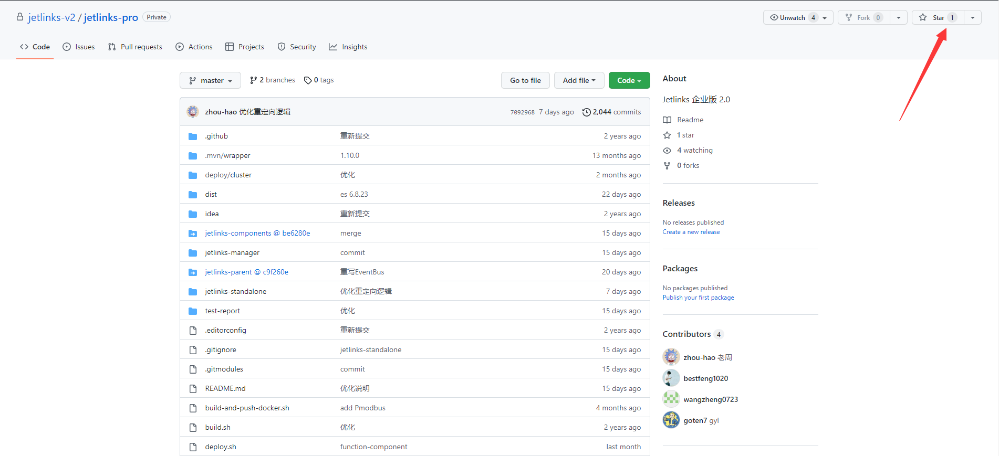
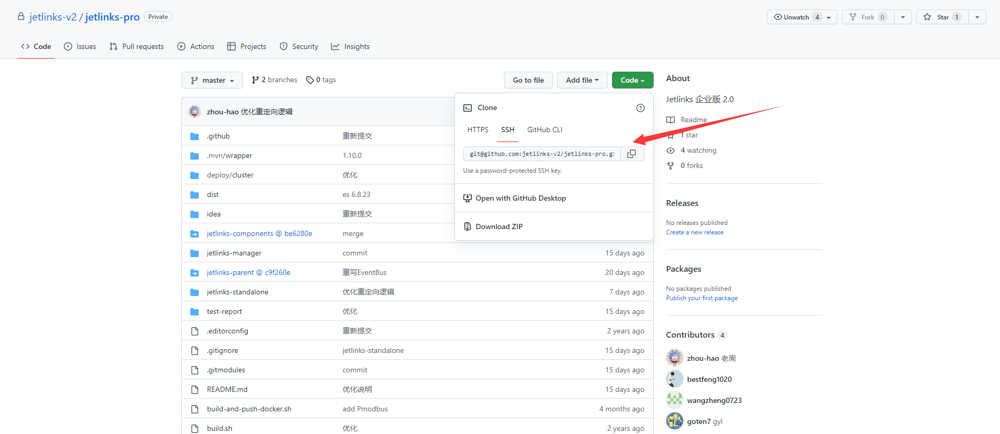

# 本地源码启动

## 系统环境

启动jetlinks之前，请先确定已经安装好以下环境:

1. JDK 1.8.0_2xx (需要小版本号大于200) <a href='https://adoptopenjdk.net/releases.html?variant=openjdk8&jvmVariant=hotspot'>下载jdk</a>
2. Redis 5.x
3. PostgreSQL 11 或者 mysql 5.7 +
4. ElasticSearch 6.8 + <a href='https://www.elastic.co/cn/downloads/elasticsearch'>下载</a> ,也可以直接<a href='#内嵌elasticsearch启动'>使用内嵌ElasticSearch</a>.

<div class='explanation primary'>
  <p class='explanation-title-warp'>
    <span class='iconfont icon-bangzhu explanation-icon'></span>
    <span class='explanation-title font-weight'>说明</span>
  </p>

如果你是linux或者macOS系统,或者是windows10. 推荐<a href='./ide-docker-start.md'>使用docker安装所需环境</a>
项目启动后会自动创建表结构,但是数据库需要手动创建。

</div>

## 下载源代码

1. 进入<a href='https://github.com/jetlinks-v2/jetlinks-pro'>GitHub</a>
2. Star仓库
   
3. 下载源代码,建议使用`git clone`下载源代码,注意代码分支,`master`为最新的开发分支.其他分支为对应的版本.
   

第一步: 先到个人设置中[添加SSH key](https://github.com/settings/keys)

第二步: 拉取代码

```bash
 git clone -b master --recurse-submodules git@github.com:jetlinks-v2/jetlinks-pro.git && git submodule foreach git checkout master
```

第三步: 更新代码

JetLinks Pro使用`git多模块`管理,使用此命令更新全部模块.
```bash
 git pull && git submodule init && git submodule update && git submodule foreach git checkout master && git submodule foreach git pull origin master
```

## 配置文件

配置文件地址:`jetlinks-standalone/src/main/resources/application.yml`

常见配置说明

```yml
spring:
  redis:
    host: 127.0.0.1 # redis配置
    port: 6379
    command: redis-server --appendonly yes --requirepass "redispassword"
    serializer: obj # 设置fst时,redis key使用string序列化,value使用 fst序列化.
  r2dbc:
    url: r2dbc:postgresql://127.0.0.1:5432/jetlinks  # 数据库postgresql数据库配置
    #url: r2dbc:mysql://127.0.0.1:3306/jetlinks # 支持切换到mysql数据库
    username: postgres  # 数据库用户名
    password: jetlinks  # 数据库密码
easyorm:
  default-schema: public # 数据库名 修改了数据库请修改这里,mysql为数据库名
  dialect: postgres # 数据库方言，支持 postgres,mysql,h2
elasticsearch:
  embedded:
    enabled: false # 为true时使用内嵌的elasticsearch
    data-path: ./data/elasticsearch
    port: 9200
    host: 0.0.0.0
  client:
    host: 127.0.0.1   # elasticsearch
    port: 9200
hsweb:
  file:
    upload:
      static-file-path: ./static/upload   # 上传的文件存储路径
      static-location: http://127.0.0.1:${server.port}/upload # 上传文件后,将使用此地址来访问文件,在部署到服务器后需要修改这个地址为服务器的ip.
```

<div class='explanation info'>
  <p class='explanation-title-warp'> 
    <span class='iconfont icon-tishi explanation-icon'></span>
    <span class='explanation-title font-weight'>提示</span>
  </p>

- 除了修改配置文件以外,还可以通过修改环境变量或者启动参数来修改配置,比如:

```bash
java -jar ./jetlinks-standalone/target/jetlinks-standalone.jar --spring.elasticsearch.embedded.enabled=true
```

- 修改了数据库配置也要同时修改`easyorm.dialect`以及`easyorm.default-schema`配置.

</div>

## 使用命令行启动

如果相关环境的ip不是本地,或者端口不是默认端口.请先修改配置文件.

linux或者macOS环境下打包:
```bash
$ ./mvnw clean package -Dmaven.test.skip=true
```

windows 环境下打包
```bash
$ mvnw.cmd clean package '-Dmaven.test.skip=true'
```

启动
```bash
$ java -jar ./jetlinks-standalone/target/jetlinks-standalone.jar
```

## 导入IDEA启动

Idea请先安装`lombok`插件.

1. 打开`IDEA`,点击`file-open`,选择项目目录,等待依赖下载完成.
2. 点击`file-Project Structure-Project`,配置SDK为jdk1.8,`Project language level`为`8`.
3. 打开`jetlinks-standalone/src/main/java/org...../JetLinksApplication.java`,启动main方法即可.

<div class='explanation info'>
  <p class='explanation-title-warp'> 
    <span class='iconfont icon-tishi explanation-icon'></span>
    <span class='explanation-title font-weight'>提示</span>
  </p>

如果依赖无法下载,请确定`maven`配置正确,请勿在settings.xml中配置全局仓库私服.

</div>

## 使用内嵌ElasticSearch

在硬件条件较差时，可以使用内嵌的ElasticSearch，不用单独安装。

修改配置文件即可

```yml
elasticsearch:
  embedded:
    enabled: true # 为true时使用内嵌的elasticsearch
```

## 启动前端

JetLinks 是前后端分离的.启动完后端服务后,还需要启动前端.
<div class='explanation info'>
  <p class='explanation-title-warp'> 
    <span class='iconfont icon-tishi explanation-icon'></span>
    <span class='explanation-title font-weight'>提示</span>
  </p>

如果本地不需要修改前端代码,并且本地有docker环境,建议使用docker启动前端.

```bash
docker run -it --rm -p 9000:80 -e "API_BASE_PATH=http://host.docker.internal:8844/" registry.cn-shenzhen.aliyuncs.com/jetlinks/jetlinks-ui-antd:2.0.0
```
http://host.docker.internal:8844/ 为后台服务的地址,请根据情况修改.

</div>
准备环境:

1. nodeJs v12.xx
2. npm v6.xx

下载前端代码:
```bash
$ git clone https://github.com/jetlinks/jetlinks-ui-antd.git
$ cd jetlinks-ui-antd
```

修改后台接口地址：
后台接口配置文件地址：config/proxy.ts:

```js
/**
 * 在生产环境 代理是无法生效的，所以这里没有生产环境的配置
 */
export default {
  dev: {
    '/jetlinks': {
      target: '后台地址',
      changeOrigin: true,
      pathRewrite: { '^/api': '' },
    },
  },
  test: {
    '/jetlinks': {
      target: '后台地址',
      changeOrigin: true,
      pathRewrite: { '^/api': '' },
    },
  },
  pre: {
    '/jetlinks': {
      target: '后台地址',
      changeOrigin: true,
      pathRewrite: { '^/api': '' },
    },
  },
};
```

启动:
```bash
$ cd jetlinks-ui-antd
$ npm install
$ npm start
```

启动成功后,访问: http://localhost:9000 即可.

